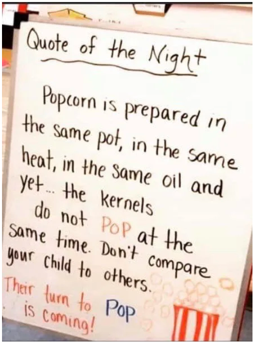

# หากเหนื่อยนักขอจงหยุดพักเสียก่อน

พอดีถูกใจไอ้รูปด้านล่างเลยอยากแชร์ และ จะแปลแบบนี้มีไรมิ ?

ป๊อปคอร์นทุกเม็ดมันก็ถูกเตรียมไว้ในหม้อเดียวกัน โดนความร้อนเท่ากัน และอะไรก็ได้พอๆกัน แต่ว่า ... มันใช้เวลาในการแตกจากเมล็ดข้าวโพดเป็นป๊อปคอร์นต่างเวลากัน ดังนั้นอย่าเปรียบเทียบว่าทำไมเราไม่ได้เหมือนเขา ไม่เก่งเหมือนเขา เรียนมาตั้งนานแล้วยังทำไม่ได้เลย . . . เพราะคนทุกคนมีความต่างกัน มีจุดที่จะเข้าใจไม่เหมือนกัน บางคนช้า บางคนเร็ว ดังนั้นแต่ละคนมีลู่วิ่งของตัวเอง และมีหนทางในการประสบความสำเร็จในรูปแบบที่แตกต่างกัน จงหาหนทางของตัวเองและจงพยายามต่อไป สักวันมันก็จะถึงเวลาของเราที่จะกลายเป็นป๊อปคอร์นเองแหละ \(นี่พึ่งรู้ว่าเราเกิดมาเป็นป๊อปคอร์นนะเนี่ย\) 🍿

แมวน้ำไม่ได้เขียนโค้ดแล้วเทพในวันแรกหรอก แต่เรียนรู้ไปเรื่อยๆเดี๋ยวมันก็เป็น Master เอง \(ถึงตอนนี้จะเป็นแค่แมวน้ำอยู่เหมือนเดิมก็ตาม\)

> กว่าจะถึงฝั่งฝันนั้นมันยากเย็น ... อย่าพึ่งเห็นฉันเดินเข้ามาง่ายง่าย ... กว่าจะถึงที่ฉันยืน ... กล้ำกลืนฝืนทนเกือบตาย **การโค้ดดิ้ง** จะท้อไม่ใช่เรื่องแปลก

ท้อได้แต่อย่ายอมแพ้ แมวน้ำเป็นกำลังใจให้เสมอ งง เรื่องอะไรก็ทักมา จะถามปัญหาเรื่องงานที่ติดก็ถามโลด แต่ถ้ามีปัญหาเรื่องเงินแล้วพบทางแก้ฝากกระซิบบอกแมวน้ำด้วย 💰

ช่วงนี้แมวน้ำต้องทำกิจกรรมว่ายน้ำต้านโควิทแถวๆอลาสก้า เลยทำให้บทความเสาร์อาทิตย์นี้ถูดงกไปก่อนนะขอรับ แต่เดี๋ยวจะมาโพสต์มุกตลกของเหล่าโปรแกรมเมอร์แทนละกัน ... ส่วนสำหรับใครจะไปสวดมนต์ต้านโควิท แมวน้ำแนะนำว่าถ้าเป็นไปได้ก็สวดที่บ้านแทนจะช่วยกว่าการไปรวมตัวกันสวดมนต์นะขอรับ ด้วยความเป็นห่วง 😘

## แด่ Developer ทุกท่านครับ



