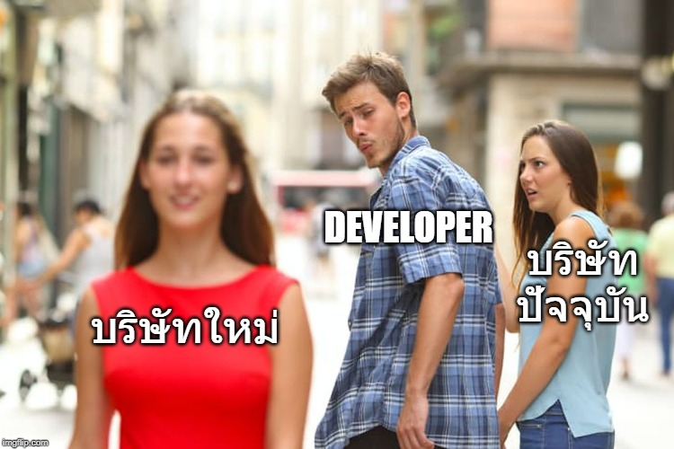

# ปัญหาสมองไหล

การหา Developer ซักคนที่ **"ทำงานเป็น"** ในวงการการทำซอฟต์แวร์นั้น ยากพอๆกับการถูกหวยเลยก็ว่าได้ แต่ที่ยากกว่าการหาคนนั้นคือ **"การรักษาให้เขาอยู่กับเราไปนานๆ"** ต่างหาก คือความหินที่แท้จริง ดังนั้นบริษัทต่างๆเลยเริ่มมีโครงการ **"ปั้นดินให้เป็นดาว"** เพื่อหวังว่าพอเป็นดาวแล้ว บริษัทก็จะสบายในอนาคต ... สุดท้ายกว่าจะรู้ตัว ดาวเหล่านั้นก็ไปทอแสงให้กับบริษัทอื่นแทนซะงั้น เพราะเงินเดือนที่มากกว่า

จากที่ร่ายมาจะโทษว่าเป็นความผิดของโปรแกรมเมอร์อย่างเดียวก็ไม่ได้ ที่เขาจะลาออกไปหาบริษัทอื่นที่เขาคิดว่าดีกว่า แต่ในบทความนี้ผมอยากให้แง่คิดของ Developer รุ่นใหม่ๆ และ แง่คิดกับบริษัทต่างๆ ว่าทำยังไงถึงจะอยู่ร่วมกันได้แบบวินๆ

### 👷 แง่คิดสำหรับโปรแกรมเมอร์รุ่นใหม่ๆ

**เงินเดือนไม่ใช่สิ่งที่สำคัญที่สุด** - ถ้าคุณกำลังจะย้ายงานเพราะอีกบริษัทให้เงินเดือนมากกว่าเพียงแค่นั้นแล้วล่ะก็ ผมแนะนำว่าอย่าทำ แต่ผมจะแนะนำว่า "**จงเล็งหาบริษัทที่เราสามารถไปเรียนรู้วิชาต่างๆเพื่อพัฒนาตัวเองแบบก้าวกระโดดได้จะดีกว่า"** เพราะสุดท้ายถ้าคุณไม่ได้มี skill ที่เหมาะกับรายได้นั้นจริงๆ สุดท้ายคุณก็จะกลับมาอยู่ใกล้ๆกับฐานเงินเดือนที่เท่ากับ skill ที่คุณมีนั่นแหละ ซ้ำร้ายถ้าคุณติดสบายจากเงินเดือนเยอะๆแล้ว มันจะเป็นการกดดันตัวเอง เพราะต้องหาบริษัทที่ให้เงินเดือนเท่าเดิมหรือมากขึ้น ทั้งๆที่ฐาน skill เราไม่ใช่ของจริงนั่นเอง แต่ในทางกลับกันถ้าเราเลือกบริษัทที่สามารถทำให้เราเก่งขึ้นไปได้เรื่อยๆ "**สุดท้ายคุณนั่นแหละจะเป็นคนเลือกบริษัท ไม่ใช่บริษัทมาเลือกคุณ"** เพราะ โปรแกรมเมอร์ที่ทำงานเป็นจริงๆ มันขาดแคลนพอๆกับวงการแพทย์เลยนั่นเอง

**&gt;&gt;&gt; ประสบการณ์คือสิ่งที่สำคัญที่สุดในสายอาชีพนี้ &lt;&lt;&lt;**

### 🤵 แง่คิดสำหรับบริษัท

**1.บริษัทได้ให้โอกาสเขาพิสูจน์ตัวเองหรือเปล่า?** - ถ้าคุณจ้าง developer ที่เก่งๆเข้ามา แต่คุณไม่เคยมีเวทีให้เขาได้พิสูจน์ฝีมือเขาเลย ทำแต่งานเดิมๆซ้ำๆเดิมๆ ไม่ได้ให้ทีมรู้สึกว่ามันมีความท้าทายต่ออนาคตเขาแล้วล่ะก็ เตรียมบอกลาพวกเขาได้เลย เพราะสุดท้าย ถ้ามีบริษัทไหนเสนอเงินเดือนที่มากกว่าให้ มันก็มีโอกาสสูงที่พวกเขาก็พร้อมจะเก็บกระเป๋าเดินไปฉายแววที่อื่นเช่นกัน

**2.บรรยากาศในการทำงานสนุกไหม?** - ถ้าคุณเห็นว่าคนในทีมเริ่มทำงานใครทำงานมัน ตอนเที่ยงกินข้าวแยกใครแยกมัน มีการแบ่งชั้นวรรณะกันชัดเจน หรือแย่กว่านั้นมีการเล่นการเมืองภายในกันด้วย ขอให้คุณไปคุยกับฝ่าย HR เรื่องเตรียมหาคนมาสำรองไว้ได้เลย เพราะบรรยากาศในการทำงานของวงการนี้สำคัญที่สุด ต่อให้เงินเดือนไม่ได้มากมายเท่าไหร่ \(พอมีเงินเก็บมีเงินเที่ยวเล่นบ้าง\) แต่ถ้าเราทำงานแล้วสนุก เพื่อนเยอะ คุยกันเล่นกันได้แบบพี่เหมือนน้องแล้วล่ะก็ Loyalty ที่เขาจะอยู่กับบริษัทคุณจะทนทานกว่าเยอะ แม้จะมีบริษัทอื่นมาให้เงินเดือนมากกว่า เขาก็\(น่าจะ\)เลือกทำงานอยู่กับเราเหมือนเดิม \(ถ้าไม่เยอะแบบกระโดดอ่ะนะ\)

**3.เงินเดือนเหมาะสมกับงานหรือเปล่า?** - เรื่องเงินเป็นเรื่องที่ยังไงก็เลี่ยงไม่ได้ ต่อให้เราทำทุกอย่างดีแล้วก็ตามสุดท้ายก็ขึ้นอยู่กับ loyalty และมุมมองในการใช้ชีวิตของคนแต่ละคนแล้วล่ะ แต่ทางบริษัทก็ต้อง **"ให้ในสิ่งที่ developer สมควรจะได้ ตามความเหมาะสมของงานที่เขารับผิดชอบด้วยเช่นกัน"** 

