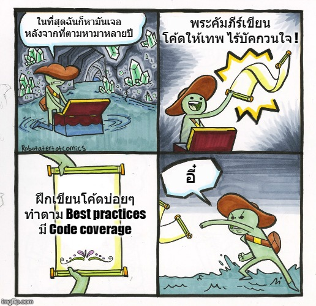

# เคล็ดไม่ลับในการทำซอฟต์แวร์

ปัญหาเรื้อรังอีกตัวที่จะคอยกัดกินเหล่า developer ในระยะยาวคือ **"ความรู้ในการเขียนโค้ด"** เพราะปัญหาส่วนใหญ่ที่เกิดขึ้นกับการทำซอฟต์แวร์นั่นคือ **"เราไม่สามารถแก้ไขปรับปรุงโค้ดได้ง่ายเหมือนที่เราอยากให้มันเป็น"** นั่นเอง ซึ่งเชื่อไหมว่าเหล่า developer หลายๆคนได้ทุ่มเงิม ทุ่มเวลา เพื่อหวังว่าจะได้ความรู้เรื่องเหล่านี้มา ซึ่งเชื่อไหมว่าเคล็ดลับทั้งหมดเมื่อกลั่นออกมาแล้ว เราจะสรุปมันออกมาได้ง่ายๆว่า

**1.ฝึกเขียนโค้ดบ่อยๆ** - ไม่ใช่ตะบี้ตะบันเขียนไปเรื่อย แต่จงดูปัญหาที่มันเกิด แล้วจงวิเคราะห์ว่าจะแก้ด้วยวิธีการแบบไหน หรือจะไปดูโค้ดคนอื่นๆด้วยก็จะทำให้เราได้เรียนรู้ข้อดีข้อเสียแบบต่างๆได้เร็วขึ้น และอย่าลืมคิดถึงเรื่องการออกแบบไว้ด้วยว่ามันดีพอหรือยัง? ทำยังไงถึงจะดียิ่งๆขึ้นไปอีก?

**2.ทำตาม Best practices** - ในการทำงานกับเรื่องอะไรก็ตาม ในแต่ละเรื่องมันจะมี best practices ของมันเสมอ ซึ่งถ้าเราไม่ทำตามก็ไม่เป็นไรนะ แต่มันจะทำงานได้ไปจนถึงจุดหนึ่งแล้วมันจะเริ่มมีปัญหานั่นเอง ซึ่งเรื่องนี้ก็เป็นเรื่องแปลกที่เหล่า developer ส่วนใหญ่จะไม่ยอมไปอ่านเรื่องพวกนี้ จนกว่ามันจะเกิดปัญหาแล้วค่อยไปนั่งไล่อ่าน

**3.มี Code Coverage** - การที่โค้ดของเรามีตัวมาช่วยตรวจสอบความถูกต้องนั้นถือว่า **"เป็นบุญของทีมและของบริษัท"** เลย เพราะในระยะยาวเราจะสามารถเพิ่มเติมแก้ไขปรับปรุง ทุกอย่างได้ตามที่เราอยากจะทำได้ง่ายม๊วกๆ แต่ในระยะสั้นที่เห็นผลได้เลยคือ เราสามารถมั่นใจได้เลยว่าโค้ดของเรามันไม่ได้เป็นตัวการผลิต bug หรือต่อให้มีก็ไม่ได้เยอะนั่นเอง


**เรื่องตลกร้าย**  
พวกเราเหล่า developer ส่วนใหญ่จะรู้เรื่องพวกนี้อยู่แล้ว แต่จะมองว่ามันเป็นเรื่องเสียเวลาที่จะทำของพวกนั้น แล้วหลายคนก็บอกว่าก็รอให้มันเกิดก่อนค่อยไปแก้มันดิ ซึ่งมันก็เป็นคำตอบที่เข้าใจได้อยู่ว่าทำไมเขาถึงเลือกทำแบบนั้น เพราะสถานะการณ์แต่ละคนอาจะไม่เหมือนกัน แต่ผมอยากจะฝากอีกมุมมองนึงไว้ว่า



**จงรักโค้ดเราเหมือนรักลูก**  
เพราะเราคือ "**ผู้เชี่ยวชาญ"** ในการสร้างซอฟต์แวร์ ดังนั้นความรู้ทุกอย่างในการทำมาหากินของเราคือ **"ความรู้"** และ **"ความปราณีต"** ในตัวงานนั่นเอง ถ้าเราฝึกมันจนเป็นธรรมชาติไปแล้ว ทุกอย่างมันจะออกมาเอง เหมือนกับเราไม่ต้องไปคอยบังคับให้เราหายใจยังไงล่ะ ดังนั้นสุดท้ายแล้ว ของที่เราต้องใช้บ่อยๆ เราก็ควรที่จะรู้ **Best Practices** ของมันอยู่ดี เช่นเราเขียน MongoDB มาตลอด 5 ปี เราก็ควรจะต้องรู้จัก Best Practices ของมันได้แล้วนะ ไม่งั้นมันก็จะเหมือนกับ ช่างที่รู้จักเครื่องมือแค่ไม่กี่ตัว แถมยังเอาเครื่องมือไปใช้ผิดๆถูกอีก เวลาเราเห็นช่างเอาค้อนไปเลื่อยไม้ เราจะคิดยังไง? แต่โชคดีหน่อยที่การทำซอฟต์แวร์นายจ้างไม่ได้เข้าใจมาเห็นเราเอาค้อนไปเลื่อยไม้ยังไงล่ะ


