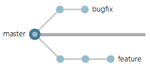
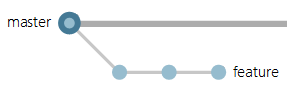
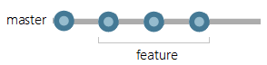
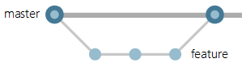
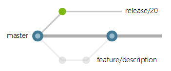
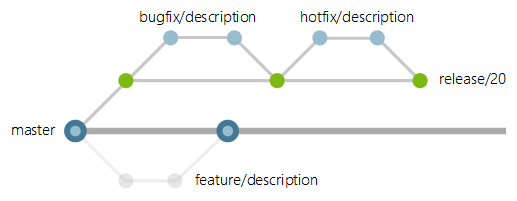
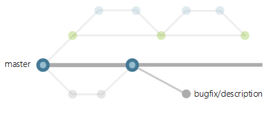
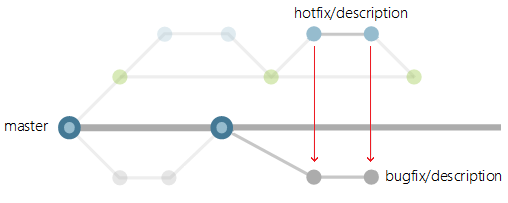
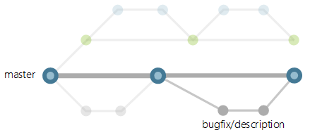

# Git branching strategy

## 😢 ปัญหา

ในการใช้งานพวก **Version controls** ต่างๆนั้นเราสามารถที่จะแตก **Branch** ออกเป็นเรื่องๆได้ เช่น เอาไว้เพิ่มความสามารถใหม่ๆ \(**Feature branch**\), เอาไว้แก้บัค \(**HotFix**\), เอาขึ้น production \(**Release**\) บลาๆ ซึ่งใครอยากจะแตก branch ก็แตกได้ทุกที่ทุกเวลา ดังนั้นมันเลยไม่มีกฎตาย และไม่ได้ทำให้อะไรพัง แต่ว่ามันจะเป็นวิธีการจัดการดีที่หรือเปล่าน๊า ? แล้วเราจะรับมือกับการทำ branching ที่มีอยู่ยั๊วเยี๊ยยังไงดี ?


**แนะนำให้อ่าน**  
สำหรับใครที่ไม่รู้เรื่อง Git ด๋อยอะไรเลย แต่หลงกดเข้ามา แล้วเริ่มอยากหัดใช้ Git กับเขาบ้าง แนะนำให้อ่านวิธีการใช้งานตั้งแต่ขั้นพื้นฐานได้จากลิงค์นี้เบยครัช [👶 **Git พื้นฐาน**](https://www.saladpuk.com/basic/git)\*\*\*\*


## 😄 วิธีแก้ปัญหา

ปัญหานี้มันเกิดขึ้นกับทุกทีมที่ใช้ **Version controls** แหละ ดังนั้นเหล่าองค์กรใหญ่ๆเลยเสนอแนวทางในการแก้ปัญหาเหล่านี้ออกมาเต็มไปหมดเบย ซึ่งเราเรียมันว่า **`Branching strategy`** ดังนั้นง่ายที่สุดในการแก้ปัญหาก็คือ **เลือกใช้ของเขาซักตัว** นั่นเอง หรือจะ **สร้างรูปแบบที่เหมาะสมกับทีมตัวเอง** ก็ได้ ซึ่งแต่ละวิธีการที่เขาเสนอมานั้น มีความเหมาะในงานแต่ละรูปแบบ และ วัฒนธรรมของทีมที่แตกต่างกัน ดังนั้นจงไปเรียนรู้ว่าทีมของเราเหมาะกับ strategy แบบไหนถึงจะเหมาะสมนะจุ๊

## 😎 ตัวอย่าง

ก่อนที่จะเสียเวลาไปศึกษาลงลึกในแต่ละตัว เราลองมาดูพื้นฐานในการจัดการกับ branch จากทีมของ **`Microsoft`** ดูบ้างดีกั่ว เพราะมันครอบคลุมแทบจะทุกกรณีเลย ตั้งแต่ทีมเล็กๆ 4-5 คน ยันไปถึงเป็นหมื่นๆคน ซึ่งขออธิบายเฉพาะตัวพื้นฐานของเขาก่อนละกันนะจ๊ะ


## Keep your branch strategy simple !

หัวใจหลักในการจัดการ branch คือ **อย่าไปทำอะไรที่มันวุ่นวาย** แต่จง **ทำให้มันง่ายๆเข้าไว้** โดยรักษาให้ตัว **master branch** ให้พร้อมสำหรับใช้บน **production** เสมอ


💖 **หัวใจหลัก** ในการทำงานของเรื่องก็คือ **อย่าไปทำงานกับ master branch ตรงๆเด็ดขาด** เพราะมันจะทำให้เรามีปัญหาตามมาเต็มไปหมดเลย ดังนั้นเขาเลยมีแนวคิดในการทำงานกับ master branch 3 แนวคิดคือ

### 1️⃣ Feature/Topic branches

ถ้าจะเพิ่มความสามารถใหม่ๆให้โค้ดเราจะต้อง **แตก branch ใหม่จาก master มาทำงานเรื่องนั้นๆโดยเฉพาะ** ซึ่งเราเรียกมันว่า **`Feature branch`** หรือบางสำนักก็เรียกว่า **`Topic branch`** นั่นเอง 

**❌ ไม่ควรทำ** - หากใครที่ทำงานและ commit ลงใน master branch เลยแบบนี้จะมีปัญหา เพราะไม่มีใครการันตีได้ว่าสิ่งที่ commit เข้ามามันจะไม่เกิด bug และเมื่อมันเข้า master ไปแล้วมันจะเอาออกหรือถอยกลับยาก ตามรูปด้านล่าง

✔️ **ควรทำ** - ทุกครั้งที่จะมีการเพิ่ม feature ใหม่ๆ หรือแก้บัคอะไรก็ตาม ให้ทำการแตก branch ใหม่ออกมาจาก master ซะ แล้วทำงานที่ branch ใหม่ตัวนั้นแทน เพราะต่อให้เราแก้จนมันพัง หรือไม่อยากได้โค้ดเหล่านี้แล้ว อย่างมากก็แค่ลบ branch ตัวนี้ออกทุกอย่างก็จบ

แล้วเมื่อไหร่ก็ตามที่เราทดสอบเจ้า branch ใหม่จนมั่นใจแล้วว่ามันใช้งานได้ ไม่มีบัค บลาๆ เราก็แค่รวม branch เหล่านั้นกลับมาที่ตัว master branch ก็เป็นอันจบ และการรวม branch เข้ามาต้องเป็นแบบ **`--no-ff`** \(no fast forward\) ด้วยนะจ๊ะ เพราะถ้าวันนึงเราไปเจอบัคที่มากับ branch ใหม่ตัวนี้ เราก็จะย้อนสถานะกลับมาก่อนที่จะ merge ได้ง่ายๆงุย


**เกร็ดความรู้**  
ข้อดีที่เราแยก branch ใหม่เมื่อเราจะแก้ไขอะไรก็ตาม \(ไม่ว่าจะแก้เล็กน้อยแค่ไหนด้วย\) มันจะช่วยให้ master branch ของเราไม่มีมีขยะปนเขาไปได้ และเมื่อเรารวมเข้า master เรียกร้อยแล้ว เราอยากจะถอยกลับก็จะทำได้ง่าย เพราะเราเห็นจุด merge ที่ชัดเจนเลยนั่นเอง ซึ่งการที่จะทำแบบนี้ได้อย่างแท้จริง เราจะต้องเพิ่ม **Policy** ว่าให้มันทำการ **LOCK master branch** ด้วย เพียงเท่านี้ก็จะไม่มีใคร commit อะไรต่างๆเข้า master ได้อีกแล้ว


#### 🤔 ทำไมต้อง --no-ff ด้วย ?

หลายคนพอเห็นคำสั่ง `--no-ff` ก็อาจจะ งงๆ หรือ คาใจว่าทำไมต้องใช้ด้วยหว่า? ดังนั้นเราลองมาดูกันว่ามันต่างกันยังไง สมมุติว่า branch ของเราตอนนี้เป็นแบบรูปด้านล่าง

ซึ่งเราต้องการจะเอา feature branch ไปรวมเข้ากับ master branch ด้วยคำสั่ง git merge ซึ่งในบางที ถ้าเราใช้ tools ในการ merge หรือจะอะไรก็ตามแต่ ตอน merge เสร็จมันอาจจะเกิดเป็นภาพแบบด้านล่างได้


**ปัญหา**  
จริงๆมันก็ไม่ได้ทำให้อะไรเราพังเลยนะ และไม่ได้มีอะไรผิดด้วย แต่เราจะกวาดตามองแล้วไม่รู้เลยว่า commit ไหนบ้างที่เกิดจาก feature นี้ เช่น เรารวม feature Login เข้ากับ master ไปเรียบร้อย แล้วมารู้ทีหลังว่า feature Login ที่รวมเข้ามามันมี bugs ตรึมเลย ทำให้เราต้องย้อนสถานะกลับไปใช้ commit ก่อนที่จะรวม feature Login ซึ่งความสนุกของมันก็คือ commit ไหนล่ะ? เพราะมันอยู่ระนาบเดียวกันหมดเลย ต้องพึ่งความทรงจำของคน commit แล้วล่ะว่าจะจำ message หรือวันเวลาตัวเองได้หรือเปล่านั่นเอง


การ merge โดยใช้คำสั่ง `--no-ff` ควบคู่ไปด้วย เป็นการการันตีว่า branch ที่ merge เข้าไปมันจะต้องถูกแยกออกไว้แบบเดิมนั่นเอง และมันจะต้องมี merge commit ด้วยนั่นเอง เลยจะทำให้เราได้ตามภาพด้านล่างเสมอ

### 2️⃣ Pull requests + Code review

เมื่อไหร่ก็ตามที่อยากจะเอา feature branch **MERGE** กลับไปที่ master branch **จะต้องทำผ่าน pull request เท่านั้น** ห้าม merge ตรงไปที่ master เด็ดขาด ดังนั้นในจุดนี้เราก็ต้อง **LOCK master branch เท่านั้น** ถึงจะทำได้ เพราะต่อให้เตือนกันแค่ไหนก็ตาม สุดท้ายคนเตือนก็อาจจะเผลอกด merge เสียเองก็เป็นได้


**ข้อควรระวัง**  
ก่อนทำ Pull request ทุกครั้งให้ตรวจสอบก่อนว่า **โค้ดมัน build ผ่าน** และที่สำคัญคือ **Test ในนั้นก็ต้องผ่านด้วย** นะจ๊ะ


นอกจากนี้ ก่อนที่เราจะทำการกดยอมรับ pull request เราจะต้องมีการไล่อ่านโค้ดที่ถูกส่งเข้ามาด้วย ซึ่งไหนๆจะทำแบบนั้นอยู่แล้ว เขาเลยแนะนำให้ทำ **Code review** ไปด้วยเลย มันจะได้ช่วยให้ทีมเก่งขึ้นแบบก้าวกระโดด และทำให้ **การแอบวางยาในโค้ดทำได้ยากขึ้นเยอะเลย**


**แนะนำให้อ่าน**  
สำหรับใครที่ไม่รู้ว่า Code Review คืออะไรและทำกันยังไง แนะนำให้อ่านจากลิงค์นี้ขอรับ [**Code Review**](https://www.saladpuk.com/basic/agile-methodology/code-review) \(🤔 อยากให้ทีมเก่งขึ้น แต่ไม่มีเวลาสอนทำไงดี ?\)


### 3️⃣ Master branch พร้อมใช้งาน

เวลาที่เราจะเพิ่ม features ต่างๆเข้าไป เราจะต้องแตก branch ออกไป ดังนั้นของทุกอย่างที่อยู่ใน master branch มันจะต้องพร้อมใช้งานเสมอ **build ได้ไม่มี error และ run test ผ่านทั้งหมด** เพราะไม่อย่างนั้นตอนที่ทีมแตก branch ออกไปเขียน features ต่างๆ ก็จะเจอ error ต่างๆ จนทำให้เสียเวลามาแก้ปัญหาพวกนั้นก่อนที่จะเริ่มทำงานกันยังไงล่ะ

## 🤨 มีแค่นี้เหรอ ?

มีอีกเต็มไปหมดเบย แต่เริ่มขี้เกียจแล้วแต่จะต่อให้จบตามตัวแนะนำขั้นพื้นฐานของเขาละกัน

### 🔥 การตั้งชื่อ branch

เวลาที่เราจะแตก branch ออกมาทำอะไรก็ตาม ในทีมควรที่จะมีการตกลงมาตรฐานในการตั้ง branch เหล่านั้นด้วย เพราะพอเวลาผ่านไป เราก็อาจจะจำไม่ได้แล้วว่าเราแตก branch นั้นมาทำไม ? ดังนั้นชื่อของมันจะเป็นสิ่งแรกๆที่จะทำให้เราระลึกชาติได้นั่นเอง เช่น เราเจอชื่อ branch Login1 กับ Login 2 เราจะรู้ไหมว่ามันต่างกันตรงไหน? ซึ่งทาง Microsoft เขามีหลักในการตั้งชื่อ branch ตามด้านล่างนี้

แบ่งตามคนที่ดูแลงานนั้นๆ

* users/username/description
* users/username/workitem

แบ่งตามการแก้ข้อผิดพลาด

* bugfix/description
* hotfix/description

แบ่งตามความสามารถใหม่ๆ

* features/feature-name
* features/feature-area/feature-name

มันอาจจะดูยาวๆหน่อย แต่ถ้าคิดดีๆมันก็จะมีประโยชน์ในรูปแบบของมัน ซึ่งข้อดีในการตั้งชื่อแบบนี้ใน Azure DevOps มันจะช่วยให้เราจัดการเรื่อง [**Branch folders**](https://docs.microsoft.com/en-us/azure/devops/repos/git/require-branch-folders?view=azure-devops&tabs=browser) ได้ด้วย

### 🔥 Release branches

เมื่อเรามั่นใจว่างานที่อยู่ใน master สามารถนำขึ้น production ได้แล้ว เราก็จะเริ่มแตก branch ใหม่ออกไป ซึ่งเราเรียกมันว่า **`release branch`** นั่นเอง ซึ่งเราอาจจะตั้งชื่อให้รู้ว่าเป็น release version อะไรลงไปด้วยก็ได้ ตามรูปด้านล่าง \(สีเขียว\) หรือบางทีก็เป็นการ release **ตอนจบ Sprint/Iteration** ก็ได้เช่นกัลล์

ซึ่งเจ้าตัว release branch นี้จะ**ต่างจาก feature branch ตรงที่มันจะไม่เคยถูก merge กลับมาที่ master branch เลยยังไงล่ะ!!** สาเหตุเพราะว่า งานที่ release ไปแล้ว เราจะไม่ไปเพิ่มความสามารถอะไรใหม่ๆในนั้น \(พูดง่ายคือไม่แตก feature branch จาก release branch\) ดังนั้นเราก็ไม่มีเหตุผลที่จะรวมมันกลับมาที่ master ยังงุยล่ะ

แต่ถ้าเราพบว่าใน release branch มี bug เกิดขึ้น เราก็สามารถแตก branch ใหม่ออกจาก release เพื่อทำการแก้ bug เหล่านั้นก็รับได้นะ ตามรูปเบย

ส่วน commit ที่แก้ bug ใน release branch พวกนั้น เราจะไม่ merge กลับมาที่ master เด็ดขาด แต่สิ่งที่เราจะทำก็คือ

1.สร้าง branch ใหม่จาก master ขึ้นมา

2.ทำการ Cherry-pick จาก commit ที่เราแก้ bug  ใน release branch เข้ามาใน branch ใหม่ตัวนี้แทน

3.เมื่อตรวจสอบทุกอย่างว่ามันทำงานได้ build ได้ test ผ่าน ก็ทำการ pull-request กลับไปที่ master ตามปรกติ

### 🔥 ไม่ใช้ Tag ถ้าไม่จำเป็น

พวก version control เช่น git นั้น เราสามารถสร้าง Tag ไปแปะไว้กับ commit อันไหนก็ได้ และส่วนใหญ่จะเป็นเป็นตัวช่วยจำกันว่า จุดนี้คือ version อะไร? จาก commit นี้แก้ bug ไปแล้วนะ หรืออะไรก็ตามแต่ที่อยากจะเอา tag แปะลงไป ซึ่งหนึ่งในปัญหาที่ซ่อนอยู่ก็คือ **Tag มันหลอกกันได้** เช่น ดันไปแปะ release tag ผิด commit ขึ้นมา เวลาเราย้อนกลับไปหา release ในรอบนั้น เราก็จะหลงเข้าใจว่า เจ้า commit ที่ติด tag นี้ไว้คือตัวที่ release ในรอบนั้นๆ ซึ่งกว่าจะรู้ตัวก็เสียเวลาอยู่นานเบย \(แอบโมโห👹 \) 

การที่เราใช้ **Branching Strategy** เข้ามาช่วย มันจะเห็นชัดเจนเลยว่า มันถูกแยกเส้นออกมาจาก master และมีการกำหนดชื่อไว้เรียบร้อยเลยเช่น **release/20** ซึ่งพอเห็นเท่านี้ก็เป็นอันจบแล้ว ไม่ต้องไปติด tag อะไรต่างๆให้วุ่นวาย


**จุดชวนคิด**  
เชื่อว่าหลายๆคนก็น่าจะเคยเห็น **comment ในโค้ด ที่มันทำงานไม่ตรงกับที่มัน comment ไว้** \(แอบกริ้วอีกแล้ว 👺\) เพราะ comment มันไม่ใช่ตัวโค้ดที่แท้จริง ดังนั้น Tag ก็เช่นกัน และ ชื่อ branch ก็ด้วย แต่ว่าถ้าทำตามวิธีการจริงๆ branch แต่ละตัวก่อนที่มันจะถูกเอาไปใช้งาน หรือถูกนำไปรวม มันจะต้องถูก Review และถูกหลายๆทีมเห็น ดังนั้นมันจะพลาดได้ยากกว่าการติด Tag นั่นเอง


## 🔗 บทความจบแต่ยังคาใจ

สำหรับคนที่สนใจอยากลงลึกก็ลองไปศึกษาเพิ่มเติมได้จากวีดีโอและลิงค์ต่างๆที่ให้ไว้ในนี้ละกันฮั๊ฟ

* [A successful Git branching model](https://nvie.com/posts/a-successful-git-branching-model/)
* [Javacodegeeks - Git Branching Strategies](https://www.javacodegeeks.com/2015/11/git-branching-strategies.html)
* [Microsoft - Release Flow](https://docs.microsoft.com/en-us/azure/devops/learn/devops-at-microsoft/release-flow)
* [Microsoft - How We Use Git at Microsoft](https://docs.microsoft.com/en-us/azure/devops/learn/devops-at-microsoft/use-git-microsoft)
* [Microsoft - Adopt a Git branching strategy](https://docs.microsoft.com/en-us/azure/devops/repos/git/git-branching-guidance)





