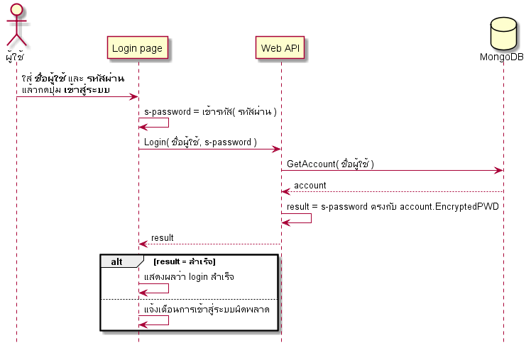

# 👶 UML พื้นฐาน

## 😢 ปัญหา

ปัญหาที่ developer เจอนั้นมีหลายเรื่องเลย และส่วนหนึ่งจะเกิดจาก**การคุยกันไม่รู้เรื่องของเหล่า developer ด้วยกันเอง** สาเหตุนั้นเป็นเพราะ งานที่ developer ทำจริงๆแล้วมันไม่ใช่งานที่จับต้องได้ เพราะมันเป็น **Logical** ที่อยู่ในโค้ดเพียงอย่างเดียว และโค้ดทั้งหมดที่ประกอบกันเป็นโปรแกรม มันก็มีโครงสร้างที่ซับซ้อนยากต่อการอธิบาย และกว่าจะรู้ตัวว่าทำงานไม่ถูกบางทีก็จะไปพบว่ามันเป็น bug ในตัวแอพที่มีคนมาใช้งานจริงๆแล้ว ดังนั้นในคอร์สนี้เราจะมาดูหนึ่งในวิธีการแก้ปัญหาในเรื่องการสื่อสาร เพื่อป้องกันไม่ให้ทำผิดแล้วต้องเสียเวลากลับมาแก้ภายหลัง

## 😄 วิธีแก้ปัญหา

สาเหตุหลักๆที่คุยกันไม่เข้าใจ หรือ เสียเวลาอธิบายกันนานนั้นมีสาเหตุมาจาก ตัวโค้ดของโปรแกรมมันจับต้องไม่ได้ มันเป็นแค่ตัวหนังสือที่อยู่ในคอม ต้องเสียเวลาในการทำความเข้าใจว่าอะไรมันเชื่อมต่อกันยังไงบ้างนั่นเอง ซึ่งจากปัญหาที่ว่ามานี้เราจะใช้สิ่งที่เรียกว่า **Unified Modeling Language** หรือที่เรียกกันติดปากว่า **UML** เป็นตัวอธิบายแทนโค้ดของเราทั้งหมด โดยเจ้า UML นั้นจะแปลงของที่เข้าใจยากๆเหล่านั้นให้กลายเป็นรูปภาพที่ developer สากลทั่วโลกดูแล้วจะเข้าใจในระดับนึงนั่นเอง ดังนั้นถ้าเราเอา UML เข้ามาใช้มันจะทำให้ทุกคนในทีมสามารถเข้าใจสิ่งต่างๆได้ตรงจุดมากขึ้น และข้อดีที่สุดของมันคือ **ทีมสามารถป้องกันข้อผิดพลาดได้ก่อนที่มันจะเกิดเสียอีก** เพราะแผนภาพมันจะฟ้องว่าทีมเข้าใจติดตรงไหน

## 🤔 UML คืออะไร ?

**UML** มันคือภาษาชนิดหนึ่ง ไม่ใช่ภาษาที่เอามาเขียนโปรแกรมนะ แต่เป็นภาษาที่เอาไว้อธิบายของต่างๆให้ออกมาเป็นแผนภาพ ซึ่งตัวมันเองมีวิธีการอธิบายความสัมพันธ์แบบต่างๆไว้เต็มไปหมดเลย ดังนั้นเดี๋ยวเราจะลองไปดูรายละเอียดคร่าวๆของแต่ละตัวกันก่อนว่ามันใช้ทำอะไรได้บ้างก่อนที่จะลงลึกในแต่ละตัว

ในคอร์สนี้ผมคงไม่ร่ายยาวประวัติ UML ให้ฟังเพราะหาอ่านได้ตาม Google เลย แต่แค่จะบอกว่ามันมีวิวัฒนาการมาหลายๆเวอร์ชั่น ส่วนรายละเอียด UML อ่านได้จากเว็บนี้ได้เลย [https://www.uml.org](https://www.uml.org/)


## 🤔 UML ใช้อธิบายอะไรได้บ้าง ?

ตัว UML สามารถอธิบายความสัมพันธ์สิ่งของต่างๆที่เกี่ยวข้องกันได้หลายวิธี ซึ่งแต่ละแผนภาพของ UML ก็จะเหมาะสมกับรายละเอียดในมุมมองแต่ละแบบ ดังนั้นเราจะล่องไล่ดูตัวอย่างแผนภาพที่ได้ใช้กันบ่อยๆดูก่อนเลยละกัน

### 🔥 Activity Diagram

เป็นแผนภาพที่เอาไว้ **อธิบายทิศทางในการทำงาน** หรือที่เราเรียกกันว่า **Workflow** นั่นเอง ดังนั้นเราลองมาดูว่าถ้าเราไม่ใช้ activity diagram ผมจะต้องอธิบายการทำงานไว้แบบนี้

**ตัวอย่างการอธิบาย**  
ได้เมื่อไหร่ก็ตามที่ได้รับเงินจากแม่จะต้องไปซื้อไข่ที่ตลาดจำนวน 1 แผง จากร้านไหนก็ได้ที่เปิดขายไข่อยู่ แล้วถ้าเจอพ่อที่ตลาดให้เอาเงินให้พ่อให้หมดเลยแล้วกลับบ้านซะไม่ต้องซื้ออะไรอีก ส่วนถ้าฝนตกไม่ต้องไปตลาดและเอาเงินคืนแม่ซะ

แล้วลองเปรียบเทียบกับการเอา activity diagram มาใช้อธิบายตามรูปด้านล่าง ก็จะเห็นว่าคำอธิบายวุ่นวายๆนั้นหายไปหมดเลย


### 🔥 Sequence Diagram

เป็นแผนภาพที่ใช้อธิบาย **การคุยกันระหว่างงานแต่ละส่วน** ดังนั้นเราลองมาดูว่าถ้าเราไม่ใช่ sequence diagram ผมจะต้องอธิบายการทำงานไว้แบบนี้

**ตัวอย่างการอธิบาย**  
ผู้ใช้ทำการใส่ชื่อผู้ใช้และรหัสผ่านเพื่อทำการเข้าสู่ระบบ เมื่อกดปุ่มเข้าสู่ระบบแล้ว ตัวโปรแกรมจะทำการป้องกันรหัสผ่านไม่ให้รั่วไหลโดยการเข้ารหัสผ่านเอาไว้ แล้วค่อยส่งข้อมูลทั้งหมดต่อให้กับเซิฟเวอร์ แล้วเซิฟเวอร์จะทำการดึงข้อมูลผู้ใช้จากฐานข้อมูลโดยอ้างจากชื่อผู้ใช้ที่ทำการกรอกเข้ามา แล้วค่อยทำการตรวจสอบว่ารหัสผ่านที่เข้ารหัสทั้งสองตรงกันหรือเปล่า สุดท้ายระบบก็จะส่งผลลัพท์กลับไปให้หน้าเว็บทำการแสดงผลการเข้าสู่ระบบ

แล้วลองเปรียบเทียบกับการเอา sequence diagram มาใช้อธิบายตามรูปด้านล่าง ก็จะเห็นว่าคำอธิบายวุ่นวายๆนั้นหายไปหมดเลย



### 🔥 Use case Diagram

เป็นแผนภาพที่ใช้อธิบายว่า **ในระบบมีใครทำอะไรกันได้บ้าง** ดังนั้นเราลองมาดูว่าถ้าเราไม่ใช่ use case diagram ผมจะต้องอธิบายการทำงานไว้แบบนี้

**ตัวอย่างการอธิบาย**  
ในระบบโทรศัพท์มีเรื่องที่ทำได้ 3 เรื่องคือ การจัดการเรื่องการโทร การจัดการเรื่องข้อความ และ ค่าโทรศัพท์ แต่ตัวมือถือจะเป็นตัวที่จัดการเรื่อง การโทร และ เรื่องข้อความต่างๆให้ โดยที่ผู้ใช้มีหน้าที่แค่จ่ายเงินค่าโทรศัพท์อย่างเดียวก็พอ

แล้วลองเปรียบเทียบกับการเอา suser case diagram มาใช้อธิบายตามรูปด้านล่าง ก็จะเห็นว่าคำอธิบายวุ่นวายๆนั้นหายไปหมดเลย


### 🔥 Class Diagram

เป็นแผนภาพที่ใช้อธิบายว่า **ในระบบมีคลาสอะไรอยู่บ้างและแต่ละคลาสมีความสัมพันธ์กันยังไง** ดังนั้นเราลองมาดูว่าถ้าเราไม่ใช่ class diagram ผมจะต้องอธิบายการทำงานไว้แบบนี้

**ตัวอย่างการอธิบาย**  
ในระบบมีคลาส 3 คลาสคือ คลาสหมา คลาสแมว และ คลาสสัตว์ โดยที่คลาสหมากับแมวสืดทอดมากจากคลาสสัตว์ด้วยกันทั้งคู่ และคลาสหมากับแมวสามารถส่งเสียงร้องของมันเองได้หรือจะใช้ความสามารถที่สืบทอดจากคลาส์แม่ก็ได้ โดยที่คลาสสัตว์เป็น abstract ด้วยนะ

หรือทั้งหมดที่ยกตัวอย่างมาผมสามารถเขียนโค้ดให้เข้าใจง่ายๆได้ว่า

```csharp
public abstract class Animal
{
    public virtual void Goes()
    {
        Console.WriteLine("ส่งเสียงร้อง");
    }
}

public class Dog : Animal
{
    public override void Goes()
    {
        Console.WriteLine("โฮ่งๆ");
    }
}

public class Cat: Animal
{
    public override void Goes()
    {
        Console.WriteLine("เหมี๊ยวๆ");
    }
}
```

แล้วลองเปรียบเทียบกับการเอา class diagram มาใช้อธิบายตามรูปด้านล่าง ก็จะเห็นว่าคำอธิบายวุ่นวายๆนั้นหายไปหมดเลย และ แค่ดูแผนภาพปุ๊ปก็เข้าใจได้เลยว่ามีคลาสอะไรอยู่บ้างและความสัมพันธ์มันเป็นยังไงโดยที่ไม่ต้องไปไล่อ่านโค้ดเลย


## 🤔 แผนภาพมีเพียงแค่นี้เองเหรอ?

ใจเย็นโยม มีอีกเพียบให้ศึกษาเลย นี่แค่เป็นเพียงน้ำจิ้มให้เห็นถึงพลังของ UML ที่ทำให้ทีมเข้าใจของหลายๆอย่างได้เร็วขึ้นเท่านั้น และในแต่ละแผนภาพนั้นก็มีรายละเอียดในการอธิบายอยู่เยอะเลยล่ะ ดังนั้นเดี๋ยวเราไปดูรายละเอียดของแต่ละแผนภาพกันเลยละกัน

## 🧭 เนื้อหาของคอร์สทั้งหมด


เรื่อง diagram ต่างๆขอสอนเท่าที่ได้ใช้กันบ่อยๆ และเป็นพื้นฐานก่อนนะ ไว้มีเวลาแล้วจะมาเพิ่มให้มันครบทุกตัวภายหลัง ถ้าไม่อยากพลาดบทความดีๆ ก็ไปกดติดตามได้จากลิงค์นี้เบย [**Saladpuk Facebook**](https://facebook.com/mr.saladpuk)












## 🤔 สร้าง UML ใช้โปรแกรมอะไรได้บ้าง?

มีโปรแกรมอยู่ยั้วเยี้ยบทเน็ทเลย ลอง search หาดูเอาละกันทั้งฟรีและไม่ฟรี ซึ่งตัวที่แนะนำก็จะขอแบ่งเป็น 2 หมวดละกันคือ

หมวดสร้างแผนภาพจาก **text**

* [Plant UML](http://plantuml.com)
* [MermaidJS](https://github.com/knsv/mermaid)
* [FlowChart.JS](http://flowchart.js.org/)

หมวดสร้างแผนภาพจาก **เครื่องมือ**

* [Lucidchart \(online\)](https://www.lucidchart.com)
* [Creately.com \(online\)](https://creately.com/)
* [Draw.io \(online\)](https://www.draw.io/)
* [Start UML \(app\)](http://staruml.io/)
* [Visio \(app\)](https://www.microsoft.com/th-th/p/visio-standard-2019/cfq7ttc0k7cf)


**โปรแกรมที่แนะนำ**  
ตัวที่ผมชอบใช้จริงๆมี 2 ตัวคือ **Plant UML** กับ **Star UML** ซึ่งแต่ก่อนชอบ **Star UML** มากเพราะลากวางแล้วสวยมากครับฟรีด้วย \(แต่ก็มีให้จ่ายเงินเหมือนกันนะ\) แต่หลังๆมาชอบใช้ **Plant UML** มากกว่าเพราะเวลาที่ผมแก้ไข diagram มันไม่ต้องมาคอยจัดตำแหน่งเส้นต่างๆ เพราะโปรแกรมมันจะจัดการให้หมดเรามีหน้าที่แค่พิมพ์ของที่เราอยากได้แค่นั้นเอง ทำให้ผมลดเวลาในการทำงานลงไปได้เยอะมาก


## 🎯 บทสรุป

ตัว UML มันสามารถใช้อธิบายของหลายๆอย่างได้ทั้งที่เกี่ยวและไม่เกี่ยวกับโปรแกรมนะ เพียงแค่มันถูกออกแบบมาให้ใช้อธิบายเรื่องโครงสร้างและความสัมพันธ์ของโปรแกรมเฉยๆ แต่จากในตัวอย่างก็น่าจะพอเห็นภาพแล้วว่า **ภาพมันเข้าใจได้มากกว่าคำพูด** เพราะการอธิบายยาวๆนั้นคนส่วนใหญ่จะต้องคอยจินตนาการตาม แต่ถ้าเรามีแผนภาพเราจะเข้าใจสิ่งต่างๆได้เร็วขึ้นนั่นเอง

