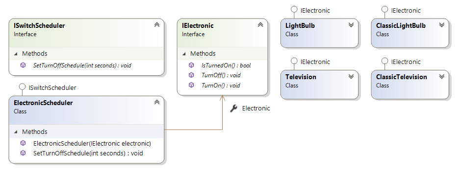

# Activity Diagram

## 😢 ปัญหา

บ่อยครั้งที่คุยงานกันแล้วจะสับสนเพราะมันมีขั้นตอนเยอะ และ แต่ละขั้นตอนก็มีรายละเอียดปลีกย่อยอยู่ข้างในด้วย ทำให้เสียเวลาเคลียความเข้าใจกันอยู่นาน และ หลังจากที่คุยกันเสร็จบางทีก็ลืมรายละเอียดบางขั้นตอนไปเสียแล้วทำให้ต้องกลับมาคุยกันใหม่ เป็นปัญหางูกินหาง แล้วเราจะจัดการกับปัญหาพวกนี้ยังไงดี?

## 😄 วิธีแก้ปัญหา

ผมเชื่อว่าคนเราเห็นภาพแล้วเข้าใจได่ง่ายกว่าเห็นตัวหนังสือ ดังนั้นเราจะใช้แผนภาพที่เรียกว่า **Activity Diagram** มาช่วยแก้ปัญหาโลกแตกนี้กัน โดยเจ้า activity diagram นั้นจะแปลงเรื่องราวทั้งหมดที่เกิดขึ้นให้กลายเป็นรูปที่เข้าใจง่ายๆนั่นเอง


**แนะนำให้อ่าน**  
บทความนี้เป็นส่วนหนึ่งของคอร์ส [👶 UML พื้นฐาน](https://saladpuk.gitbook.io/learn/basic/uml) หากเพื่อนๆสนใจอยากดูรายละเอียดของ UML แต่ละตัวว่ามันมีอะไรบ้างก็สามารถกดลิงค์ที่ชื่อคอร์สเข้าไปดูได้เลยนะ หรือจะดูหมวดอื่นๆจาก side menu ก็ได้เน่อ


## 🤔 Activity Diagram ใช้ยังไง?

สมมุติว่าเราต้องเขียนโปรแกรม **Login** ละกัน ซึ่งกระบวนการ login นั้นมันเกี่ยวข้องกับงานในหลายๆส่วน ดังนั้นเราจะลองให้ **ดช.แมวน้ำ** 🧔 เป็นคนไล่ลำดับการทำงานของตัวโปรแกรมให้ฟังละกันนะ

## 😄 ลองเขียน Activity Diagram กัน

โดยปรกติเวลาที่เราใช้ UML เราจะไม่เขียนโค้ดหรือเขียนเอกสารกันนะ แต่เราจะวาดรูปเล่นกันต่างหาก ดังนั้นมาลองไล่ตามสิ่งที่ **ดช.แมวน้ำ** จะวาดรูปให้ดูทีละขั้นตอน เพื่อที่จะมีโครงสร้างของระบบ Login ดูละกันนะ

### 🔥 **Initial Node**

🧔 สิ่งแรกที่จะวาดลงไปก็คือจุดเริ่มต้นที่เป็น **วงกลมทึบ** เพื่อบอกว่าการทำงานมนจะเริ่มที่จุดนนี้นะ ตามรูปด้านล่างเลย

### 🔥 Action

🧔 การที่จะทำการ login ได้นั้นจะต้องเริ่มที่หน้า Login ดังนั้นถัดไปเราก็จะวาดรูป **วงรี** แล้วเขียนว่า **เปิดหน้า Login** เพื่อกำหนดว่าขั้นตอนนี้มันคืออะไรลงไปตามรูป

### 🔥 Control Flow

🧔 ในตัวระบบนี้ถ้าผู้ใช้เข้ามาและยังไม่ได้ login ระบบจะพาเข้าไปที่หน้า Login ดังนั้นเราก็จะ ลากเส้น จากจุดเริ่มต้นไปยังกล่องแสดงหน้า login เพื่อบอกว่าโปรแกรมจะพาผู้ใช้ไปในทิศทางไหนนั่นเอง

### 🔥 Guard Condition

🧔 ในเส้นที่พึ่งวาดลงไปเราสามารถเขียน **เงื่อนไขกำกับบนเส้น** ได้ว่าเฉพาะผู้ใช้ที่ยังไม่ได้ login เท่านั้นนะถึงจะวิ่งมาเส้นนี้ได้ด้วยนะ

### 🔥 Decision Node

🧔 ถัดมาผู้ใช้ก็ทำการกรอกข้อมูลชื่อผู้ใช้และรหัสผ่านของเขาลงไปแล้วก็กดปุ่มเข้าสู่ระบบ สิ่งที่ระบบจะทำต่อก็คือตรวจสอบว่าถูกต้องสามารถเข้าสู่ระบบได้หรือเปล่าตามรูปเลย

🧔 คราวนี้ระบบก็จะต้องตัดสินใจว่าข้อมูลที่ใส่เข้ามาถูกต้องหรือเปล่าโดยการวาดรูป **Diamon** ลงไป และลากเส้นผลลัพท์ที่เป็นไปได้ออกมาเพื่อบอกว่าจะเกิดอะไรขึ้นกับผลลัพท์ต่างๆลงไป ซึ่งในกรณีนี้ ถ้า login ได้ระบบก็จะพาไปหน้า Dashboard ซะ แต่ถ้าไม่ได้ระบบก็จะแจ้งเตือนข้อผิดพลาดแล้วยังอยู่ที่หน้า Login เช่นเดิม ตามรูปด้านล่างเลย

### 🔥 Final Node

🧔 สุดท้ายเมื่ออยู่ในหน้า Dashboard แล้วก็จะถือว่าการทำงานทั้งหมดในกระบวนการ login นั้นจบละ ดังนั้นเราก็จะวาดวงกลมซ้อนกัน แล้วลากเส้นไปใส่มันเพื่อบอกว่ากระบวกการทำงานเรื่องนี้จบลงแล้วนั่นเองตามรูปเลย

จากที่ร่ายยาวมาทั้งหมดก็จะเห็นว่า แทนที่ผมจะเขียนข้อความยาวๆตั้งแต่เริ่มต้นเพื่ออธิบายการทำงานของระบบ Login ทำไมผมไม่เอารูปสุดท้ายนี้มาให้ดูตั้งแต่แรก เพราะมันอ่านแล้วเข้าใจได้เลยโดยที่ไม่ต้องมีคนมาอธิบายอะไรต่อนั่นเอง

## 🤔 Activity Diagram มีแค่นี้เหรอ ?

ของที่ยกตัวอย่างให้ดูด้านบนทั้งหมดจริงๆมันก็เพียงพอต่อการใช้งาน 80% แล้วล่ะ ส่วนที่เหลือมันเป็นตัวเสริมให้เราสามารถลงรายละเอียดของแผนภาพได้ชัดขึ้นกว่าเดิมเฉยๆ ดังนั้นผมจะยกตัวอย่างการใช้งานตัวอื่นๆไว้ในนี้ต่อละกันไม่งั้นเดี๋ยวคนที่พึ่งเคยใช้จะตกใจว่าทำไมมันวุ่นวายจุงเบย

###  🔥  **Swimlane and Partition**

ในบางครั้งเราก็อาจจะต้อง**แบ่งแยกการทำงานออกเป็นสัดเป็นส่วน**ให้ชัดเจนมากยิ่งขึ้น ซึ่งตัว activity diagram ก็สามารถแบ่งกลุ่มได้โดยใช้สิ่งที่เรียกว่า **Swimlane** นี้แหละ

🧔 ในตัวอย่างการ Login ถ้าเราแบ่งกลุ่มเป็นงานของ Front-end, Back-end และตัว Database แล้วเราก็จะได้หน้าตาคร่าวๆออกมาแบบนี้

🧔 หรือเราจะทำการแบ่งกลุ่มแบบแนวนอนเพื่อแยกสถานะว่าผู้ใช้อยู่ในสถานะไหนก็ได้นะ

### 🔥  **Fork Node**

ในบางทีการทำงานของเราก็จะทำงานพร้อมๆกัน หรือที่เราเรียกว่า **parallel**  นั่นเอง เราก็สามารถวาดรูป**เส้นทึบยาวๆ**แล้วโยงออกไปยังการทำงานที่มันจะทำพร้อมกันได้เลย

🧔 เช่นถ้าเงินในบัญชีถูกถอนออก ระบบจะต้องทำการบันทึกข้อมูลเก็บไว้ พร้อมต้องรีบส่ง notification ไปแจ้งให้ผู้ใช้ระบรู้ เราก็จะเขียนแผนภาพได้ว่า

### 🔥  **Join Node**

🧔 หลังจากที่มันทำงานแบบ Parallel เสร็จแล้วในบางครั้งมันก็จะรอจนกว่าจะเสร็จพร้อมกันแล้วค่อยเริ่มทำงานในขั้นตอนถัดไปก็ได้ โดยเราจะวาดเส้นทึบเหมือนเดิมแล้วลากเส้นจากการทำงานที่ถูกแยกออกไปกลับมารวมกันอีกครั้ง ตามรูปเลย

### 🔥  Merge **Node**

หลังจากที่มีการแยกการทำงานออกจากการตัดสินใจแล้วเราก็สามารถนำการทำงานกลับมารวมกันใหม่ก็ได้ โดยการใช้สีญลักษณ์ Diamon เหมือนเดิม แล้วลากเส้นที่เคยแยกออกไปกลับมารวมกันอีกครั้ง

🧔 สมมุติว่าเราต้องเขียนอธิบายว่า ถ้าคะแนนมากกว่า 60 ให้ถือว่าสอบผ่าน แต่ถ้าไม่ใช่ถือว่าสอบตก แล้วสุดท้ายก็ต้องกลับไปรายงานผลการสอบให้พ่อกับแม่ฟัง ตามรูป

## 🎯 บทสรุป

จากตัวอย่างทั้งหมดเราจะเห็นว่าจริงๆแล้วเราสามารถใช้ Activity Diagram กับการอธิบายการทำงานเรื่องอะไรก็ได้ให้กลายเป็นภาพที่ดูแล้วเข้าใจได้เลย ดังนั้นต่อปเวลาเราอธิบายอะไรก็ลองหัดเปลี่ยนมาใช้แผนภาพแทนการอธิบายโดยใช้ลายลักษณ์อักษรดูนะ


**คำเตือน**  
เวลาที่เราเขียน Diagram ต่างๆ ห้ามเอาทุกกระบวนการทำงานมาเขียนยำกันไว้ในภายใน diagram เดียวกัน เพราะไม่อย่างนั้นมันจะกลายเป็นแผนภาพพาทัวร์นรกเลย เพราะเส้นมันจะยุ่งเหยิงไม่รู้จุดเริ่มต้นแต่ละเรื่องคืออะไร

**สิ่งที่ควรทำคือ** เขียน 1 กระบวนการทำงานต่อ 1 diagram เท่านั้น ดังนั้นถ้างานเราใหญ่เราก็จะมีหลาย diagram ก็จริงแต่มันจะช่วยทำให้เรา focus กับแต่ละกระบวนการทำงานได้ชัดเจนขึ้นนั่นเอง


