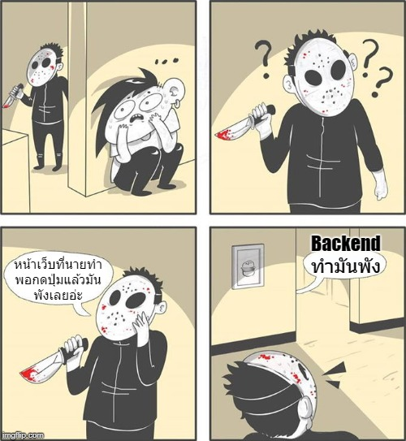

# 👶 ความรู้พื้นฐานในการทำเว็บ

ในบทความนี้จะเป็นการรวบรวม **`ความรู้ในการทำเว็บ`** ขั้นพื้นฐานสำหรับคนทำเว็บนะครัช ซึ่งถ้าเราเข้าใจเนื้อหาในส่วนนี้ มันจะช่วยให้เราแก้ปัญหาได้ไวและตรงจุดมากขึ้นนั่นเอง โดยเนื้อหาแต่ละส่วนจะแบ่งเป็นบทความย่อยๆลงไปนะ \(อัพเดทเมื่อไหร่ก็จะเอามาลงในบทความย่อยของหน้านี้แหละ\)

## 🤨 คอมมันคุยกันยังไง ?

เวลาที่คอม 2 เครื่องมันคุยกันจริงๆมีรายละเอียดยุบยิบเลย แต่สิ่งที่เราควรรู้คือ เวลาที่เรากดอะไรซักอย่างบนหน้าเว็บไป เช่นเข้าเว็บขอพร \(พรฮับ\) สิ่งที่จะเกิดขึ้นก็คือ **ตัวเรา \(client\)** จะส่งคำขอไปยัง**เซิฟเวอร์ \(server\)** ของเว็บตัวนั้น แล้วเซิฟเวอร์ก็จะให้พรกลับมา โดยทั้งหมดนี่เขาเรียกว่า **Request & Response** ตามรูปด้านล่างนั่นเอง

## 😒 รู้ไปทำไม ?

นั่นดิแต่ พร ที่ได้มันแหล่มมากเลยนะ! ไปๆเข้าเรื่อง ... ถ้าเราเข้าใจการทำงานของฝั่ง Client และ Server ว่าตอนมันคุยกันจริงๆมันทำงานยังไงได้ถูกต้อง เราก็จะสามารถทำเรื่อง security ได้ง่ายขึ้น รู้ว่าเวลามันรับส่งข้อมูลมันมีวิธีอะไรบ้าง และ ถ้ามันพังขึ้นมา เราจะรู้ได้ยังไงว่ามันพังเพราะฝั่งไหนทำพังนั่นเอง \(จะได้ด่าได้ถูกทีม 😂\) ดังนั้นไปลงรายละเอียดต่อนิดนุง

## 🔥 ลงลึกขึ้นอีกนิส

การที่ client ทำการส่งคำขอพร \(request\) ไปหาเซิฟเวอร์นั้น ตัว client เองจะสามารถ **`แนบข้อมูล`** ไปให้เซิฟเวอร์ได้ \(รายละเอียดของที่แนบไปได้มีเยอะม๊วก ดังนั้นขอเก็บไว้เป็นบทความย่อยนะ\)

ฝั่งเซิฟเวอร์เมื่อได้รับ request จาก client มันก็จะเอาข้อมูลที่แนบมา ไปประมวลผลต่อว่าจะให้พรอะไรกลับไปนั่นเอง พอมันเลือกได้แล้ว เซิฟเวอร์ก็จะส่งผลลัพท์ \(response\) ที่เหมาะสมกลับไป พร้อมกับสิ่งที่เรียกว่า **`Status code`** ด้วย

ซึ่งเจ้า Status code นี่แหละคือจุดเริ่มต้นที่ทุกคนต้องได้เจอ แม้ว่าจะเป็นแค่ผู้ใช้ธรรมดาก็เห็นจนชินตาเสียด้วยเชื่อมิ เพียงแค่เราอาจไม่รู้ตัวเท่านั้นเอง เช่นรูปนี้

หรือใครเข้า GitHub บ่อยๆ \(ไม่ใช่เว็บขอพรแล้วนะ แต่ฮับเหมือนกัน\) ก็อาจจะเคยเห็นรูปนี้อยู่บ้าง

ซึ่งเจ้า 2 รูปด้านบนนี่แหละคือส่วนหนึ่งของ Status code รหัส 404 นั่นเอง

## 🤔 Status codes คือไย ?

มันคือรหัสตัวเลขที่เกิดจากฝั่งเซิฟเวอร์ส่งกลับมาให้ client โดยมีวัตถุประสงค์ให้รู้ว่า **request ที่ส่งมานั้นเกิดอะไรขึ้น** นั่นเอง ซึ่งเราที่เป็น developer ถ้าเราอ่าน status code พวกนี้ออก มันจะช่วยทำให้เรารู้ได้ทันทีว่า ที่เว็บมันล่ม หรือ ทำงานไม่ได้ เกิดจากฝั่งไหนนั่นเอง แต่ว่าเจ้ารหัสนี้มีเยอะม๊วกกกกกกก จะไปนั่งไล่จำมันหมดก็ปวดกบาลเสียเปล่าๆ \(ผมคนนึงล่ะไม่นั่งท่องมันแน่ๆ\) แต่มันมีเคล็ดในการจำอยู่นั่นก็คือ **`จำตระกูล`** ของมันแทนไล่จำทีละตัว

โดยปรกติรหัส status codes ต่างๆจะเป็นตัวเลข 3 หลัก โดยตัวเลขตัวแรกก็คือ ตระกูล ของมันนั่นเอง ดังนั้นมาลองไล่ดูกันว่ามันมีตระกูลอะไรบ้าง และแต่ละตระกูคืออะไร รู้แล้วได้ประโยชน์ยังไง

### 1️⃣ ตระกูล 1xx \(Information\)

เป็นการบอกให้รู้ว่า เซิฟเวอร์ได้รับ request แล้ว แต่กระบวนการทำงานยังไม่จบ ดังนั้นตัว client ต้องรอไปก่อนนะ โดยรายละเอียดของตระกูลนี้มีตามนี้

| รหัส | ความหมาย |
| :--- | :--- |
| 100 | Continue |
| 101 | Switching Protocols |
| 102 | Processing |
| 103 | Checkpoint |

### 2️⃣ ตระกูล 2xx \(Successful\)

เป็นการบอกให้รู้ว่า request ที่ส่งมานั้น เซิฟเวอร์ได้รับและดำเนินการให้เรียบร้อยแล้ว วางใจได้ โดยรายละเอียดของตระกูลนี้มาตามนี้


เห็นตระกูลนี้ให้สบายใจหายห่วงได้ เพราะฝั่ง **Frontend** และ **Backend** คุยกันรู้เรื่องเรียบร้อย


| รหัส | ความหมาย |
| :--- | :--- |
| 200 | OK |
| 201 | Created |
| 202 | Accepted |
| 203 | Non-Authoritative Information |
| 204 | No Content |
| 205 | Reset Content |
| 206 | Partial Content |

### 3️⃣ ตระกูล 3xx \(Redirection\)

เป็นการบอกให้รู้ว่า request ที่ส่งมานั้น มันจำเป็นต้องไปทำงานที่อื่นให้เรียบร้อยก่อนถึงจะกลับมาทำงานตัวนี้ต่อได้ เช่น เวลาเรา login เว็บอื่นด้วย Facebook มันจะพาเราเด้งไปหน้า Facebook เพื่อให้เรา login ให้เสร็จก่อน ค่อยเด้งกลับมาที่หน้าเว็บนั้นอีกที \(แต่บางกรณีมันก็เด้งเราไปหน้าอื่นเฉยๆเลยก็เป็นได้\) โดยรายละเอียดของตระกูลนี้มีตามนี้

| รหัส | ความหมาย |
| :--- | :--- |
| 300 | Multiple Choices |
| 301 | Moved Permanently |
| 302 | Found |
| 303 | See Other |
| 304 | Not Modified |
| 306 | Switch Proxy |
| 307 | Temporary Redirect |
| 308 | Resume Incomplete |

### 4️⃣ ตระกูล 4xx \(Client Error\)

\(มาแล้วความหรรษา\) เป็นการบอกให้รู้ว่า Client เอ็งส่งบ้าอะไรขึ้นมาหาเซิฟเวอร์ฟระ เช่น ลืมใส่ header หรืออะไรก็ตามที่ไม่ตรงกับที่ตกลงกับฝั่ง Backend ไว้ โดยรายละเอียดของตระกูลนี้มีตามนี้


เวลาเจอ status code ในกลุ่มนี้ แสดงว่าฝั่ง Frontend ส่งอะไรบางอย่างมาแปลกๆ ไม่ตรงตามที่ Backend เตรียมไว้ให้ ดังนั้นไปตรวจที่ฝั่ง Frontend ได้เลย



บางทีฝั่ง Frontend ก็เขียนทุกอย่างถูกต้องตามที่คุยกันแล้ว แต่ทีม Backend ดันไม่ได้ทำตามที่คุย มันก็จะเกิด status code ตระกูลนี้ได้เหมือนกัน เช่น คุยกันว่าจะรับ parameter 2 ตัว เป็น GET นะ แต่ backend ดันไปเขียนเป็นรับ parameter 1 ตัว หรือดันไปเขียนเป็น POST แทนไรงี้


| รหัส | ความหมาย |
| :--- | :--- |
| 400 | Bad Request |
| 401 | Unauthorized |
| 402 | Payment Required |
| 403 | Forbidden |
| 404 | Not Found |
| 405 | Method Not Allowed |
| 406 | Not Acceptable |
| 407 | Proxy Authentication Required |
| 408 | Request Timeout |
| 409 | Conflict |
| 410 | Gone |
| 411 | Length Required |
| 412 | Precondition Failed |
| 413 | Request Entity Too Large |
| 414 | Request-URI Too Long |
| 415 | Unsupported Media Type |
| 416 | Requested Range Not Satisfiable |
| 417 | Expectation Failed |

### 5️⃣ ตระกูล 5xx \(Server Error\)

\(ถึงคราวตรูเอาคืนบ้างละ\) เป็นการบอกให้รู้ว่า ฝั่งเซิฟเวอร์ล่มนะจ๊ะ เพราะอะไรก็ตามแต่มันเกิด Exception ขึ้นในฝั่ง Backend นั่นเอง โดยรายละเอียดของตระกูลนี้มีตามนี้


เห็นโค้ดตระกูลนี้ให้วิ่งไปดูโค้ดฝั่ง **Backend** ได้เลยว่ามันเกิด Exception ที่ตรงไหน



ทีม **Frontend** ก็อย่าพึ่งวางใจ เพราะที่เขาล่มมันอาจจะเป็นที่เอ็งส่งอะไรแปลกๆไปหาเขาก็ได้ และทีม Backend จะรอให้แต่ทีม Frontend แก้ให้ก็ไม่ได้แม้เขาจะส่งแปลกๆมาให้ก็ตาม เพราะหน้าที่ของ Backend คือการไม่เชื่อใจ Frontend ดังนั้นสุดท้ายเอ็งก็ต้องไปเขียน Validation ไว้ด้วยเช่นกัน


| รหัส | ความหมาย |
| :--- | :--- |
| 500 | Internal Server Error |
| 501 | Not Implemented |
| 502 | Bad Gateway |
| 503 | Service Unavailable |
| 504 | Gateway Timeout |
| 505 | HTTP Version Not Supported |
| 511 | Network Authentication Required |

## 💖 สรุป

การที่เราเข้าใจการทำงานของ HTTP/HTTPS protocal มันจะช่วยทำให้เราทำงานได้ถูกต้องมากขึ้น และ ยิ่งเราเข้าใจรหัส Status codes ในแต่ละตระกูล ก็จะช่วยทำให้เรา \(ตามไปด่ามัน\) ตามไปเช็คจุดที่เกิด error ต่างได้เร็วขึ้นนั่นเอง


**โปรดระวัง**  
แม้ว่าตัว Status codes แต่ละตระกูลจะบอกชัดเจนอยู่แล้วว่ามันเกิดอะไรขึ้น แต่ก็ไม่ได้หมายความว่ามันจะถูกเสมอไป เช่นเราได้ status code กลับมาเป็นตระกูล 200 \(Successful\) มันอาจจะเกิดจากที่ทีม Backend เขียนโค้ดเปล่าๆเอาไว้ มันก็จะถือว่าทำงานไม่เกิดข้อผิดพลาดใดๆเช่นกันนะจ๊ะ


