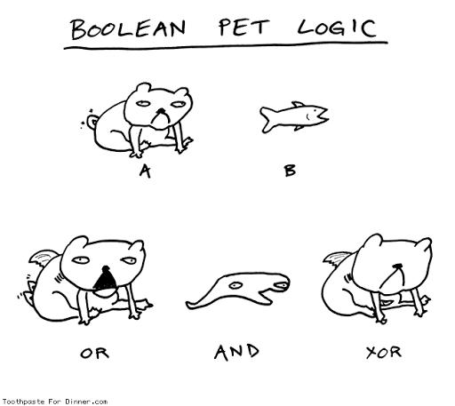

# 👽 Algorithm P & NP

จากบทความ [👾 **Algorithm Big-O**](https://www.saladpuk.com/beginner-1/data-structure-and-algorithm/big-o) น่าจะทำให้เหล่าแมวน้ำหลายคนตาสว่างขึ้นว่า **การเขียนโค้ดสั้นๆไม่ได้หมายความว่ามันจะเร็วกว่าโค้ดยาวๆเสมอไป** เพราะมันวัดกันที่จำนวน Execution ต่างหาก ดังนั้นในรอบนี้เราจะมาต่อกันให้จบพื้นฐานว่า **Algorithm มันลากยาวไปจนถึงเรื่องการทำ Security ได้ยังไง** และ **หัวใจของ Algorithm คืออะไร ?**


**แนะนำให้อ่าน**  
บทความนี้เป็นส่วนหนึ่งของบทความ [**👶 Data Structure & Algorithm**](https://www.saladpuk.com/beginner-1/data-structure-and-algorithm) หากเพื่อนๆสนใจอยากรู้ว่าเจ้า Algorithm มันคืออะไร คุ้มค่าเวลาชีวิตที่เราจะอ่านไหม  ก็สามารถศึกษาได้จากบทความหลักได้เลยโดยการคลิกที่ชื่อบทความสีฟ้าๆนั่นแหละ


## 🥱 **หารเลข ป.2**

รอบนี้เรามาลองหารเลขดูบ้าง โดยแมวน้ำมีคำถามว่า

> **ถ้าเราจะหารเลข 2 ตัว เรามีวิธีคิดแบบไหนได้บ้าง ?**  
> ตัวอย่าง 12 / 2 เราคิดยังไงให้ได้ผลลัพท์เป็น 6

จากโจทย์ด้านบน เราก็อาจจะคิดง่ายๆโดยการ **ลบซ้ำไปเรื่อยๆ** เช่น เราก็จะเอา 12 มาลบกัน 2 ไปเรื่อยๆจนกว่าจะลบไม่ได้ แล้วนับเอาว่าลบได้กี่ครั้ง ซึ่งก็จะได้ผลลัพท์เป็น 6 ตามด้านล่างนั่นเอง

> \(ครั้งที่ 1\) 12 - 2 = 10  
> \(ครั้งที่ 2\) 10 - 2 = 8  
> \(ครั้งที่ 3\) 8 - 2 = 6  
> \(ครั้งที่ 4\) 6 - 2 = 4  
> \(ครั้งที่ 5\) 4 - 2 = 2  
> \(ครั้งที่ 6\) ****2 - 2 = 0  
> ทำต่อไม่ได้ละ ดังนั้นตอบ 6 ยังไงล่ะจ๊ะ

เหมือนจะไม่มีไรเรยชิมิ? แต่เคยสงสัยไหมว่า **คอมมันหารเลขยังไงหว่า** 🤔 ??

ต่อให้เราเขียนโค้ดในระดับ Machine Language อย่าง Assembly สุดท้ายเรารู้อ่ะป่าวว่ามันไปทำงานยังไง?

## 🤨 คอมคิดเลขยังไง ?

> หัวข้อนี้กึ่งๆเป็นเกร็ดความรู้ เบื่อก็อ่านข้ามได้ แต่มันคือพื้นฐานการคำนวณของคอมพิวเตอร์เบย

จากเรื่องง่ายๆที่คนทำได้สบายๆ เชื่อไหมว่าคอมมันทำงานวุ่นวายกว่านั้นเยอะ เพราะ **คอมมันทำงานกับตัวเลขฐานสอง** หรือ **binary** \(0/1\) นั่นเอง ดังนั้นการคำนวณที่แท้จริงมันจะใช้พวก **Logic gate** ต่างๆ \( AND, OR, NOT บลาๆ\) เช่นเราจะสั่งให้ A + B มันก็จะต้องเอา 2 ค่านี้ไปเข้าวงจร เพื่อให้มันได้ผลลัพท์ออกมาตามรูปด้านล่าง

> อย่าพึ่งปิดหนีนะ 😭 แมวน้ำไม่ได้จะลงลึกของพวกนี้หรอก แต่อยากให้เข้าใจแนวคิดพื้นฐานก่อน แล้วจะถึงบางอ้อว่า หัวใจ Algorithm คืออะไรโดยไม่ต้องมานั่งจำอะไรเลย

ทีนี้เหล่าแมวน้ำก็รู้แล้วนะว่า **คอมมันใช้วงจรไฟฟ้าคิดเลข** ดังนั้นเครื่องคอมเลยมีแต่วงจรยั้วเยี๊ยไปหมดงุยล่ะ และถ้าเราอยากให้มันเก่งขึ้น เราก็จะเพิ่มวงจรให้เยอะขึ้น แต่สิ่งที่แลกมาก็คือ **มันจะร้อนขึ้น** + **กินไฟมากขึ้น** + **กินพื้นที่ใส่วงจรมากขึ้น** นั่นเอง


**เกร็ดความรู้**  
จากปัญหาความร้อน กินไฟบลาๆ ซึ่งแน่นอนว่าพวกวิศวะก็รู้เรื่องเหล่านี้ดี เขาเลยแบ่งตัวประมวลผล หรือ [**Microprocessor**](https://en.wikipedia.org/wiki/Microprocessor) ออกเป็น 2 ตระกูล

1. **\(CISC\) Complex Instruction Set Computer** - มีวงจรค่อนข้างเยอะ
2. **\(RISC\) Reduced Instruction Set Computer** - มีวงจรไม่เยอะ

แม้ว่า **RISC** จะมีวงจรที่น้อยกว่า แต่มันก็สามารถทำงานต่างๆได้แบบที่ CISC ทำนะ เพียงแต่มันต้องนำวงจรที่มันมี ไปใช้ต่อๆกันหลายๆรอบถึงจะได้คำตอบ ซึ่งข้อดีของ RISC ก็คือ มันจะใช้ไฟน้อยกว่า ดังนั้นเขาเลยนิยมใช้ตัวประมวลผลแบบ RISC เอาไปทำเป็นอุปกรณ์พกพายังไงล่ะ หรือชื่อหนึ่งที่เรามักจะคุ้นเคยนั่นก็คือ **สถาปัตยกรรมเออาร์เอ็ม \(ARM architecture\)** งุย


## 👾 P & NP

การหารเลขของคอมพิวเตอร์มันมีปัญหาหลายเรื่อง ซึ่งแมวน้ำขอไม่พูดถึง แต่ที่แน่ๆคือ **การหารเลขมันเสียเวลาเยอะม๊วกกก** \(กอไก่ล้านตัว\) **แต่คำตอบถูกพิสูจน์ได้เร็วมาก** อ่านแล้วอาจจะ งงๆ ไปดูตัวอย่างด้านล่างดีก่า

> จงหาคำตอบว่า 390 / 13 ได้เท่าไหร่เอ่ย ?

จากโจทย์ด้านบนถ้าให้คอมพิวเตอร์ไปหาคำตอบ มันจะใช้เวลานาน \(ในเชิงคอมพิวเตอร์\) แต่ถ้าเราบอกมันว่า ผลลัพท์คือ 30 เข้าไปปุ๊ป คอมมันจะตอบได้ทันทีเลยว่าคำตอบนั้นถูกหรือผิดภายในเวลาไม่นานนั่นเอง

> เพราะมันแค่นำ 13 x 30 ก็จะได้คำตอบเป็น 390 ดังนั้นคำตอบถูกต้องแน่นวล

แต่ในทางตรงกันข้ามถ้าจะให้คอมไปหาคำตอบว่า 390 / 13 ได้เท่าไหร่ล่ะก็ \(คิดแบบคนเข้าใจง่ายๆนะ\) ถ้าเอาแบบเด็กสุดก็นั่งท่องสูตรคูณแม่ 13 ตามด้านล่างเลยครัช

> 13 x 1 = 13  
> 13 x 2 = 26  
> 13 x 3 = 39  
> ...  
> 13 x 30 = **390 ! ได้คำตอบแล้วเฟร้ยยยย น้ำตาจิไหล**


**เกร็ดความรู้**  
คอมเวลาที่มันต้องหารเลขจริงๆ มันมีสิ่งที่เรียกว่า **Lookup table** หรือพูดแบบบ้านๆคือมันมี **ตารางแม่สูตรคูณ** นั่นแหละ เวลามีคนถามอะไรไป มันก็ไปหาจากตารางแม่สูตรคูณแล้วก็เอามาตอบ ก็จะไม่เสียเวลามากงุยล่ะ \(มันไม่ได้ทำแบบนี้เสมอไปนะ แมวน้ำจำไม่ได้ส่งคืนอาจารย์ไปหมดแล้ว ใครรู้เมนต์บอกด้วยกะดี\)


ก็น่าจะพอเห็นภาพแล้วนะว่า ถ้าต้องการหาคำตอบซักอย่างมันจะมีแบบ **ใช้เวลาสั้นๆก็ได้คำตอบ** และ **ใช้เวลาเยอะๆถึงได้คำตอบ** เราก็จะแบ่งระดับความซับซ้อนได้ง่ายๆ เป็น 2 แบบคือ

1. \*\*\*\*[**\(P\)**](https://en.wikipedia.org/wiki/P_%28complexity%29) **Polynomial** - ไม่ซับซ้อนมาก ใช้เวลาสั้นๆ
2.  [**\(NP\)**](https://en.wikipedia.org/wiki/NP_%28complexity%29) **Nondeterministic Polynomial** - ซับซ้อนม๊วก ใช้เวลานานม๊วก


**เกร็ดความรู้**  
ถ้าในใจอยากรู้ลึกๆในเรื่องการคำนวณของพวกนี้ สามารถเข้าไปอ่านต่อได้ในเรื่องของ [**Time complexity**](https://en.wikipedia.org/wiki/Time_complexity) ซึ่งระเอียดยิบเลย เช่น Zero-error Probabilistic Polynomial [**\(ZPP\)**](https://en.wikipedia.org/wiki/ZPP_%28complexity%29) ,  Randomized Polynomial [**\(RP\)**](https://en.wikipedia.org/wiki/RP_%28complexity%29)**,**  Bounded-error Probabilistic Polynomial [**\(BPP\)**](https://en.wikipedia.org/wiki/BPP_%28complexity%29),  Bounded-error Quantum Polynomial [**\(BQP\)**](https://en.wikipedia.org/wiki/BQP) เผื่อใครอยากไปดูปัญหาของควอนตัมไรงี้


จากที่เกริ่นมายาวเหยียดก็ได้เวลาเข้าสู่ประเด็นที่แมวน้ำจะพูดละ นั่นคือ . . .

### **🔥 Algorithm บางอย่างมันมีทั้ง P และ NP** 

นั่นหมายความว่าการคำนวณบางอย่างถ้า **ทำแบบโง่ๆมันก็จะช้า** แต่ถ้าเราคิดวิธี **ทำแบบฉลาดๆมันก็จะเร็ว** เช่นโจทย์ ป.6 ด้านล่าง

> **เลข 100 เป็นจำนวนเฉพาะหรือเปล่า? \(Prim number\)**  
> \(จำนวนเฉพาะคือ เลขที่ไม่มีใครสามารถหารมันได้ลงตัว ยกเว้น 1 กับตัวมันเอง เช่น 7 เป็นจำนวนเฉพาะ เพราะมีแค่เลข 1 กับ 7 เท่านั้นที่หารมันลงตัว\)

**Algorithm 1.ทำแบบไม่ได้คิดอะไรมาก** เราก็จะเอาเลขทั้งหมด 2, 3, 4, ... 99 ไปหารมันแล้วดูว่ามีตัวไหนหารมันได้หรือเปล่า ดังนั้นวิธีนี้แบบเลวร้ายสุดเราก็จะต้องจับหารไปเรื่อยๆ **98 ครั้ง** \(N-2\) ดังนั้นก็ค่อนข้างช้าอยู่

**Algorithm 2.ตัดเลขที่ไม่จำเป็นออก** ถ้าเราคิดต่อจากวิธีแรกดีๆเราก็จะรู้ว่า **เลขคู่** ไม่จำเป็นต้องนำไปหารก็ได้ เพราะเลข 2 สามารถหารเลขคู่ได้ทุกตัว ดังนั้นเราก็เอา 2, 3, 5, 7, 9, ... 99 ไปหารก็จะได้คำตอบเหมือนกัน ดังนั้นวิธีนี้จะเร็วกว่าวิธีแรกเท่าตัว เพราะมันทำแค่ **50 ครั้ง** \(N/2\)

**Algorithm 3.ตัดเลขที่ไม่มีทางหารมันได้ลงตัวออก** สุดท้ายถ้าเราเพ่งกสิณก็จะค้นพบว่า ถ้าเลขเกินช่วงนึงไปแล้วมันจะไม่มีทางเอาไปหารลงตัวได้เลย เช่นถ้าเกิน 50 ไปแล้วก็ไม่มีทางหาร 100 ลงตัวแน่ๆ ซึ่งจุดที่เอาไว้บอกว่าควระหยุดเมื่อไหร่นั่นก็คือ √N \(รูท 2 ของ N\) นั่นเอง ดังนั้นเราก็จะเอา 2, 3, 5, 7, 9 ไปหารก็พอ ซึ่งมันก็จะทำแค่ **5 ครั้ง**เท่านั้น

จากตัวอย่าง Algorithm ทั้ง 3 แบบเราก็จะพบว่า เรื่องการหาจำนวนเฉพาะ เราจะทำแบบ P หรือแบบ NP ก็ได้ ขึ้นอยู่กับเราคิดวิธีการคำนวณออกหรือเปล่าเท่านั้นเอง

### **🔥 Algorithm บางอย่างมีแต่แบบ NP เท่านั้น**

หมายความว่าโจทย์บางอย่าง เราไม่มีวิธีลัด ต้องค่อยๆทำไปเรื่อยๆเท่านั้นถึงจะได้คำตอบ แต่ในบางทีเราก็สามารถพิสูจน์ได้ว่าคำตอบนั้นถูกหรือไม่ด้วยการใช้ P ได้ เช่น ตัวอย่างการหารเลขด้านบน หรือ การทำ Digital Signature เราต้องใช้ขั้นตอนในการสร้างนาน แต่เราสามารถพิสูจน์ได้ง่ายๆว่าคนที่ sign key นั้นมี key จริงๆหรือเปล่านั่นเอง


**แนะนำให้อ่าน**  
สำหรับเพื่อนๆที่สนใจอยากเข้าใจเรื่อง Digital Signature สามารถไปอ่านต่อกันได้ที่บทความในลิงค์นี้เลยฮั๊ฟ [**👦 Security พื้นฐาน**](https://www.saladpuk.com/basic/security101)\*\*\*\*


## 👻 NP-completeness

เป็นสิ่งที่เขาเชื่อกันว่า Algorithm บางอย่าง ไม่มีทางที่เราจะลดรูปความซับซ้อน หรือ หาวิธีลัดใดๆได้เลย ดังนั้นถ้าใครจะแก้ Algorithm ประเภทนี้จะต้องนั่งถึกตะบี้ตะบันทำไปเรื่อยๆจนได้คำตอบนั่นเอง


**เกร็ดความรู้**  
อย่างที่บอกไปว่า NP-completeness เป็นแค่สิ่งที่อยู่ในทฤษฎีเท่านั้น ยังไม่มีคนสามารถพิสูจน์ได้ว่ามันมีของแบบนี้อยู่จริงหรือไม่ แต่ว่าหัวใจหลักของการทำ Security คือการทำสมการให้เป็น NP-completeness ตัวนี้แหละ เพราะเหล่าแฮกเกอร์จะต้องใช้เวลาในการถอดรหัสนานมากนั่นเอง ดังนั้นถ้ามีใครสักคนไปพิสูจน์ได้ว่า NP-completeness ไม่มีอยู่จริง มันจะทำให้ Security ทั่วโลกพัง เพราะมันหมายความว่า Algorithm ที่เราเชื่อว่ามันถอดรหัสยาก จริงๆแล้วไม่ได้ยากแบบนั้น แค่ยังไม่มีคนหารูปแบบการถอดรหัสที่อยู่ในรูปของ P เจอเท่านั้นเอง


## 🎯 บทสรุป

Algorithm คือบนโลกนี้แบ่งง่ายๆเป็น 2 อย่าง **\(P\) แก้ได้เร็ว** กับ **\(NP\) แก้ได้ช้า** ดังนั้นเวลาที่เราจะเลือกใช้ Algorithm อะไรก็ตาม เราอาจจะต้องดูความยากง่ายในการแก้ไขปัญหาของมันด้วย

และในทางตรงข้ามของที่แก้ได้ช้า NP ในบางทีก็สามารถพิสูจน์คำตอบได้แบบ P เร็วเช่นกัน ดังนั้นเราไม่จำเป็นต้องนั่งถึกทำกระบวนการเดิมซ้ำเพื่อตรวจคำตอบแบบ NP ก็ได้

