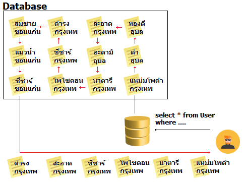
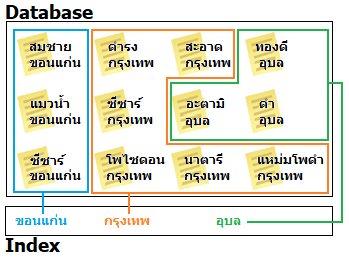
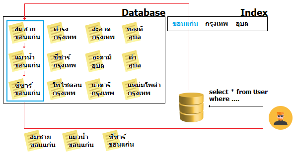

# Database indexing

## **😢 ปัญหา**

**ดช.แมวน้ำ** เชื่อว่าหลายคนที่ทำงานกับ database มาซักพัก ก็น่าจะมีความความรู้สึกว่า **เธอไม่เหมือนเดิม** ยิ่งนานวันยิ่งช้า ยิ่งอืด แข็งข้อบอกอะไรก็ไม่ค่อยจะยอมทำให้ และวันดีคืนดีก็หยุดทำงานไปดื้อๆซะอย่างนั้น แล้วเราจะแก้ปัญหาเหล่านี้ยังไงดีน๊าาาา \(ผมพูดถึง database ไม่ได้อ้างถึงเมียแต่ประการใด หยุดส่งไปหาเมียผมได้แล้ว 🤕\)


**แนะนำให้อ่าน**  
สำหรับใครที่ยังออกแบบ database ไม่เป็น ยัง งงๆ อยู่ว่าตารางนี้ควรจะเก็บอะไรดี หรือ Normalization คืออะไร? ความรู้ส่งคืนครูหมดแล้ว ก็สามารถไปศึกษาต่อได้จากลิงค์นี้เบยครัช [👶 **บทสรุปฐานข้อมูล**](https://www.saladpuk.com/beginner-1/database-design)\*\*\*\*


## 😄 วิธีแก้ปัญหา

สาเหตุที่ทำให้เกิดปรากฎการณ์ที่ว่ามา จริงๆมันมีหลายปัจจัยเลย แต่โดยพื้นฐานที่คนทั่วไปนิยมทำก็คือการทำ **`Database indexing`** นั่นเอง เพราะมันทำได้ง่าย ไม่ต้องพึ่งพาใคร ไม่ต้องเขียนโค้ดเพิ่ม และ มันเร็วขึ้นจริง


**แนะนำให้อ่าน**  
เรื่องการทำ database indexing มันเป็นแค่ตัวเลือกหนึ่งที่ช่วยให้มันเร็วขึ้นได้ แต่มันเป็นการแก้ไขปัญหาที่ปลายเหตุ ซึ่งพอผ่านไปซักพักใหญ่ๆ เดี๋ยวมันก็จะกลับมาช้าเหมือนเดิมแหละถ้าต้นสาเหตุของมันไม่ถูกแก้ไข ซึ่งถ้าเพื่อนๆสนใจอยากรู้ว่าปัญหามันเกิดจากอะไรได้บ้าง ลองไปศึกษาได้จากลิงค์นี้เบย  
  
[👦 **Bottlenecks of Software**](https://www.saladpuk.com/basic/bottlenecks)  
อยู่ๆแอพที่ทำก็ช้าเป็นเต่าเฉยเลย เกิดจากอะไรและแก้ไงดี ?  
  
[**หัวใจที่สำคัญที่สุดของฐานข้อมูล**](https://www.saladpuk.com/basic/bottlenecks/work-with-db)  
ความรู้เบื้องต้นของฐานข้อมูลที่โปรแกรมเมอร์ 90% ไม่รู้


## 🤔 มันช้าลงได้ไง ?

### 🔥 จุดเริ่มต้น

ในวันแรกที่เราสร้าง database ขึ้นมาใหม่ๆ สดๆ ซิงๆ มีข้อมูลอยู่น้อยๆข้างใน  ตามรูปด้านล่าง


คราวนี้ถ้าเราส่งคำสั่งไปดึงข้อมูล โดยเอาเฉพาะคนที่อยู่จังหวัดกรุงเทพออกมาดิ๊ ตามโค้ดด้านล่าง

```sql
selecte * from Users where จังหวัด = 'กรุงเทพ';
```

เมื่อเราสั่งให้มันทำงาน database ก็จะวิ่งเข้าไปที่ตาราง User เพื่อค้นหาข้อมูลที่มีจังหวัดเป็นกรุงเทพกลับมาให้ ดังนั้นเราก็จะได้ผลลัพท์กลับมาประมาณนี้


จุดที่น่าสนใจของเรื่องนี้ก็คือเจ้า database มันจะต้อง 🎯 **ไล่ดูข้อมูลตั้งแต่ตัวแรกยันตัวสุดท้าย** เพื่อลิสต์เอาเฉพาะข้อมูลที่ตรงตามเงื่อนไขส่งกลับมานั่นเอง ดังนั้นตัว database ของเราทุกคนจะทำงานได้ไวมากในช่วงแรกๆก็ไม่ใช่เรื่องแปลก เพราะ **ข้อมูลมันน้อย** ทำให้มันวิ่งไล่ตั้งแต่ไฟล์แรกยันไฟล์สุดท้ายได้ไวยังไงล่ะ

### 🔥  ความหฤหรรษ์บังเกิด

หลังจากที่เราใช้งานตัว database ไปได้ซักระยะ ตอบไม่ได้ว่านานแค่ไหน เพราะมันขึ้นอยู่กับ มันมีการเขียนไฟล์เยอะไหม? ไฟล์ใหญ่ใหม่? โค้ดที่เขียนกากหรือเปล่า? บลาๆ แต่ที่แน่ๆที่มันต้องเกิดกับทุกคนคือ **ข้อมูลมันเยอะขึ้น** ตามรูปด้านล่าง


จากรูปด้านบน บางคนอาจจะดูเหมือนไม่เยอะ แต่ถ้าผมให้คุณ**ลองหาข้อมูลเฉพาะที่อยู่ในกรุงเทพให้หน่อยดิ๊** ผมเชื่อว่าอย่างน้อยก็ใช้เวลา 3-5 วิ หรือมากกว่านั้นในการหาแน่นอน เพราะต้องกวาดตาไล่อ่านทีละอันชิมิ? ดังนั้น database ก็เช่นกัน เพราะ**ไม่ว่าข้อมูลจะมากจะน้อย มันก็ต้องไล่ตรวจทีละข้อมูลตั้งแต่ตัวแรกยันตัวสุดท้ายอยู่ดี**ยังไงล่ะ ตามรูปด้านล่างเลย



ลองจินตนาการง่ายๆ ว่าตัว database ของเราก็เหมือนกับสมุดโทรศัพท์หน้าเหลืองเล่นหนาๆซักเล่ม แล้วก็มีคนมาสั่งให้เราไปหาเบอร์โทร โรงพยาบาลสรรพสิทธิประสงค์ โดยไม่บอกเลยว่าอยู่จังหวัดไหนดู นั่นแหละงานช้างเลย เพราะเราก็ต้องไปไล่อ่านทีละบรรทัดว่า อันไหนเป็นโรงพยาบาล และ ต้องเป็นโรงพยาบาลที่ชื่อ สรรพสิทธิประสงค์ ด้วยนะ


**ลองคิดดู**  
ถ้ามันมีข้อมูลเป็นล้านๆข้อมูลล่ะ? ถ้าเราใส่เงื่อนไขที่ซับซ้อนมากขึ้นกว่านี้ล่ะ? ถ้าเราทำการ Join ตารางด้วยล่ะ? ถ้าเรา Transform data ด้วยล่ะ? \(พอๆชักเยอะ\) นี่แหละคือ **หนึ่งในสาเหตุที่ทำให้ฐานข้อมูลของเรามันช้าลงไปเรื่อยๆ** นั่นเอง


## 🤔 มันจะเร็วขึ้นได้ไง ?

จากที่ร่ายยาวมาทั้งหมดด้านบน ปัญหาของมันจริงๆก็คือ **ทุกครั้งที่มันต้องไปค้นหาข้อมูล มันจะต้องไปไล่ดูตั้งแต่ข้อมูลตัวแรกยันตัวสุดท้ายเสมอ** นั่นเอง แม้ว่าจะเป็นคำสั่งแบบเดิมเป๊ะๆก็ตาม

จากปัญหาที่ว่ามาแนวคิดในการแก้ปัญหาก็คือ **อย่าให้มันไปไล่หาแบบนั้นดิ** ดังนั้น การทำ Database indexing ก็จะมาช่วยจัดระบบเบียบในการค้นหาใหม่ ทำให้มันเข้าถึงข้อมูลที่มันต้องการได้เร็วขึ้นนั่นเอง ดังนั้นถ้าเรามีข้อมูลเยอะๆประมาณรูปด้านล่างนี้


เราก็แค่ทำการสร้าง indexing ให้กับตาราง Users ตามโค้ดด้านล่าง

```sql
CREATE INDEX idx_province ON Users (จังหวัด);
```

ซึ่งเจ้า indexing มันจะทำการแยกออกเป็นข้อมูลอีกชุดนึง โดยอ้างอิงจากข้อมูลที่มีในตาราง Users ตามรูปด้านล่าง


โดยทั้งหมดนี้เจ้ากลุ่ม Indexing ก็จะจำว่าข้อมูลแต่ละกลุ่มมันอยู่ตรงไหนบ้าง ตามรูปด้านล่าง



ดังนั้นเมื่อเราส่งคำสั่งให้มันไปค้นหาข้อมูล เฉพาะคนที่อยู่จังหวัดขอนแก่น ลงไปปุ๊ป เจ้า database ก็จะดูว่ากลุ่มของจังหวัดขอนแก่นอยู่แถวๆไหนบ้าง ซึ่งมันก็จะทำให้มันเร็วขึ้นเพราะมันไม่ต้องวิ่งไปไล่ตรวจข้อมูลตั้งแต่ตัวแรกยันตัวสุดท้ายอีกแล้วนั่นเองขอรับ




