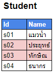
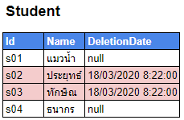
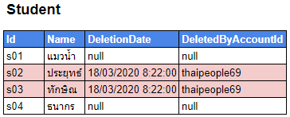
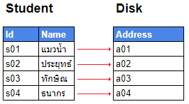
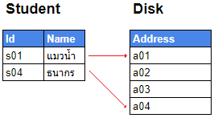

# การลบข้อมูล

## 😥 ปัญหา

บางทีข้อมูลที่เราลบไปแล้วก็ดันมีกรณีให้เราเอามันกลับมา และบางทีการลบข้อมูลก็ทำให้ database เร็วขึ้นและช้าลงได้ด้วยนะ แล้วเราจะแก้ยังไงหว่า ?


**แนะนำให้อ่าน**  
สำหรับใครที่ยังออกแบบ database ไม่เป็น ยัง งงๆ อยู่ว่าตารางนี้ควรจะเก็บอะไรดี หรือ Normalization คืออะไร? ความรู้ส่งคืนครูหมดแล้ว ก็สามารถไปศึกษาต่อได้จากลิงค์นี้เบยครัช [👶 **บทสรุปฐานข้อมูล**](https://www.saladpuk.com/beginner-1/database-design)


## 😄 วิธีแก้ปัญหา

แทนที่เราจะลบข้อมูลทิ้งทั้ง record จริงๆเราก็แค่ทำ **`Delete Flag`** ง่ายๆไว้แทนงุยล่ะ เช่น เรามีข้อมูลอยู่ในตารางประมาณนี้

![&#xE44;&#xE21;&#xE48;&#xE40;&#xE01;&#xE35;&#xE48;&#xE22;&#xE27;&#xE01;&#xE31;&#xE1A;&#xE01;&#xE32;&#xE23;&#xE40;&#xE21;&#xE37;&#xE2D;&#xE07;&#xE43;&#xE14;&#xE46;&#xE17;&#xE31;&#xE49;&#xE07;&#xE2A;&#xE34;&#xE49;&#xE19; &#xE23;&#xE32;&#xE22;&#xE0A;&#xE37;&#xE48;&#xE2D;&#xE17;&#xE31;&#xE49;&#xE07;&#xE2B;&#xE21;&#xE14;&#xE19;&#xE31;&#xE48;&#xE19;&#xE40;&#xE1B;&#xE47;&#xE19;&#xE0A;&#xE37;&#xE48;&#xE2D;&#xE40;&#xE1E;&#xE37;&#xE48;&#xE2D;&#xE19;&#xE46;&#xE2A;&#xE21;&#xE31;&#xE22;&#xE40;&#xE14;&#xE47;&#xE01;&#xE02;&#xE2D;&#xE07;&#xE41;&#xE21;&#xE27;&#xE19;&#xE49;&#xE33; &#xE0A;&#xE48;&#xE27;&#xE07;&#xE2B;&#xE31;&#xE14;&#xE27;&#xE48;&#xE32;&#xE22;&#xE02;&#xE49;&#xE32;&#xE21;&#xE41;&#xE2D;&#xE15;&#xE41;&#xE25;&#xE19;&#xE15;&#xE34;&#xE2A;&#xE01;&#xE31;&#xE19;](../../.gitbook/assets/db-delete01.png)

แล้วด้วยเหตุผลอะไรก็แล้วแต่ เรามีความจำเป็นต้องลบ records สีแดงทิ้งไป 2 ตัว ตามรูปด้านล่าง

เราก็แค่สร้าง **Delete Flag** ขึ้นมาช่วยในการลบซะ โดยแมวน้ำแนะนำว่าควรจะใช้ **`วันที่และเวลา`** เป็น flag นะจ๊ะ ตามรูปด้านล่าง

จากตารางด้านบน เมื่อเราอยากจะเอาไปใช้เราก็แค่ filter เอาเฉพาะตัวที่ DeletionDate = null ไปใช้เท่านั้นยังไงล่ะ ส่วนถ้าใครซีเรียสขึ้นอีกหน่อยก็อาจจะเก็บลงไปต่อด้วยว่า ใครเป็นคนลบข้อมูลพวกนี้ต่อได้อีกนะ ตามรูปดเานล่างเบย

เพียงเท่านี้ข้อมูลของเราก็จะไม่ได้หายไปจริงๆ แถมมี history record ที่เป็นประโยชน์ในการตรวจสอบย้อนหลังเพิ่มเข้ามาด้วยแล้วขอรับ และ ถ้าอยากจะย้อนสถานะกลับมาก็เพียงแค่กำหนดค่ากลับให้เป็น null ก็เป็นอันเรียบร้อย

## 🤕 ข้อควรระวัง 1

ตามบทความก่อนหน้าที่เคยบอกไปว่า **ยิ่งฐานข้อมูลใหญ่เท่าไหร่มันจะยิ่งช้า** ดังนั้นการทำแบบนี้สำหรับ database บางตัวและบางเวอร์ชั่น จะมีปัญหาในการทำแบบนี้ เพราะข้อมูลเราไม่เคยถูกลบเลยจริงๆจังๆนั่นเอง \(Relational Database จะมีปัญหากับเรื่องนี้เยอะกว่า NoSQL\) ดังนั้นเราควรมีการกำหนดเวลาลบข้อมูลที่ไม่มีการเคลื่อนไหวเป็นระยะเวลานานๆทิ้งไปด้วย


**ข้อควรระวัง**  
การลบข้อมูลในที่นี่หมายถึงการย้ายข้อมูลที่ไม่มีการเคลื่อนไหวเป็นระยะเวลานานๆ **ไปพักเก็บอีกที่** นะ ซึ่งเราเรียกข้อมูลพวกนั้นว่า Archive data เพราะวันดีคืนดี เราอาจจะต้องเอามันกลับมาใช้ก็ได้ เช่น ลูกค้าอยากจะดูรายการสั่งซื้อย้อนหลัง 10 ปีที่ผ่านมาไรงี้ ถ้าเราลบทิ้งทั้งหมดก็จบกัน และไม่ควรเก็บมันไว้ใน Hot data ด้วย



**เกร็ดความรู้**  
ข้อมูลที่มีอยู่ในระบบ ส่วนใหญ่เราจะแยกมันออกมาได้ 3 ประเภทตามด้านล่าง ซึ่งแต่ละประเภทก็จะมีการดูแลและความถี่ในการเรียกใช้งานที่ต่างกันครัช

* **Hot data** - ข้อมูลมีการเรียกใช้บ่อยๆ เช่น ข้อมูลที่แสดงในหน้ารายการสินค้า ส่วนใหญ่เราจะคุ้นเคยกับตัวนี้อยู่แล้ว
* **Cool data** - ข้อมูลถูกเรียกใช้ไม่ค่อยบ่อยเท่าไหร่ ส่วนใหญ่จะใช้สำหรับข้อมูลที่เก่าแต่ไม่เก่ามาก และ รวมถึงใช้เป็น backup data ด้วย
* **Archive data** - ข้อมูลที่ไม่ถูกเรียกใช้เลย ส่วนใหญ่เป็นข้อมูลที่เก่าม๊วกๆๆ เช่น ข้อมูลสั่งซื้อที่ผ่านมาแล้ว 1 ปี ซึ่งข้อมูลพวกนี้ถ้าเก็บไว้ใน cloud จะถูกม๊วกๆ แต่ถ้าจะเรียกใช้มันจะมีค่าใช้จ่ายที่เยอะกว่าปรกติ แถมต้องรอมันดึงข้อมูลอาจจะ 30 นาทีหรือเป็นชั่วโมงเลยก็ได้


ตามที่เขียนไว้ใน ข้อควรระวัง การลบมันจะต้องเป็นการย้ายจากที่นึงไปพักไว้อีกที่นึง **ไม่ใช่ลบทิ้งถาวร \(Hard delete\)** เพื่อเป็นการ backup เผื่อกรณีที่จำเป็นต้องเรียกใช้จริงๆนั่นเอง เพราะอย่าลืมว่าในสมัยนี้ ข้อมูลคือสิ่งที่สำคัญที่สุด ดังนั้นการมี data ไว้ก่อนย่อมดีกว่า \(ถ้าไม่ใช่ data ขยะ ส่วนเรื่อง fresh data ก็ว่ากันไปตามเรื่องอะนะ\) และอย่าลืมวางแผนคุยกันว่าจะย้ายจะลบอะไรบ้างนะ ไม่งั้นทีมตีกันตายแน่เลย

## 🤕 ข้อควรระวัง 2

การลบข้อมูลแบบถาวร \(Hard delete\) ในบางทีจะมีปัญหากับ **DBMS** ได้ เพราะตอนที่เราเขียนข้อมูล ตัวระบบมันจะจัดการให้ข้อมูลแต่ละอย่างมีการเรียงต่อกัน ซึ่งข้อมูลพวกนั้นตอนที่เอาไปเขียนลง physical disk จริงๆมันจะอยู่ address ใกล้ๆกัน ตามรูปด้านล่าง

แต่เมื่อเรามีการลบข้อมูลนั้น สิ่งที่เกิดขึ้นก็จะเป็นแบบในรูปด้านล่างนี้

ซึ่งจริงๆความหมายก็ไม่ได้มีอะไรผิดแปลกไปนะ แต่ตอนที่มันวิ่งไปอ่านข้อมูล ตัว OS มันจะต้องวิ่ง a01 แล้วกระโดดข้ามไปที่ a04 ยังไงล่ะ แถมถ้าเราเพิ่มข้อมูลเข้าไปใหม่ อีก 2 record มันอาจจะเกิดเป็นภาพนี้ก็ได้

ดังนั้นเรื่องการ delete record ไปเยอะๆ ก็จะทำให้เกิดปัญหาในการ access address เพราะมันจะต้องกระโดดข้ามไปอ่าน pointer ในแต่ละจุดไปๆมาๆนั่นเอง ดังนั้นเราก็ควรจะมีวาระในการจัดการ disk ของเราด้วยนะจ๊ะ

## 🤔 ทำแบบนี้มีข้อเสียป่าว ?

แน่นอนครับของทุกอย่างย่อมมีด้านมืดและสว่างในตัวมันเอง ดังนั้นวิธีการทำ Delete Flag แบบนี้ก็มีข้อเสียที่เจอได้บ่อยๆนั่นก็คือ

1. ชัดเจนที่สุดคือ **เปลืองพื้นที่** เพราะมันไม่ถูกลบออกไปจริงๆ
2. เวลาที่ดึงข้อมูลไปใช้เราจะต้องจัดการเอาตัวที่มี `Delete Flag` ออกก่อนเสมอ นั่นหมายความว่ามันจะต้อง**เปลือง Computing Power** มากขึ้น และ มีโอกาสผิดพลาดสูงขึ้นถ้าลืมกัน
3. การที่ข้อมูลไม่ถูกลบออกไปจริงๆ ทำให้**เกิดปัญหาเรื่อง Reservation** เช่น Username นี้จะไม่สามารถใช้ได้อีกเลย \(กรณีนี้ขึ้นอยู่กับ business requirements ว่าจริงๆมันควรจะเป็นยังไง\)
4. ในบางกรณีที่มี constrain ว่าลบแม่แล้วลูกต้องถูกลบตายตามกันไป ถ้าเราใช้ Delete Flag นั่นหมายความว่าเราต้องมั่นใจในการทำ **event sourcing** เพื่อตามไป Flag ตัวลูกด้วยนั่นเอง


**เครดิต**  
**ดช.แมวน้ำ** ต้องขอขอบคุณข้อแนะนำของท่าน [Pramoth Suwanpech](https://www.facebook.com/pramoth.suwanpech?comment_id=Y29tbWVudDoyOTk5ODc2ODMzMzY2Mzg2XzMwMDEyNzgxNzk4OTI5MTg%3D) ด้วยขอรับ ที่ช่วยชี้แนะว่าบทความนี้ตกเรื่องอะไรไป จุ๊ฟๆ 😘


