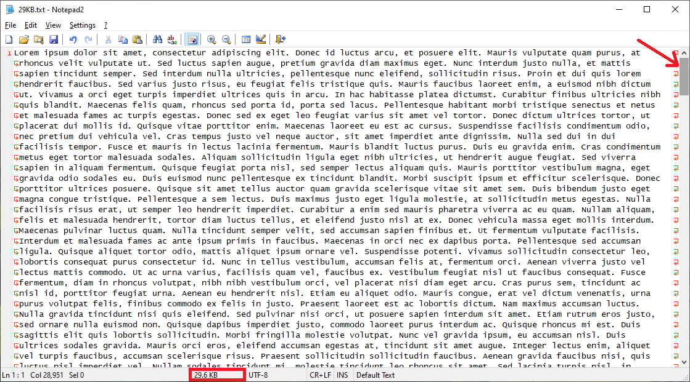
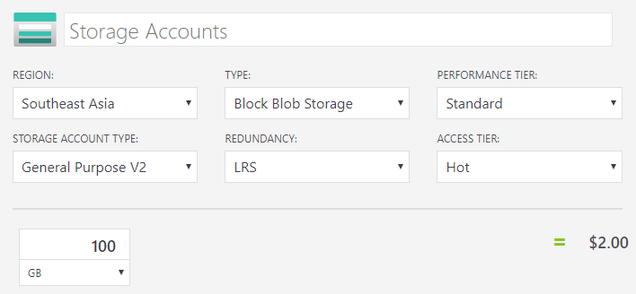
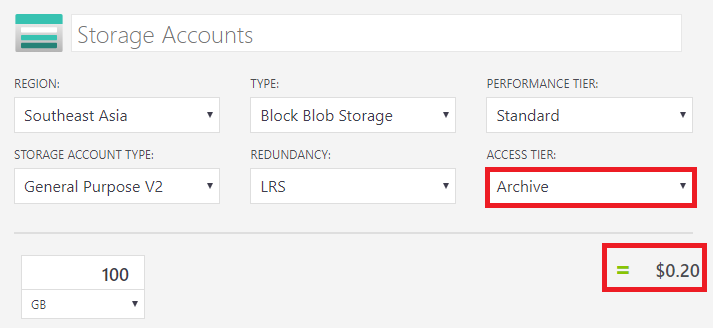

# เก็บรูปในฐานข้อมูล

## 😥 ปัญหา

เวลาที่ทำแอพอะไรก็ตาม แล้วมันต้องมีการเก็บรูปที่ผู้ใช้อัพโหลดเข้ามา **ดช.แมวน้ำ** แมวน้ำเจอบ่อยมากที่ **developer จะชอบเอาไฟล์รูปไปเก็บไว้ใน database ! 😱**  ซึ่งถามว่าทำได้ไหม? คำตอบคือทำได้ครับ แต่มันจะเหมาะสมหรือเปล่า? ในบทความนี้เราจะมาดูกันว่าจริงๆแล้วเราควรจะเก็บรูปยังไง? และ ทำไม?


**แนะนำให้อ่าน**  
สำหรับใครที่ยังออกแบบ database ไม่เป็น ยัง งงๆ อยู่ว่าตารางนี้ควรจะเก็บอะไรดี หรือ Normalization คืออะไร? ความรู้ส่งคืนครูหมดแล้ว ก็สามารถไปศึกษาต่อได้จากลิงค์นี้เบยครัช [👶 **บทสรุปฐานข้อมูล**](https://www.saladpuk.com/beginner-1/database-design)\*\*\*\*


## 🤔 เก็บรูปในฐานข้อมูลผิดตรงหนาย ?

ตามที่เกริ่นไปด้านบนว่า **มันก็เก็บได้นะ แต่ปรกติทั่วโลกเขาไม่เก็บไว้ในนั้นกัน** ส่วนสาเหตุหลักๆมาจาก 2 เรื่องตามด้านล่างเบย

### 💳 ค่าใช้จ่าย

ถ้าใครที่เคยจ่ายค่า database ด้วยตัวเองก็น่าจะพอทราบว่า **ขนาดความใหญ่ของฐานข้อมูล** ก็เป็นหนึ่งในปัจจัยที่ราคาจะถูกลงหรือแพงขึ้นด้วย ดังนั้นยิ่งเราทำให้ข้อมูลเราเล็กได้มากเท่าไหร่ เราก็จะประหยัดได้มากขึ้นเท่านั้นนั่นเอง

> ❓ มีน้องๆ developer หลายคนสงสัยกันต่อว่า แต่บางทีไฟล์รูปที่เก็บมันก็เล็กๆแค่ไม่มี 10KB เองนะ มันจะทำให้ฐานข้อมูลโตได้ยังไงอ่ะ ?

จากคำถามด้านบนผมลองเปรียบเทียบให้ดูง่ายๆแบบนี้ละกัน โดยสมมุติว่าผมต้องการจะเก็บรูปด้านล่างนี้เข้าฐานข้อมูล ซึ่งมันมีขนาดแค่ 29.6KB เพียงเท่านั้นเอง

ซึ่งก็จริงว่ามันก็ดูเหมือนจะไม่ได้ใหญ่โตอะไรเท่าไหร่เลยชิมิ? งั้นคราวนี้ผมจะลองสร้างไฟล์ text ที่มีขนาด 29.6KB ดูบ้างนะ ซึ่งมันก็จะประมาณรูปด้านล่างนี่แหละ ซึ่งลองสังเกต scroll bar ดูนะว่ามันยาวแค่ไหน

สำหรับใครที่ไม่จุใจอยากเบิกเนตรดูเต็มตาก็โหลดไฟล์ด้านล่างไปดูก็ได้



จากที่ว่ามาไฟล์ขนาด 29 KB ดูเหมือนว่ามันจะเล็กๆเอง แต่เมื่อเทียบกับปริมาณข้อมูลตัวอักษรแล้วเราจะพบว่า ตัวอักษรมันมีขนาดเล็กกว่ามากเบย ซึ่งจากรูปด้านบนผมว่าเอาไปเขียนหนังสือจบ 1 บทแน่ๆเลย


**เกร็ดความรู้**  
ตัวอักษรที่เราพิมพ์ๆกันอยู่นั้นมีขนาด 1 Byte เพียงเท่านั้นเอง


แล้วลองคิดดูว่าถ้าเราต้อง**เก็บไฟล์รูปเข้าไปในฐานข้อมูลสำหรับหรับทุก record เลย**มันจะเกิดอะไรขึ้น ? เอาง่ายๆนะแค่เราเก็บรูป Profile \(29.6KB\) ในตารางผู้ใช้ แล้วเรามีคนใช้งานระบบเราซัก 1,000 คน  พื้นที่ในฐานข้อมูลเราก็ใหญ่ราวๆ 30 MB ได้แล้ว

แต่ในทางกลับกันถ้าเราเก็บข้อมูลเป็น text อย่างเดียว ผมเชื่อว่ามันเก็บข้อมูลผู้ใช้ได้น่าจะราวๆ 5 แสนถึง 1 ล้าน คนแน่นอน \(ขึ้นอยู่กับเก็บอะไรบ้าง\)


**มุมชวนคิด**  
เพียงแค่เราเก็บรูปโปรไฟล์ของผู้ใช้ 1,000 คนลงในฐานข้อมูล เราก็จะต้องจ่ายเงินเท่ากับเรามีผู้ใช้ 5 แสนถึง 1 ล้านคนละ \(แพงขึ้น 100~1,000 เท่า+\) รูปโปรไฟล์มันสำคัญขนาดนั้นเลยเหรอ? และถ้าเรามีผู้ใช้ 1 ล้านคนล่ะ ? \(มันก็จะโตขึ้น 30 GB เลยนะ!! นี่มันเก็บหนังได้กี่เรื่องฟร๊าา 😱\)


ลองมาดูราคาที่แท้จริงกันดีกว่า สมมุติว่าเรามีฐานข้อมูลขนาด 100 GB เราจะต้องจ่ายสูงสุดปรมาณ $ 25 USD ตามรูปด้านล่าง

### 💨 Performance

ทำไมการเก็บไฟล์รูปลงฐานข้อมูลถึงส่งผลให้ **ประสิทธิภาพตกลง** นะเหรอ? นั่นก็เพราะว่า**ตัวฐานข้อมูล \(ส่วนใหญ่\) มันถูกออกแบบมาให้ทำงานกับข้อมูลที่เป็น Simple type** ยังไงล่ะ เช่น ตัวอักษร, ตัวเลข, true/false, วันที่และเวลา ไรพวกนี้ ซึ่งไฟล์รูปที่เก็บอยู่ใน database มันก็ทำงานด้วยได้นะ แต่ข้อมูลพวกนั้นมันจะไม่รู้เรื่องเพราะไฟล์รูปมันอยู่ในรูปแบบของ bytes ยังไงล่ะ และมันก็จะเป็นภาระเวลาที่เราดึงข้อมูลออกมาใช้งานด้วย เช่น แค่จะไปดึงข้อมูลผู้ใช้ออกมา มันก็ต้อง**ไปดึงข้อมูลรูปพวกนั้นขึ้นมาอัดไว้ใน Memory ซึ่ง RAM มันมีจำกัดและราคาแพงม๊วกกกกกกก** แถมยังก่อให้เกิดปัญหาเวลาที่เราส่งข้อมูลกลับไปให้ client ด้วย เพราะมันจะ**เปลือง network bandwidth อีกด้วย** ลองดูราคาด้านล่างเอาละกัน หรือจะไปดูราคาเต็มๆของเซิฟเวอร์ทั้งหมดได้ที่ลิงค์นี้ [**Microsoft - VM Pricing**](https://azure.microsoft.com/en-us/pricing/details/virtual-machines/windows/)\*\*\*\*


**แนะนำให้อ่าน**  
แนวคิดพื้นฐานในการทำงานกับ database ที่เหล่าโปรแกรมเมอร์บ้านเราไม่ค่อยรู้ ไปอ่านแล้วทำความเข้าใจได้จากบทความนี้ เพราะมันโคตรสำคัญ ไม่งั้นต่อให้ทำทุกอย่างดีแค่ไหน แต่เรื่องนี้เรื่องก็ทำให้ระบบอืดจนเต่าแซงหน้าได้ [**หัวใจที่สำคัญที่สุดของฐานข้อมูล**](https://www.saladpuk.com/basic/bottlenecks/work-with-db) \(🤔 ความรู้เบื้องต้นของฐานข้อมูลที่โปรแกรมเมอร์ 90% ไม่รู้\)


## 😄 วิธีแก้ปัญหา

ก็น่าจะพอเห็นภาพความบาปในการเก็บไฟล์รูปในฐานข้อมูลแล้วนะ วิธีการแก้กรรมหนักนี้คือการไปทำบุญล้างป่าช้า เพื่อนำเหล่าไฟล์ภาพออกจากฐานข้อมูลของเราไปเก็บไว้ในที่ชอบๆของมันนั่นเอง \(ซี๊ดดดดดด กาวยี่ห้อใหม่ใช้ดี\)

ซึ่งจากที่ว่ามาทั้งหมดเราก็พอจะรู้แล้วว่า **ฐานข้อมูลไม่ใช่ที่เก็บไฟล์รูป** ดังนั้นเราก็ควรจะย้ายไฟล์รูปทั้งหมดไปไว้ในที่ๆสมควรของมันนั่นเอง และ **ฐานข้อมูลควรจะเก็บข้อมูลที่เป็น Simple type ดังนั้นเราก็แค่เก็บ URL ของไฟล์รูป**พวกนั้นก็เป็นอันเสร็จสิ้นแล้วนั่นเอง

### 🤔 แล้วจะเก็บรูปไว้ที่ไหน ?

> จะเก็บไว้ที่ไหนก็แล้วแต่ความสะดวกของแมวน้ำแต่ละตัว เช่น จะเก็บไว้ในเซิฟเวอร์ตัวเอง หรือ จะเอาไปไว้พวกเว็บฝากไฟล์ก็ได้ ขอแค่เราได้ URL ที่สามารถเข้าถึงได้ก็พอ \(ส่วนเรื่อง privacy ก็จัดการกันเอาเองนะ\)

ถ้าปิดจบแบบด้านบนก็ดูเหมือนจะใจร้ายไปหน่อยเอาเป็นแบบนี้ละกัน โดยปรกติ **ดช.แมวน้ำ** จะเก็บไฟล์ไว้ใน **Cloud Service** เพราะมันถูกม๊วก และสามารถควบคุมสิทธิ์และ privacy ได้แบบถึงลูกถึงคนเลย ชนิดที่ว่า Hack ไม่เข้าแน่นอน จะหลุดก็ต่อเมื่อเราเป็นคนตั้งค่าผิดกับมือเอง ส่วนเรื่องราคาก็ตามรูปด้านล่าง สมมุติว่าเก็บไฟล์ 100 GB ไว้ทั้งเดือนก็จ่ายแค่ $2 USD \(60-70 บาท\) เท่านั้นเอง

แต่ถ้าเป็นไฟล์ที่นานๆๆๆครั้งจะมาเปิดดู ก็จะยิ่งถูกลงไปกว่านั้นได้อีก 100 GB จ่ายแค่ $0.2 USD \(6~7 บาท\) ต่อเดือนเท่านั้นเอง ตามรูปด้านล่างเบย


**แนะนำให้อ่าน**  
สำหรับเพื่อนที่สนใจตัวเก็บไฟล์ตัวนี้ว่าจะใช้งานยังไงทำอะไรได้บ้าง ก็สามารถไปศึกษาต่อได้จากบทความนี้เลยครัช [**Blob storage**](https://www.saladpuk.com/cloud/azure-storage/blobs) ซึ่งมันเป็นส่วนหนึ่งของคอร์ส [**👶 Azure Storage**](https://www.saladpuk.com/cloud/azure-storage) ถ้าสนใจดูเนื้อหาของคอร์สทั้งหมดก็กดที่ชื่อไปดูได้เบย


## 🎯 สรุป

โดยรวมการทำงานกับฐานข้อมูลคือ ใช้งานมันให้ถูกวิธี และ ข้อมูลก็ต้องเก็บให้ถูกตามความถนัดของมันด้วย เพราะตัว database จริงๆมันเก่งและเร็วมาก ถ้าเราใช้งานมันได้ถูกต้อง ส่วนใหญ่ที่มีปัญหาคือใช้งานมันไม่ถูก ดังนั้นแนะนำให้เพื่อนๆไปอ่าน Best Practices ของตัว database ที่ตัวเองใช้อยู่ด้วย ถึงจะสามารถรีดความสามารถมันออกมาได้เต็มประสิทธิภาพอย่างแท้จริง


**แนะนำให้อ่าน**  
ถ้าสงสัยว่าทำไมแอพมันช้าลองไปทำความเข้าใจเรื่อง คอขวด ของระบบจากบทความด้านล่างนี้ดู แล้วจะเข้าใจว่าผองเพื่อนของความช้านั้น เกิดจากอะไรได้บ้างครัช  
[👦 **Bottlenecks of Software**](https://www.saladpuk.com/basic/bottlenecks)\*\*\*\*


