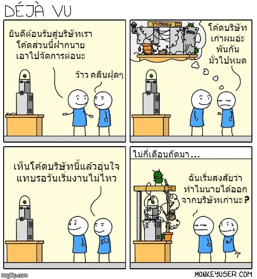

# บังคับคลีนโค้ดทำไมฟระ ?

โค้ดคือส่วนหนึ่งที่ทำให้ซอฟต์แวร์เกิดขึ้นมาได้ และ Developer หลายๆคนก็ไม่ได้สนใจคุณภาพของโค้ดที่ตัวเองเขียนสักเท่าไหร่ เพราะหลายคนคิดว่า "**ถ้าส่งงานเก็บเงินได้ก็ถือว่าเป็นอันจบกัน"** \(น่าเสียดายงานส่วนใหญ่ในประเทศอุ๊งๆของเราเป็นแบบนี้\) ซึ่งจะคิดแบบนั้นก็ไม่ได้ผิดอะไรนะ แต่แมวน้ำอยากเตือนไว้ว่า

> **แนวคิดลักษณะนี้มันจะทำลายอาชีพ Programmer ของคุณในระยะยาว เพราะมันฝึกให้ตัวคุณทำงานแบบเด็กจบใหม่ทำ และมันจะบ่มนิสัยการเขียนโค้ดที่มืออาชีพเขาไม่ทำกัน**

เพราะแนวคิดนี้มันจะทำให้เรามุ่งเน้นไปที่ **"การสร้างซอฟต์แวร์เพื่อเอาไปขาย"** และเมื่อขายได้ก็ไปสร้างตัวใหม่เพื่อขายต่อไปเรื่อยๆ ดังนั้นมันจะ "**มุ่งไปที่ความเร็วในการผลิตซอฟต์แวร์"** นั่นเอง

แต่เชื่อไหมว่า **"ตัวชีวัดการอยู่รอดของบริษัทซอฟต์แวร์กลับไม่ใช่การสร้างซอฟต์แวร์"** แต่มันกลับเป็นเรื่องการ **"ปรับปรุงรักษา"** ต่างหาก ซึ่งเรื่องนี้แหละทำให้บริษัทที่ไม่ได้เข้าใจเรื่องนี้ส่วนใหญ่จะต้องปิดตัว \(ผลวิจัยคือ 80% ของบริษัทซอฟต์แวร์ที่ไม่เข้าใจเรื่องนี้จะปิดตัวลง\)

### 💖 **หัวใจหลักของซอฟต์แวร์คืองานเซอร์วิส**

ถ้าเราแอบไปดูใหญ่ๆที่ทำซอฟต์แวร์ที่เรารู้จักเราจะพบว่า รายได้หลักของบริษัทจะเกิดจากการเซอร์วิสซอฟต์แวร์ตัวเดิมๆ มากกว่าการสร้างซอฟต์แวร์ตัวใหม่ เพราะรายได้ในระยะยาวของซอฟต์แวร์คือการเซอร์วิสโดยเน้นที่กินยาวๆนั่นเอง \(Microsoft, Google, Facebook แม้ว่าจะมี product ใหม่ๆออกมา แต่ตัวที่เป็นพระเอกทำเงินก็ตัวเดิมๆแหละ\)

### 🤔 แล้วทำไมบริษัทส่วนใหญ่ถึงไม่รอด ?

ก็อย่างที่บอกไปว่ารายได้หลักของงานซอฟต์แวร์คือการกินงานเดิมไปยาวๆ ดังนั้นเราต้องมีการปรับปรุง พัฒนาความสามารถใหม่ๆให้กับมันไปเรื่อยๆ แต่ถ้าเราสร้างซอฟต์แวร์ขึ้นมาจากโค้ดที่ไม่ได้คิดถึงเรื่องเหล่านี้ สุดท้ายเรื่องเล็กๆน้อยๆพวกนั้นก็จะพอกเป็นหางแมวน้ำ ทำให้เราจมอยู่กับ **Technical debt** จนเราไม่สามารถไปเซอร์วิสอะไรได้อีกต่อไป และหนึ่งในแม่ทัพใหญ่เจ้าปัญหาก็คือการคลีนโค้ดนี่แหละ เพราะโค้ดที่พันกันมั่วซั่วเป็นสปาเก็ตตี้ มันไม่มีทางที่จะสามารถปรับปรุงแก้ไขได้ง่าย แถมเพิ่มความสามารถใหม่ๆก็ยากอีกด้วยนั่นเอง


**แนะนำให้อ่าน**  
[ปัญหาที่ใหญ่ที่สุดในการทำซอฟต์แวร์](https://www.saladpuk.com/v/tips/why-software-fail)


### 🤔 ทำไงถึงจะแก้นิสัยพวกนี้ได้ ?

**ลองหันมารักโค้ดของคุณดูดิ !** \(ผมไม่ได้เมานะ\) เพราะโค้ดมันเป็นกระจกสะท้อนตัวคุณตลอดเวลาแหละ โค้ดที่มีระเบียบ มี consistency ที่ดี มีการออกแบบ และ การใส่ใจที่ดี มันก็บ่งบอกได้ในระดับหนึ่งว่าคุณเป็นคนยังไง \(บางที่แค่เห็นโค้ดก็รับเขาทำงานแล้ว เพราะโค้ด = ตัวคุณ\) หรือให้ลองคิดง่ายๆว่า การเขียนโค้ดมันก็เหมือนกับการเขียนนิยายดีๆซักเรื่องหนึ่ง ที่รอคนมาเปิดอ่าน แค่เราใส่ใจ ใส่ความรู้สึกว่าจะทำยังไงให้มันดีขึ้นให้ได้มากกว่านี้ เพียงแค่เรามี Mindset แบบนี้เชื่อผมเถอะว่า โค้ดปีนี้กับปีหน้ามันจะต่างกันจนคิดว่าเป็นคนละคนเขียนเลย เพราะ มีแต่ Professional เท่านั้นแหละที่ใส่ใจรักในลูกที่เขาสร้างขึ้นมา และสิ่งที่ได้มันจะเกิดขึ้นอัตโนมัติทุกอย่าง เหมือนกับการหายใจเลย

### **บทความสอนการจัดการโค้ด**

* [👶 Clean Code](https://www.saladpuk.com/basic/clean-code)
* [👶 Code Smells](https://www.saladpuk.com/basic/code-smells)
* [👶 สิ่งที่คนเขียนโค้ดมักเข้าใจผิด](https://www.saladpuk.com/basic/mist)
* [👦 Test-Driven Development](https://www.saladpuk.com/software-testing/tdd101)


**แนะนำให้อ่าน**  
[Clean Coder Blog](https://blog.cleancoder.com/uncle-bob/2012/08/13/the-clean-architecture.html) เป็น blog ของหนึ่งในมหาเทพของวงการซอฟต์แวร์ของโลก ที่สอนในเรื่องการออกแบบ และอื่นๆอีกมากมาย ซึ่งเรียกได้ว่าถ้าอยากเป็น Professional ในวงการก็ต้องเรียนรู้จากคนนี้แหละ


