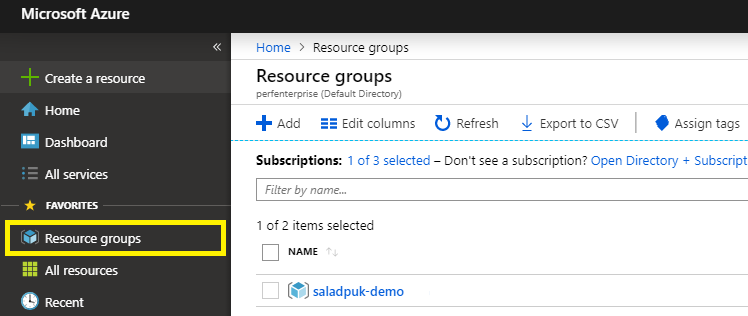

# 👶 Azure Bot Service

ในคอร์สนี้เราจะมาพูดถึงการเขียน **Bot** กัน ซึ่งหลายๆคนที่ได้เคยเห็น Chat Bot ก็อาจจะอยากมีเป็นของตัวเองบ้างไรงี้ ส่วนสำหรับคนที่ไม่รู้ว่าเจ้านี่คืออะไรเลย ผมอธิบายให้เห็นภาพง่ายๆว่า เราสามารถเขียนระบบโต้ตอบอัตโนมัติกับผู้ใช้ได้ เพื่อเอาไว้ช่วยเหลือผู้ใช้จากคำถามที่เจอบ่อยๆได้ หรือแม้กระทั่งช่วยงานเราในการจัดซื้อสินค้าไรงี้ ดังนั้นในรอบนี้เราจะมาเรียนรู้เจ้าสิ่งที่ชื่อว่า **Azure Bot Service** กันครับ

## 🤔 Bot ทำอะไรได้บ้าง ?

คำตอบมันเยอะจนไม่รู้จะเลือกตอบยังไงดีเลย เอาเป็นว่า **Bot** มันสามารถ **`พูดคุยกับเราได้`** **`เข้าใจบทสนทนาได้`** **`ตัดสินใจจากข้อมูลที่มี`** **`ค้นหาข้อมูล`** บลาๆ ดังนั้นถ้าถามว่ามันทำอะไรได้บ้าง คำตอบคือ ของที่ผม highlight ไว้เราสามารถเอามาประกอบกันแล้วอยากให้ bot เราทำอะไรก็ได้ เช่น ช่วยตอบคำถามลูกค้า หรือ จะให้เป็นเลขาเราแบบจาวิสในไอรอนแมนก็ทำได้ เพราะ bot มันมีความสามารถในการทำงานร่วมกับ service อื่นๆของคลาว์ทุกเจ้านั่นเอง เช่นทำงานร่วมกับ AI เพื่อช่วยวิเคราะห์ว่าหุ้นตัวไหนน่าสนใจไรงี้

 ตัวอย่างที่เห็นกันบ่อยๆคือทำ Chat Bot เอาไว้ช่วยอำนวยความสะดวกต่างๆ หรือ เป็นเลขาส่วนตัว มันง่ายมากจนเด็กก็ทำได้เชื่อไหม ?


สาเหตุที่ Bot มันเก่งเพราะมันสามารถทำงานร่วมกับ service ต่างๆได้นั่นเอง


## 🤔 แพงไหม ?

มีทั้งตัวเสียเงินและตัวไม่เสียเงิน ซึ่งถ้าเราอยากลองวิชาก็ลองเล่นฟรีได้เลยครับ

| CHANNEL | FREE | S1 |
| :--- | :--- | :--- |
| Standard | ไม่จำกัด | ไม่จำกัด |
| Premium | 10,000 ข้อความ/เดือน | $0.50 USD ต่อ 1,000 ข้อความ |

## 🤔 สนใจละ เริ่มไง ?

การสร้าง Chat Bot ทำได้หลายวิธีเลย แต่อันแรกที่อยากแนะนำคือทำผ่าน **Azure Portal** ครับ ส่วนวิธีสร้างแบบอื่นๆลองดูจากลิงค์ด้านล่างเอาต่อนะครับ


**Azure Portal**  
เนื้อหาในรอบนี้จะต้องเข้าไปที่ทำที่เว็บ [https://portal.azure.com](https://portal.azure.com) นี้นะครับ ซึ่งเราต้องสมัครสมาชิกก่อนด้วย ส่วนถ้าใครยังไม่ได้สมัครก็ไปสมัครให้เรียบร้อยแซ๊ร [\(วิธีสมัครจิ้มตรงนี้\)](https://saladpuk.gitbook.io/learn/cloud/azure101/register)


1.หลังจากที่ Login เข้ามาละ ที่เมนูด้านซ้ายมือให้เลือก **`+ Create a resource`** ซะ แล้วเมนูในหน้าตรงกลางให้เลือก **`AI + Machine Learning`** แล้วจะเห็น **`Web App Bot`** ให้จิ้มมันเข้าไปเบย


2.ถัดมาเขาก็จะขอให้เราใส่รายละเอียด **Web App Bot** ที่จะสร้าง ดังนั้นก็ใส่ๆข้อมูลไปครับ รายละเอียดแต่ละช่องคืออะไรอยู่ด้านล่างครับ 

<table>
  <thead>
    <tr>
      <th style="text-align:left">&#xE0A;&#xE37;&#xE48;&#xE2D;</th>
      <th style="text-align:left">&#xE23;&#xE32;&#xE22;&#xE25;&#xE30;&#xE40;&#xE2D;&#xE35;&#xE22;&#xE14;</th>
    </tr>
  </thead>
  <tbody>
    <tr>
      <td style="text-align:left">Bot name</td>
      <td style="text-align:left">&#xE0A;&#xE37;&#xE48;&#xE2D; Bot service &#xE02;&#xE2D;&#xE07;&#xE40;&#xE23;&#xE32;</td>
    </tr>
    <tr>
      <td style="text-align:left">Resource group</td>
      <td style="text-align:left">
        <p>&#xE08;&#xE30;&#xE2A;&#xE23;&#xE49;&#xE32;&#xE07;&#xE44;&#xE27;&#xE49;&#xE43;&#xE19;
          resource group &#xE44;&#xE2B;&#xE19;</p>
        <p>(&#xE16;&#xE49;&#xE32;&#xE44;&#xE21;&#xE48;&#xE21;&#xE35;&#xE43;&#xE2B;&#xE49;&#xE01;&#xE14;
          Create new &#xE40;&#xE25;&#xE22;&#xE04;&#xE23;&#xE31;&#xE1A; &#xE41;&#xE25;&#xE49;&#xE27;&#xE40;&#xE25;&#xE37;&#xE2D;&#xE01;&#xE40;&#xE1B;&#xE47;&#xE19;
          Southeast Asia)</p>
      </td>
    </tr>
    <tr>
      <td style="text-align:left">Location</td>
      <td style="text-align:left">
        <p>&#xE08;&#xE30;&#xE2A;&#xE23;&#xE49;&#xE32;&#xE07; Bot &#xE44;&#xE27;&#xE49;&#xE17;&#xE35;&#xE48;&#xE40;&#xE0B;&#xE34;&#xE1F;&#xE40;&#xE27;&#xE2D;&#xE23;&#xE4C;&#xE42;&#xE0B;&#xE19;&#xE44;&#xE2B;&#xE19;</p>
        <p>(&#xE16;&#xE49;&#xE32;&#xE40;&#xE23;&#xE32;&#xE25;&#xE2D;&#xE07;&#xE40;&#xE25;&#xE48;&#xE19;&#xE43;&#xE19;&#xE44;&#xE17;&#xE22;&#xE43;&#xE2B;&#xE49;&#xE40;&#xE25;&#xE37;&#xE2D;&#xE01;
          Southeast Asia &#xE04;&#xE23;&#xE31;&#xE1A;&#xE40;&#xE23;&#xE47;&#xE27;&#xE14;&#xE35;)</p>
      </td>
    </tr>
    <tr>
      <td style="text-align:left">Pricing tier</td>
      <td style="text-align:left">
        <p>&#xE23;&#xE32;&#xE04;&#xE32;&#xE15;&#xE48;&#xE2D;&#xE40;&#xE14;&#xE37;&#xE2D;&#xE19;
          &#xE2D;&#xE22;&#xE32;&#xE01;&#xE14;&#xE39;&#xE23;&#xE32;&#xE22;&#xE25;&#xE30;&#xE40;&#xE2D;&#xE35;&#xE22;&#xE14;&#xE01;&#xE14;
          View full pricing details &#xE44;&#xE14;&#xE49;&#xE19;&#xE30;</p>
        <p>&#xE15;&#xE31;&#xE27;&#xE19;&#xE35;&#xE49;&#xE16;&#xE49;&#xE32;&#xE40;&#xE23;&#xE32;&#xE25;&#xE2D;&#xE07;&#xE27;&#xE34;&#xE0A;&#xE32;&#xE40;&#xE09;&#xE22;&#xE46;&#xE43;&#xE0A;&#xE49; <b>F0 </b>&#xE04;&#xE23;&#xE31;&#xE1A;&#xE44;&#xE21;&#xE48;&#xE40;&#xE2A;&#xE35;&#xE22;&#xE15;&#xE31;&#xE07;&#xE40;&#xE25;&#xE22;</p>
      </td>
    </tr>
    <tr>
      <td style="text-align:left">Bot template</td>
      <td style="text-align:left">
        <p>&#xE40;&#xE23;&#xE32;&#xE08;&#xE30;&#xE40;&#xE02;&#xE35;&#xE22;&#xE19;
          bot &#xE14;&#xE49;&#xE27;&#xE22;&#xE20;&#xE32;&#xE29;&#xE32;&#xE2D;&#xE30;&#xE44;&#xE23;
          &#xE41;&#xE25;&#xE30;&#xE08;&#xE30;&#xE43;&#xE2B;&#xE49;&#xE43;&#xE2A;&#xE48;&#xE15;&#xE31;&#xE27;&#xE2D;&#xE22;&#xE48;&#xE32;&#xE07;&#xE41;&#xE1A;&#xE1A;&#xE44;&#xE2B;&#xE19;&#xE21;&#xE32;</p>
        <p><b>&#xE14;&#xE39;&#xE23;&#xE32;&#xE22;&#xE25;&#xE30;&#xE40;&#xE2D;&#xE35;&#xE22;&#xE14;&#xE14;&#xE49;&#xE32;&#xE19;&#xE25;&#xE48;&#xE32;&#xE07;&#xE15;&#xE48;&#xE2D;</b>
        </p>
      </td>
    </tr>
    <tr>
      <td style="text-align:left">LUIS App location</td>
      <td style="text-align:left">
        <p>&#xE16;&#xE49;&#xE32;&#xE43;&#xE04;&#xE23;&#xE40;&#xE25;&#xE37;&#xE2D;&#xE01;
          Bot template &#xE40;&#xE1B;&#xE47;&#xE19; Basic Bot (C#)</p>
        <p>&#xE40;&#xE23;&#xE32;&#xE08;&#xE30;&#xE15;&#xE49;&#xE2D;&#xE07;&#xE2A;&#xE23;&#xE49;&#xE32;&#xE07;
          LUIS &#xE14;&#xE49;&#xE27;&#xE22; &#xE0B;&#xE36;&#xE48;&#xE07;&#xE40;&#xE08;&#xE49;&#xE32;&#xE19;&#xE35;&#xE48;&#xE04;&#xE37;&#xE2D;&#xE15;&#xE31;&#xE27;&#xE17;&#xE35;&#xE48;&#xE04;&#xE2D;&#xE22;&#xE17;&#xE33;&#xE04;&#xE27;&#xE32;&#xE21;&#xE40;&#xE02;&#xE49;&#xE32;&#xE43;&#xE08;</p>
        <p>&#xE27;&#xE48;&#xE32;&#xE04;&#xE19;&#xE17;&#xE35;&#xE48;&#xE04;&#xE38;&#xE22;&#xE14;&#xE49;&#xE27;&#xE22;&#xE01;&#xE33;&#xE25;&#xE31;&#xE07;&#xE1E;&#xE39;&#xE14;&#xE16;&#xE36;&#xE07;&#xE2D;&#xE30;&#xE44;&#xE23;
          &#xE0B;&#xE36;&#xE48;&#xE07;&#xE40;&#xE08;&#xE49;&#xE32;&#xE15;&#xE31;&#xE27;&#xE19;&#xE35;&#xE49;&#xE22;&#xE31;&#xE07;&#xE44;&#xE21;&#xE48;&#xE21;&#xE35;&#xE43;&#xE19;</p>
        <p>Southeast Asia &#xE14;&#xE31;&#xE07;&#xE19;&#xE31;&#xE49;&#xE19;&#xE40;&#xE25;&#xE37;&#xE2D;&#xE01;&#xE46;&#xE2D;&#xE30;&#xE44;&#xE23;&#xE01;&#xE47;&#xE44;&#xE14;&#xE49;&#xE44;&#xE1B;&#xE01;&#xE48;&#xE2D;&#xE19;&#xE04;&#xE23;&#xE31;&#xE1A;</p>
      </td>
    </tr>
    <tr>
      <td style="text-align:left">App service plan</td>
      <td style="text-align:left">
        <p>&#xE15;&#xE31;&#xE27;&#xE40;&#xE0B;&#xE34;&#xE1F;&#xE40;&#xE27;&#xE2D;&#xE23;&#xE4C;&#xE17;&#xE35;&#xE48;&#xE40;&#xE23;&#xE32;&#xE08;&#xE30;&#xE2A;&#xE23;&#xE49;&#xE32;&#xE07;&#xE40;&#xE27;&#xE47;&#xE1A;</p>
        <p>&#xE2B;&#xE32;&#xE01;&#xE43;&#xE04;&#xE23;&#xE22;&#xE31;&#xE07;&#xE44;&#xE21;&#xE48;&#xE21;&#xE35;&#xE43;&#xE2B;&#xE49;&#xE01;&#xE14;
          setting &#xE40;&#xE02;&#xE49;&#xE32;&#xE44;&#xE1B;&#xE41;&#xE25;&#xE49;&#xE27;&#xE01;&#xE14;
          Create &#xE40;&#xE25;&#xE22;&#xE04;&#xE23;&#xE31;&#xE1A;</p>
        <p><b>&#xE14;&#xE39;&#xE23;&#xE32;&#xE22;&#xE25;&#xE30;&#xE40;&#xE2D;&#xE35;&#xE22;&#xE14;&#xE14;&#xE49;&#xE32;&#xE19;&#xE25;&#xE48;&#xE32;&#xE07;&#xE15;&#xE48;&#xE2D;</b>
        </p>
      </td>
    </tr>
  </tbody>
</table>

**Bot template** ให้เลือกเป็นภาษา C\# และ Basic Bot นะครับ เพราะในตัวอย่างเราจะเขียนโดยวิธีนี้ครับ อ่านจบแล้วไปลองแบบอื่นก็ตามสะดวกเบย


**App service plan** ถ้าใครยังไม่มีให้กดตามขั้นตอนนี้เลยนะครับ


หลังจากที่ใส่ทุกอย่างจนหนำใจแล้วก็จิ้มปุ่ม **Create** เบาๆไป 1 ทีงับก็เป็นอันจบพิธีกรรม แล้วก็รอเขาสร้างจนเสร็จครับ


## 🤔 สร้างเสร็จแล้วจะลองเล่นทำไง ?

1.เราสามารถลองเล่น Bot Service ที่สร้างมาได้โดยการเข้าไปใน Resource group ที่เราสร้างมันเอาไว้ครับ ในตัวอย่างผมสร้างไว้ใน `saladpuk-demo` ดังนั้นของเพื่อนๆสร้างไว้ที่ไหนก็ลองหาดูเด้อ



2.พอเข้ามาก็จะเจอกับผองเพื่อนของมัน ไม่ต้องตกใจครับให้กดตัวที่มันเป็น Bot Service เลยครับ


3.จากตรงนี้เขาก็จะมีรายละเอียดให้ว่าจะทำนั่นนู่นนี่กับ Bot ยังไงได้บ้าง ก็ถ้าสนใจลึกๆก็ลองเข้าไปอ่านต่อเอาละกันครับ แต่ในรอบนี้ผมจะลองเข้าใช้งานตัว Bot ละดังนั้นผมก็ขอกด **`Test in Web Chat`** ที่เมนูด้านซ้ายเลยละกัน


4.ในตัว `Test in Web Chat` จะเป็นการลองคุยกับตัว Bot ของเราผ่านหน้าเว็บเลย ซึ่งมันก็จะมีการทำงานพื้นฐานแบบง่ายๆให้เราลองจองตั๋วเครื่องบินจากเบอร์ลินไปปารีสไรงี้นะครับ ซึ่งเจ้าตัวนี้มันก็จะยังไม่เก่งเท่าไหร่ เดี๋ยวเราก็จะค่อยๆทำให้มันเก่งขึ้นไปเรื่อยๆเอาครับ


## 🤔 อยากทำให้มันเก่งขึ้นทำไง ?

ในรอบนี้เราก็จะต้องเอา source code ไปแก้ไขครับ โดยการคลิกที่เมนู `Build` ด้านซ้าย แล้วเลือก `Download bot source code` ครับ ส่วนถ้าแก้ไขเสร็จแล้วจะเอากลับขึ้นมายังไง หรือจะเทสมันยังไง รายละเอียดก็จะอยู่ในหน้านี้เช่นกันครับ


เสร็จเขาจะถามว่าตัว source code จะให้ใส่ รหัสลับในการเข้าใช้งาน Bot ตัวจริงลงมาด้วยหรือเปล่า ในตัวอย่างนี้ผมเอาง่ายเขาว่าครับเลยขอตอบ `Yes` ไปละกัน


หลังจากได้ไฟล์มาแล้ว ก็ให้ทำการแตก zip เพื่อเตรียมเล่นกับโค้ดละครับ ซึ่งเราก็จะเจอของเยอะๆประมาณรูปนี้แหละ ซึ่งเราก็จะเห็นไฟล์โปรเจคของ Visual Studio นะครับ ให้กดเปิดไฟล์นี้ได้เลยถ้ามี Visual Studio อยู่แล้ว หรือจะเปิด Folder นี้ด้วย Visual Studio Code ก็ได้ครับ



**Visual Studio Installer**  
หากยังไม่มี Visual Studio IDE หรือ Visual Studio Code สามารถดาวโหลดได้จากลิงค์ด้านล่างนี้ครับ ฟรี \(ถ้าเอาด่วนๆแนะนำให้ลง Visual Studio Code ครับ\) อ่ออย่าลืมลง .NET Core ด้วยนะ

* [Visual Studio Community](https://visualstudio.microsoft.com/)
* [Visual Studio Code](https://code.visualstudio.com/)
* [.NET Core SDK](https://dotnet.microsoft.com/download)


พอเราเปิดออกมา เราจะเห็นว่าเขามี Web App ให้เราตัวนึง แล้วข้างในก็มีโค้ดของ Bot ทำงานร่วมกับ LUIS อีกทีนึง ซึ่งรายละเอียดของโค้ดเดี๋ยวมาว่ากันทีหลัง ตอนนี้ผมขอลอง Run web ขึ้นมาให้ดูก่อน


**การ Run website ขึ้นมาดู**

สำหรับการเปิดเว็บถ้าเป็น **Visual Studio IDE** สามารถกด `CTRL + F5` เพื่อเปิดเว็บได้เลยนะครับ ส่วนสำหรับคนที่ใช้ **Visual Studio Code** นั้นให้เปิด command prompt/terminal ขึ้นมา แล้วเข้ามาที่ directory ของโปรเจคนี้นะครับ แล้วใช้คำสั่งด้านล่างได้เลยครับ

```text
dotnet run
```

แล้วจะเห็นลิงค์ของเว็บขึ้นมาครับ \(ตัว port อาจจะไม่ตรงกับผมก็ไม่เป็นไรครับ\) ให้ copy ลิงค์ที่ได้ไปเปิดใน web browser ได้เลยครับ

```text
Now listening on: http://localhost:3978
```

พอเปิดเว็บขึ้นมาเราก็จะเจอหน้าตาประมาณนี้ โดยรวมๆเขาก็จะบอกว่าเรามี Bot ที่พร้อมทำงานแล้ว แต่ถ้าเราอยากทดสอบ Bot ตัวนี้ให้ไปดาวโหลด `Emulator` มาลองใช้คุยกับ Bot ของเราได้



**Emulator**  
ในที่นี้ปรกติตัว Bot จะทำงานเป็น background อยู่ด้านหลัง หรือพูดง่ายคือคนจะเข้ามาคุยกับ Bot ได้จะต้องคุยผ่าน API ไรงี้ ซึ่งจริงๆเราจะต้องเขียน Client เพื่อทำหน้าที่เป็นตัวคุยกับ Bot อีกทีนึง ซึ่งเจ้า Emulator นี้จะทำหน้าที่แทน Client ของเรานั่นเอง ดังนั้นอย่างรอช้าไปดาวโหลด Emulator จากลิงค์ด้านล่างนี้ได้เลย

* [Download Microsoft Bot Emulator](https://github.com/Microsoft/BotFramework-Emulator/blob/master/README.md)
* [Microsoft Bot Emulator Document](https://docs.microsoft.com/en-us/azure/bot-service/bot-service-debug-emulator?view=azure-bot-service-4.0&tabs=csharp)


หลังจากดาวโหลดมาเสร็จแล้วก็ให้เปิดโปรแกรมขึ้นมาก็จะเจอหน้าตาประมาณนี้ครับ ถัดมาเราก็จะลองทำงานกับ Bot ของเราโดยการกดปุ่มสีฟ้าๆ `Open Bot`ได้เลย


ถัดมาเขาก็จะให้เรากรอกตัว Web API ของ Bot ของเราลงไป ก็ไป copy ลิงค์เว็บของเรามาใส่ครับ แต่จะต้องต่อท้ายด้วย `/api/messages` ด้วยครับ \(ลองเข้าไปดู API ใน source code ได้ครับ มันอยู่ในไฟล์`Controllers/BotController.cs` นั่นแหละ\) แล้วก็กดปุ่ม `Connect` เลยครับ


เราก็จะสามารถมาลองเล่นกับ Bot เราได้ละ โดยเจ้าตัว Bot Emulator นี้เราสามารถเอาเมาส์ไปคลิกพวกข้อความอะไรพวกนี้ได้นะครับ เพื่อดูว่ามันส่ง request ไปที่ไหนและได้ response อะไรกลับมาอีกด้วย


## 🎯 บทสรุป

ในตัวอย่างนี้เราจะเห็นว่าการสร้าง Chat Bot จริงๆงายม๊วกๆ คลิกๆไม่กี่ทีก็ได้ Chat Bot ง่ายๆมา 1 ตัวละ แถมยังมีเครื่องมือที่เอาไว้ช่วยให้เรา Test การทำงานของ Bot เราได้แบบละเอียดยิบเลยด้วย ส่วนที่เหลือเราก็จะต้องไปเขียนโค้ดเพื่อให้ Bot ของเราเก่งขึ้นต่อไป ซึ่งรอติดตามได้ในคอร์สนี้เลยครับ จะมาอัพเดทเรื่อยๆที่ side menu ครับป๋ม


