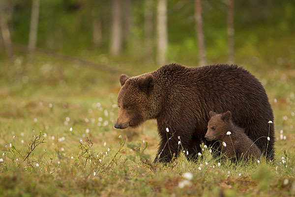

# เขียนแอพให้ AI อธิบายรูปเป็นภาษาคน


ในรอบนี้เราจะลองเขียนโค้ดส่งรูปให้ AI แล้วให้มันบอกเราเป็นภาษาคนดูซิว่ามันเห็นอะไรในรูปบ้าง? ซึ่งการที่จะทำแบบนี้ได้ผมจะใช้ AI สำเร็จรูปของ **Microsoft Azure** ที่ชื่อว่า **Cognitive Services** ครับ


**แนะนำให้อ่าน**  
บทความนี้เป็นหนึ่งในซีรี่ AI ดังนั้นถ้าเพื่อนสนใจของสนุกๆ เช่น [**Login ด้วยใบหน้า**](https://saladpuk.gitbook.io/learn/cloud/azure-cognitive-services/faceauth)**,** **ยืนยันตัวตนด้วยเสียง,** [**แปลงภาพเป็นข้อความ**](https://saladpuk.gitbook.io/learn/cloud/azure-cognitive-services/ocr)**,** [**แยกแยะภาพต่างๆ**](https://saladpuk.gitbook.io/learn/cloud/azure-cognitive-services/image-classification) และอื่นๆ สามารถดูเนื้อหาทั้งหมดได้จาก Side menu ในหมวดของ **Cognitive Services** ครับ ซึ่งถ้ามีบทความเกี่ยวกับ AI ก็จะมาลงในหมวดนี้เรื่อยๆ แต่ถ้าอยากรู้ว่า AI สำเร็จรูปตัวอื่นๆของ Microsoft Azure มีอะไรน่าเล่นบ้าง ไปอ่านกันได้จากลิงค์นี้เลยครัช [👶 Azure Cognitive Services](https://saladpuk.gitbook.io/learn/cloud/azure-cognitive-services) เชื่อผมเต๊อะ AI ไม่ได้ยากแบบที่คิด


## 😗 ทำความเข้าใจกันก่อน

ตัวอย่างนี้ผมจะใช้ภาษา C\# ด้วย .NET Core ดังนั้นใครที่จะทำตามด้วยภาษา C\# ให้ลง `Visual Studio Code` และ `.NET Core SDK` ในลิงค์ด้านล่างด้วยถ้ายังไม่มี **ส่วนคนที่ใช้ภาษาอื่นๆก็สามารถทำตามได้เหมือนกัน** เพราะขั้นตอนทั้งหมดเราเรียกใช้ **REST API** เพียงอย่างเดียวเลยครับ

* [Download Visual Studio Code](https://code.visualstudio.com/)
* [Download .NET Core SDK](https://dotnet.microsoft.com/download)

## 🤔 เริ่มยังไงดี ?

ก่อนที่จะเริ่มเขียนโค้ดผมอยากเคลียให้เข้าใจตรงกันก่อน ว่าในตัวอย่างนี้เราจะต้องทำอะไรกันบ้างตามนี้เลย

1. ขั้นตอนแรกเราต้องสร้าง **Cognitive Services** เสียก่อน เพื่อไปเอา **Key กับ Endpoint** มา เราถึงจะมีสิทธิ์ในการเรียกใช้ AI ต่อนั่นเอง
2. สร้าง C\# โปรเจคขึ้นมา แล้ว setup project ให้พร้อมทำงานกับ REST API และ Json
3. ทำความรู้จักกับ API ที่เราจะเรียกใช้
4. เขียนโค้ดส่งรูปให้ AI เอาไปวิเคราะห์แล้วเอาผลลัพท์มาแสดงผลก็เป็นอันจบ

## 🔥 \(1-2\) สร้าง Cognitive Services และ Project C\# <a id="1-2-cognitive-services-project-c"></a>

ขั้นตอนที่ 1 กับ 2 เป็นพื้นฐานในการทำ AI ของคอร์สนี้เลย ผมเลยแยกออกไปอีกลิงค์นึง ไม่งั้นทุกบทความผมจะต้องมาคอยนั่ง copy วางตลอดเวลา เลยขอรวมขั้นตอนที่ 1 กับ 2 ไว้ในลิงค์ด้านล่างนี้ครับง



## 🔥 \(3\) ทำความรู้จักกับ Analyze Image API กันก่อน

ในรอบนี้ตัว Cognitive Services API ที่เราจะทำการเรียกมีชื่อว่า Analyze Image ครับ ซึ่งเจ้า API ตัวนี้ดูรูปแล้วอธิบายออกมาว่ามีอะไรบ้างอยู่ในรูปแบบเป็นภาษาคนอ่านแล้วเข้าใจ โดยเจ้า API ตัวนี้มีหน้าตาแบบนี้ครับ



ดูรูปแล้วอธิบายออกมาเป็นภาษาคน



**ข้อจำกัดของ API**  
1.ไฟล์รุปจะต้องเป็น JPEG, PNG, GIF, BMP เท่านั้น  
2.ขนาดไฟล์ต้องไม่เกิน 4MB  
3.ขนาดรูปต้องใหญ่เกิน 50 x 50 px






Key ที่ได้จาก Cognitive Service



application/json





Url ของรูป










```
{
  "categories": [
    {
      "name": "abstract_",
      "score": 0.00390625
    },
    {
      "name": "people_",
      "score": 0.83984375,
      "detail": {
        "celebrities": [
          {
            "name": "Satya Nadella",
            "faceRectangle": {
              "left": 597,
              "top": 162,
              "width": 248,
              "height": 248
            },
            "confidence": 0.999028444
          }
        ],
        "landmarks":[
          {
            "name":"Forbidden City",
            "confidence": 0.9978346
          }
        ]
      }
    }
  ],
  "adult": {
    "isAdultContent": false,
    "isRacyContent": false,
    "isGoryContent": false,
    "adultScore": 0.0934349000453949,
    "racyScore": 0.068613491952419281,
    "goreScore": 0.08928389008070282
  },
  "tags": [
    {
      "name": "person",
      "confidence": 0.98979085683822632
    },
    {
      "name": "man",
      "confidence": 0.94493889808654785
    },
    {
      "name": "outdoor",
      "confidence": 0.938492476940155
    },
    {
      "name": "window",
      "confidence": 0.89513939619064331
    }
  ],
  "description": {
    "tags": [
      "person",
      "man",
      "outdoor",
      "window",
      "glasses"
    ],
    "captions": [
      {
        "text": "Satya Nadella sitting on a bench",
        "confidence": 0.48293603002174407
      }
    ]
  },
  "requestId": "0dbec5ad-a3d3-4f7e-96b4-dfd57efe967d",
  "metadata": {
    "width": 1500,
    "height": 1000,
    "format": "Jpeg"
  },
  "faces": [
    {
      "age": 44,
      "gender": "Male",
      "faceRectangle": {
        "left": 593,
        "top": 160,
        "width": 250,
        "height": 250
      }
    }
  ],
  "color": {
    "dominantColorForeground": "Brown",
    "dominantColorBackground": "Brown",
    "dominantColors": [
      "Brown",
      "Black"
    ],
    "accentColor": "873B59",
    "isBWImg": false
  },
  "imageType": {
    "clipArtType": 0,
    "lineDrawingType": 0
  },
  "objects": [
    {
      "rectangle": {
        "x": 25,
        "y": 43,
        "w": 172,
        "h": 140
      },
      "object": "person",
      "confidence": 0.931
    }
  ]
}
```






**ข้อแนะนำ**  
สำหรับ API ตัวนี้จริงๆมันมี options ให้เลือกเล่นอีกเยอะเลย เช่นให้มันอธิบายมาเป็นภาษาอะไร รูปนี้เกี่ยวกับพวก adult content หรือเปล่า บลาๆ ซึ่งสามารถเข้าไปดูรายละเอียดทั้งหมดของเขาได้ที่ลิงค์นี้เลยครับ  
[Microsoft Cognitive Services API - Analyze Image](https://southeastasia.dev.cognitive.microsoft.com/docs/services/5cd27ec07268f6c679a3e641/operations/56f91f2e778daf14a499f21b)


## 🔥 \(4\) เขียนโค้ดส่งรูปให้ AI ดู

อะเช หลังจากที่เห็นตัวอย่าง API แล้ว ถัดไปเราก็จะเริ่มเขียนโค้ดเพื่อเรียกใช้ API ด้านบนกันเลย โดยผมจะใช้รูปนี้ส่งเข้าไป



ส่วนโค้ดที่ที่ใช้ก็จะเขียนภายใน method Main\(\) ออกมาราวๆนี้



```csharp
var analyzieImageRequest = CreateRestRequest("vision/v2.1/analyze?visualFeatures=Description&language=en", new
{
    url = "https://www.natures-images.co.uk/wp-content/uploads/2014/02/Brown-bear-2011-10-Paul-Hobson.jpg"
});
var analyzieImageResult = client.Execute(analyzieImageRequest, Method.POST);
if (analyzieImageResult.StatusCode == HttpStatusCode.OK)
{
    var captionsText = JObject.Parse(analyzieImageResult.Content)["description"]["captions"].ToString();
    var captions = JArray.Parse(captionsText).Select(it => it["text"]?.ToString()).Where(it => !string.IsNullOrWhiteSpace(it));
    foreach (var item in captions)
    {
        Console.WriteLine(item);
    }
}
else
{
    System.Console.WriteLine($"Error: {analyzieImageResult.Content}");
}
```



**อธิบายโค้ด**  
ในตัวอย่างผมก็จะทำการเรียก Cognitive Services API ออกไป แล้วพอได้รับผลลัพท์กลับมาก็ทำการแปลง Json ออกมาเป็นข้อความที่เขาส่งกลับมาแสดงผล

แล้วเราก็ลอง Run โปรแกรมโดยการกด `CTRL + F5` หรือจะใช้คำสั่ง `dotnet run` ใน command prompt หรือ terminal ก็ได้ครับ แล้วเราก็จะเห็นผลลัพท์ตามนี้

```text
a large brown bear walking across a grass covered field
```

แปลเป็นภาษาไทยง่ายได้ว่า

```text
หมีสีน้ำตาลตัวใหญ่กำลังเดินข้ามทุ่งหญ้า
```

ฮัดช่าเสร็จเรียบร้อยแล้วครัช


**ภาษาไทยทำไง ?**  
ณ ตอนนี้เขียนบทความนี้ ตัว Analyze Image ของ Microsoft Azure ยังไม่รองรับภาษาไทยนะครับ ดังนั้นวิธีแก้ขัดชั่วคราวก็คือส่งข้อความภาษาอังกฤษนี่แหละไปให้ AI มันแปลกลับมาเป็นภาษาไทยต่ออีกที ส่วนถ้าถามว่ามีอะไรบ้างที่ AI ของ Microsoft ที่รองรับภาษาไทย สามารถเข้าไปดูได้จากลิงค์นี้เลยครับ  
[Cognitive Services: Language support](https://docs.microsoft.com/en-us/azure/cognitive-services/language-support)


## 🤔 ยาวจังของโค้ดทั้งหมดหน่อย

พอดีเนื้อหาค่อนข้างยาวดังนั้นผมขอยก source code ให้ไปดาวโหลดมาลองเล่นเลยดีกว่าครับ



## 🎯 บทสรุป

ในการทำงานกับ AI จริงๆไม่ใช่เรื่องยากเลยหัวใจหลักของมันจริงๆก็คือการเรียกใช้ REST API ให้ถูกตัวเท่านั้น ดังนั้นไม่ว่าเราจะเขียนภาษาไหนก็ตาม เราก็สามารถเรียกใช้ Cognitive Services API เพื่อทำของประมาณนี้ได้เลย


**Cognitive Services API**  
หากใครสนใจอยากดู API ทั้งหมดที่ Microsoft เตรียมไว้ให้เราเรียกใช้ AI สำเร็จรูป ก็สามารถเข้าไปดูได้จากลิงค์ด้านล่างนี้เลยครับ

* [Microsoft Cognitive Services API](https://southeastasia.dev.cognitive.microsoft.com/docs/services/563879b61984550e40cbbe8d/operations/563879b61984550f30395236)



**Cognitive Services Library**  
สำหรับคนที่ต้องการเขียนทำงานกับ Cognitive Services จริงๆไม่ต้องไปนั่งเขียนเชื่อม API ทีละตัวก็ได้นะ เพราะทาง Microsoft นั้นได้มี Library ให้เราสามารถเรียกใช้ได้เลยครับ เช่นในฝั่ง .NET ก็จะมีตัวนี้ **Microsoft.Azure.CognitiveServices.Vision.ComputerVision** ที่สามารถติดตั้งแล้วใช้งานได้เลย


