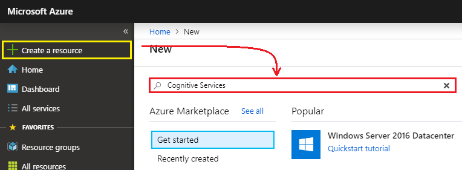
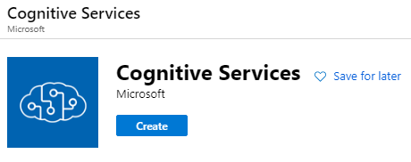
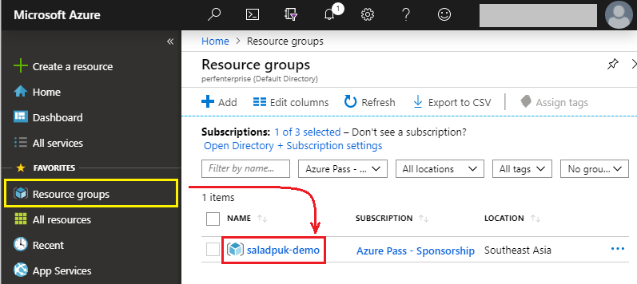
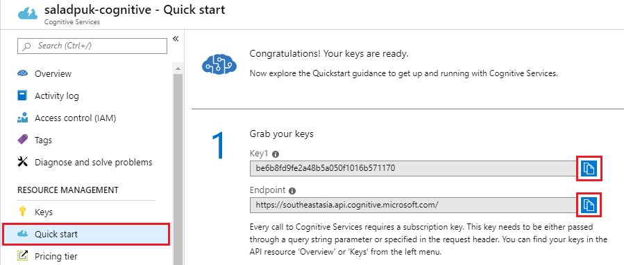

# การสร้าง Cognitive Services

ในบทความนี้เราจะมาสอนวิธีการสร้าง **Cognitive Services** ของ Microsoft Azure กัน ซึ่งเจ้าตัวนี้จะช่วยให้เราสามารถเข้าไปใช้งาน AI สำเร็จรูปต่างๆที่ทาง Microsoft จัดเตรียมไว้ยังไงล่ะ

สิ่งสำคัญที่เราจะได้จากการสร้าง Cognitive Services คือตัว `Key` และ `Endpoint` ครับ โดยแต่ละตัวมีหน้าที่ตามนี้

* **Endpoint** - เป็น `base URL` ที่เราจะเรียกใช้ Cognitive Services API ของเรา ซึ่งเจ้าตัวนี้จะมีชื่อตาม **Region** ที่เราสร้าง Cognitive Services ครับ
* **Key** - ใช้สำหรับเป็นรหัสลับในการเข้าไปใช้งาน Cognitive Services โดยทุกครั้งที่เราจะเรียก API เข้าไปเราจะต้องแนบ **header** ชื่อ `Ocp-Apim-Subscription-Key` เข้าไปด้วยเสมอ ส่วน **value** ที่ต้องส่งเข้าไปก็คือ `key` นี้แหละ

ดังนั้นถัดไปเราจะไปดูขั้นตอนการสร้าง Cognitive Services กันเลย

## 🔥 สร้าง Cognitive Services กัน


**Azure Portal**  
เนื้อหาตรงจุดนี้จะต้องเข้าไปที่ทำที่เว็บ [https://portal.azure.com](https://portal.azure.com) นี้นะครับ ซึ่งเราต้องสมัครสมาชิกก่อน แต่ถ้าใครยังไม่ได้สมัครก็ไปสมัครให้เรียบร้อยแซ๊ร [\(วิธีสมัครจิ้มตรงนี้\)](https://saladpuk.gitbook.io/learn/cloud/azure101/register)


1.หลังจากที่ Login เข้ามาละ ที่เมนูด้านซ้ายมือให้กดที่ **`+ Create a resource`** ซะ ส่วนช่องค้นหาให้พิมพ์คำว่า **`Cognitive Services`** ลงไปแล้วกด Enter ได้เบย



2.ถัดมาเขาก็จะบอกรายละเอียดเกี่ยวกับ Cognitive Services ว่ามันคืออะไร จะไปศึกษาลองเล่นต่อได้ยังไง ราคาที่ต้องจ่ายต่อเดือนคิดยังไง บลาๆ ก็ถ้าอ่านจนหนำใจแล้วก็จิ้มปุ่ม **Create** เบาๆไป 1 ทีงับ



3.ถัดมาก็ใส่รายละเอียดของ Cognitive Services ให้เรียบร้อยซะ แล้วก็กดปุ่ม **`Create`** ได้เลย

<table>
  <thead>
    <tr>
      <th style="text-align:left">&#xE0A;&#xE37;&#xE48;&#xE2D;</th>
      <th style="text-align:left">&#xE23;&#xE32;&#xE22;&#xE25;&#xE30;&#xE40;&#xE2D;&#xE35;&#xE22;&#xE14;</th>
    </tr>
  </thead>
  <tbody>
    <tr>
      <td style="text-align:left"><b>Name</b>
      </td>
      <td style="text-align:left">&#xE0A;&#xE37;&#xE48;&#xE2D; Cognitive Services &#xE17;&#xE35;&#xE48;&#xE08;&#xE30;&#xE2A;&#xE23;&#xE49;&#xE32;&#xE07;</td>
    </tr>
    <tr>
      <td style="text-align:left"><b>Location</b>
      </td>
      <td style="text-align:left">
        <p>&#xE15;&#xE31;&#xE27; service &#xE19;&#xE35;&#xE49;&#xE08;&#xE30;&#xE2A;&#xE23;&#xE49;&#xE32;&#xE07;&#xE44;&#xE27;&#xE49;&#xE20;&#xE39;&#xE21;&#xE34;&#xE20;&#xE32;&#xE04;&#xE44;&#xE2B;&#xE19;</p>
        <p>&#xE43;&#xE19;&#xE15;&#xE31;&#xE27;&#xE2D;&#xE22;&#xE48;&#xE32;&#xE07;&#xE1C;&#xE21;&#xE40;&#xE25;&#xE48;&#xE19;&#xE43;&#xE19;&#xE44;&#xE17;&#xE22;&#xE01;&#xE47;&#xE40;&#xE25;&#xE37;&#xE2D;&#xE01;&#xE40;&#xE1B;&#xE47;&#xE19;
          Southeast Asia</p>
      </td>
    </tr>
    <tr>
      <td style="text-align:left"><b>Pricing tier</b>
      </td>
      <td style="text-align:left">
        <p>&#xE08;&#xE30;&#xE43;&#xE2B;&#xE49;&#xE40;&#xE02;&#xE32;&#xE40;&#xE01;&#xE47;&#xE1A;&#xE40;&#xE07;&#xE34;&#xE19;&#xE40;&#xE23;&#xE32;&#xE41;&#xE1A;&#xE1A;&#xE44;&#xE2B;&#xE19;
          &#xE43;&#xE19;&#xE15;&#xE2D;&#xE19;&#xE19;&#xE35;&#xE49;&#xE22;&#xE31;&#xE07;&#xE44;&#xE21;&#xE48;&#xE21;&#xE35;&#xE15;&#xE31;&#xE27;&#xE1F;&#xE23;&#xE35;&#xE43;&#xE2B;&#xE49;&#xE40;&#xE25;&#xE48;&#xE19;</p>
        <p>&#xE41;&#xE15;&#xE48;&#xE16;&#xE49;&#xE32;&#xE40;&#xE23;&#xE32;&#xE25;&#xE2D;&#xE07;&#xE40;&#xE2A;&#xE23;&#xE47;&#xE08;&#xE41;&#xE25;&#xE49;&#xE27;&#xE25;&#xE1A;&#xE40;&#xE25;&#xE22;&#xE2A;&#xE34;&#xE49;&#xE19;&#xE40;&#xE14;&#xE37;&#xE2D;&#xE19;&#xE01;&#xE47;&#xE08;&#xE48;&#xE32;&#xE22;&#xE44;&#xE21;&#xE48;&#xE16;&#xE36;&#xE07;
          1 &#xE1A;&#xE32;&#xE17;&#xE04;&#xE23;&#xE31;&#xE1A;</p>
      </td>
    </tr>
    <tr>
      <td style="text-align:left"><b>Resource group</b>
      </td>
      <td style="text-align:left">
        <p>&#xE08;&#xE30;&#xE2A;&#xE23;&#xE49;&#xE32;&#xE07; service &#xE19;&#xE35;&#xE49;&#xE44;&#xE27;&#xE49;&#xE43;&#xE19;
          Resource Group &#xE44;&#xE2B;&#xE19;</p>
        <p>&#xE16;&#xE49;&#xE32;&#xE22;&#xE31;&#xE07;&#xE44;&#xE21;&#xE48;&#xE21;&#xE35;&#xE43;&#xE2B;&#xE49;&#xE01;&#xE14;&#xE1B;&#xE38;&#xE48;&#xE21; <b><code>Create new</code></b> &#xE40;&#xE25;&#xE22;&#xE01;&#xE47;&#xE44;&#xE14;&#xE49;&#xE04;&#xE23;&#xE31;&#xE1A;</p>
      </td>
    </tr>
  </tbody>
</table>

3.เรียบร้อยครับ ที่เหลือก็แค่รอให้มันสร้าง Cognitive Services จนเสร็จ


## 🔥 ไปเอา Key กับ Endpoint กัน

โดยปรกติเวลาที่เราจะเรียกใช้ **REST API** ของ Cognitive Services เราจะต้องส่งรหัสลับเพื่อยืนยันว่าเราเป็นคนที่มีสิทธิ์ในการใช้งาน AI ตัวนี้จริงๆนะ ซึ่งเจ้ารหัสลับก็คือ **Key** นั่นเอง ส่วนเจ้า **Endpoint** ก็คือตัว API ที่เราจะเรียกไป ดังนั้นหลังจากทำขั้นตอนที่ 1 เสร็จแล้ว เราก็ไปเอาของพวกนั้นกันเลย

1.ที่เมนูด้านซ้ายให้กด **`Resource groups`** แล้วเขาเลือก Resource group ที่เราสร้างไว้จากขั้นตอนที่ 1 ครับ



2.พอเข้ามาใน Resource group แล้วถัดไปเราก็จะเห็น **`Cognitive Services`** ที่เราสร้างไว้ ให้จิ้มมันอย่างอ่อนโยน


3.พอเข้ามาเราก็จะเห็น **`Key`** กับ **`Endpoint`** ที่เราตามหาเลย แล้วทำการกด **copy ทั้ง 2 ตัวไปเก็บไว้เลย**ครับ เพราะในตัวอย่างถัดๆไปเราจะใช้ 2 ตัวนี้บ่อยมาก



เพียงแค่นี้เราก็จะได้ `Key` กับ `Endpoint` ที่พร้อมเอาไปใช้งานกับ Cognitive Services API แล้วครับ


**ข้อแนะนำ  
Key** และ **Endpoint** เราใช้ 2 ตัวนี้บ่อยมากดังนั้นทำการบันทึก 2 ค่านี้เก็บไว้เลยนะครับ เพราะในตัวอย่างทุกตัวของ Cognitive Services เราจะใช้เจ้า 2 ค่านี้ตลอดครับ ส่วนเจ้า **Key** มันเป็นเหมือนกับกุญแจสำคัญดังนั้นอย่าเอาตัวนี้ให้ใครไปมั่วซั่วนะครับ ไม่งั้นเขาจะเข้ามาปั่นป่วน AI ของเราได้


## 🔥 สร้างโปรเจคที่เตรียมเชื่อมกับ Cognitive Services

หลังจากที่เราสร้าง Cognitive Services เรียบร้อยแล้ว ถัดมาเราก็จะสร้างโปรเจคเพื่อเตรียมไปเรียกใช้งาน Cognitive Services API กันครับ โดยในตัวอย่างนี้ผมจะใช้ภาษา C\# และ .NET Core เป็นหลัก ส่วนใครที่ใช้**ภาษาอื่นๆก็สามารถใช้งาน Cognitive Services ได้เหมือนกัน** เพราะการทำงานกับ Cognitive Services นั้นเป็นการเรียก REST API ธรรมดาเลยครับ


ใครที่จะทำตามด้วยภาษา C\# ให้ลง **`Visual Studio Code`** และ **`.NET Core SDK`** ให้เรียบร้อย ส่วนใครที่ยังไม่ได้ติดตั้งให้กดดาวโหลดแล้วติดตั้งได้จากลิงค์ด้านล่างเลยครับ

* [Download Visual Studio Code](https://code.visualstudio.com/)
* [Download .NET Core SDK](https://dotnet.microsoft.com/download)


ถ้าใครที่ติดตั้งทุกอย่างเสร็จหมดแล้ว และขี้เกียจทำตามขั้นตอนในการสร้างโปรเจคก็สามารถดาวโหลดไฟล์โปรเจคด้านล่างนี้ไปใช้เล่นต่อได้เลยนะครับ



### สร้างโปรเจคด้วย C\# .NET Core

เริ่มต้นก็เปิด `Command prompt` หรือ `Terminal` ขึ้นมาเลย แล้วใช้คำสั่งด้านล่างในการสร้างโปรเจคได้เลย

```text
dotnet new console -n saladpuk-demo
```

> `saladpuk-demo` คือชื่อโปรเจคนะครับ ถ้าอยากได้ชื่ออื่นก็ให้เปลี่ยนชื่อตรงนี้ได้เลย

หลังจากใช้คำสั่งด้านบนไปเราก็จะได้โปรเจคมา 1 ตัวละ ถัดไปเราก็จะเข้าไปในในโปรเจคที่เราพึ่งสร้างตัวนั้น โดยใช้คำสั่งด้านล่างนี้ _\(ใครที่เปลี่ยนชื่อโปรเจคก็แก้คำสั่งด้านล่างให้เป็นชื่อที่ตัวเองตั้งไว้นะ\)_

```text
cd saladpuk-demo
```

ในตอนนี้ตัวโปรเจคของเราจะต้องทำงานกับ Cognitive Services ซึ่งการที่เราจะทำงานกับเขาได้ โค้ดของเราจะต้องเรียกผ่าน REST API และทำงานกับ Json ดังนั้นผมจะติดตั้ง library เสริมเพื่อให้เราทำงานกับ REST API และ Json ได้ง่ายขึ้น โดยใช้ 2 คำสั่งด้านล่างเพื่อติดตั้ง library ครับ

```text
dotnet add package RestSharp --version 106.6.10
```

```text
dotnet add package Newtonsoft.Json
```

ลองทดสอบว่าโปรเจคที่สร้างใช้ได้ไม่มีปัญหาอะไรด้วยคำสั่งด้านล่างนี้เลย

```text
dotnet build
```

ถ้าไม่มีปัญหาอะไรก็น่าจะได้ผลลัพท์ออกมาแบบนี้

```text
Build succeeded.
    0 Warning(s)
    0 Error(s)
```

ส่วนถ้าใครทำตามแล้วไม่ได้จริงๆก็สามารถดาวโหลดไฟล์นี้ไปใช้ได้เลยครับ



คราวนี้ให้เราเปิด **Visual Studio Code** ขึ้นมา โดยใช้คำสั่ง `code .` ภายใน `Command prompt` หรือ `Terminal` ก็ได้ ส่วนคนที่ใช้ Visual Studio Code ก็สามารถกด `File > Open Folder...` แล้วเลือกเปิดมาที่โปรเจคที่สร้างไว้ก็ได้เหมือนกันครับ

หลังจากที่ Visual Studio Code เปิดขึ้นมาแล้ว ให้ทำการเปิดไฟล์ **`Program.cs`** ขึ้นมารอเลยครับ



**Visual Studio Code: C\# Extension**  
ในตัวอย่างที่เป็นสีสวยงาม เพราะผมลง extension 2 ตัวให้กับ Visual Studio Code นะครับ ถ้าสนใจก็กดติดตั้งได้จากลิงค์ด้านล่างเลย

* [C\#](https://marketplace.visualstudio.com/items?itemName=ms-vscode.csharp)
* [C\# Extensions](https://marketplace.visualstudio.com/items?itemName=jchannon.csharpextensions)


### เตรียมโค้ดให้พร้อมใช้งาน

คราวนี้เราก็จะมาเตรียมโค้ดให้พร้อมที่จะเรียกใช้ Cognitive Services กันบ้าง โดยเอาโค้ดด้านล่างไปทับไฟล์ `Program.cs` ทั้งหมดเลยได้เลย


```csharp
using System;
using System.Collections.Generic;
using System.IO;
using System.Linq;
using System.Net;
using Newtonsoft.Json;
using RestSharp;

namespace saladpuk_demo
{
	class Program
	{
		static string Endpoint = "ENTER_YOUR_ENDPOINT_HERE";
		static string SubscriptionKey = "ENTER_YOUR_SUBSCRIPTION_KEY_HERE";

		static void Main(string[] args)
		{
			var client = new RestClient(Endpoint);

			// โค้ดในตัวอย่างอื่นๆจะเอามาเขียนต่อใส่ตรงนี้
		}

		static RestRequest CreateRestRequest(string resource, object requestBody)
		{
			var request = new RestRequest(resource);
			request.AddHeader("content-type", "application/json");
			request.AddHeader("ocp-apim-subscription-key", SubscriptionKey);
			if (requestBody != null)
			{
				request.AddJsonBody(requestBody);
			}
			return request;
		}
	}
}

```


เพียงเท่านี้ตัวโปรเจคของเราก็พร้อมที่จะทำงานกับ Cognitive Services API เรียบร้อยแล้วครับ ดังนั้นลองดูบทความถัด หรือ กลับไปที่บทความที่อ่านมา เพื่อการเรียกใช้ AI สำเร็จรูปกันเลยได้เลยครับ

