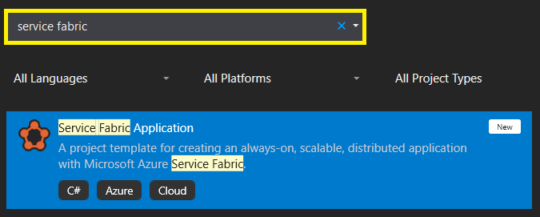

# สร้าง Service Fabric กัน

ตามชื่อหัวข้อเลยคือเราจะมาสร้างแอพที่อยู่บน **Service Fabric** กัน ซึ่งก่อนที่เราจะสร้างเราต้องรู้จักกับของ 2 อย่างกันก่อนนั่นก็คือ สิ่งที่เรียกว่า **Stateful** และ **Stateless** นั่นเอง เพราะทั้ง 2 อย่างนี้มีความจำเป็นในการที่เราจะสร้างของใน Service Fabric นั่นเอง ดังนั้นเรามารู้จักมันก่อนนิสนุง


**แนะนำให้อ่าน**  
บทความนี้เป็นหนึ่งในซีรี่ **Service Fabric** ซึ่งจะมาช่วยให้เราสามารถสร้างแอพที่ไม่มีวันตาย และรองรับการทำ **Microservices Architecture** อีกด้วย ซึ่งถ้าเพื่อนๆสนใจอยากศึกษาเพิ่มเติมก็สามารถอ่านได้จากลิงค์นี้ครับ [👶 Azure Service Fabric](https://saladpuk.gitbook.io/learn/cloud/azure-service-fabric)


## 🤔 **State คือไย ?**

ในการเขียนแอพอะไรก็แล้วแต่เราสามารถแบ่งมันได้เป็น 2 รูปแบบเสมอ เช่น เราสร้างเว็บขายสินค้า แล้วเมื่อลูกค้าทำการเพิ่มสินค้าเข้าตะกร้าปุ๊ป เราก็จะต้องทำการ **บันทึก** รายการสินค้าลงตะกร้า ซึ่งการบันทึกข้อมูลนั้นเราสามารถเลือกได้ว่าจะเก็บข้อมูลพวกนั้นแบบ **Stateful** หรือ **Stateless** นั่นเอง ดังนั้นเราลองมาดูกันว่าทั้งสองแบบนี้ต่างกันยังไงบ้าง

### 🔥 Stateful

เป็นการ**บันทึกข้อมูลไว้ในตัวเซิฟเวอร์เอง** เช่น รายการสินค้าในตะกร้าก็จะเก็บไว้ในตัวเซิฟเวอร์ตัวนั้นเอง ซึ่งข้อดีของมันคือ **มันเร็ว** แต่ก็ต้องแลกมากับข้อเสียว่าข้อมูลมันจะติดอยู่กับเซิฟเวอร์ตัวนั้นเท่านั้น เช่นถ้าเรามีเซิฟเวอร์ 2 ตัว แล้วลูกค้าเข้ามาเพิ่มสินค้าลงตะกร้าที่เซิฟเวอร์ A เสร็จแล้วออกจากเว็บไป พอเขากลับมาใหม่ในรอบนี้เขาอาจจะเข้ามาที่เซิฟเวอร์ B ก็ได้ ซึ่งข้อมูลตะกร้าของเขาอยู่ในเซิฟเวอร์ A ดังนั้นเขาจะได้ตะกร้าสินค้าเปล่านั่นเอง ดังนั้นปัญหาหลักๆของการทำ Stateful คือ **การขยายเซิฟเวอร์** เพราะข้อมูลไปติดอยู่กับเซิฟเวอร์ใดเซิฟเวอร์หนึ่งนั่นเอง

### 🔥 **Stateless**

เป็นการ**บันทึกข้อมูลไว้ที่อื่น หรือไม่บันทึกเลย** ซึ่งข้อดีคือ **ทุกเซิฟเวอร์เหมือนกันหมด** ลูกค้าจะมาใช้งานที่เซิฟเวอร์ A หรือ B ก็ไม่มีความต่าง ทำให้เราสามารถขยายเซิฟเวอร์เพื่อรองรับโหลดหนักๆได้ แต่ข้อเสียคือ **มันจะช้ากว่า Stateful** เพราะมันต้องไปเอาข้อมูลมาจากตัวเก็บข้อมูลอีกที


**Stateful & Stateless**  
รูปแบบการทำงานทั้ง 2 แบบเป็นแค่แนวทางในการเลือกว่าเซิฟเวอร์ หรือ service ของเราตัวนั้นจะเป็นแบบไหน ไม่ได้บอกว่าใครดีกว่ากัน เพราะแต่ละแบบมีจุดดีจุดเด่นเหมาะกับงานคนละรูปแบบกัน ดังนั้นถ้าเราเลือกประเภทได้เหมาะกับงาน มันก็จะทำงานได้เร็วและไม่มีปัญหาครับ

* เรื่อง **Stateful & Stateless** มันไม่ได้ใช้แค่ Microservices Architecture เท่านั้น แต่ในทุกๆอย่างที่เราเขียนมันก็มีเรื่องพกวนี้หมด ดังนั้นเวลาออกแบบอะไรต่างๆให้คำนึงถึงเรื่องพวกนี้ไว้ด้วยเสมอ


## 🧰 ติดตั้งโปรแกรม

หลักจากที่เข้าใจหลักการของ Server state แล้วถัดมาเราก็จะลองสร้าง Service Fabric กันดูบ้าง โดยเราจะต้องติดตั้งโปรแกรม 2 ตัวนี้ก่อน **ตามลำดับด้วยนะ** นั่นก็คือ

1. [Visual Studio 2019 Community](https://www.visualstudio.com/)
2. [Microsoft Azure Service Fabric SDK](https://www.microsoft.com/web/handlers/webpi.ashx?command=getinstallerredirect&appid=MicrosoftAzure-ServiceFabric-CoreSDK)

เจ้า **Visual Studio 2019 Community** เมื่อติดตั้งเสร็จให้ติ๊กเลือกตัว **.NET Core** ด้วยนะครับ แล้วกด OK ไป


## ⚒️ สร้างโปรเจค Service Fabric กัน

ให้เปิดตัว Visual Studio 2019 Community โดยต้องเปิดเป็น **ADMIN mode** ด้วยนะ โดยวิธีการเปิดคือคลิกขวาที่ตัว Icon ของ Visual Studio แล้วเลือเป็น **Run as administrator** ตามรูปด้านล่าง


เมื่อ Visual Studio ถูกเปิดขึ้นมาแล้ว ก็เลือก **Create a new project** ได้เลยครัช


ถัดมาให้เลือก Service Fabric Application \(ถ้าหาไม่เจอให้พิมพ์ชื่อมันลงไปในช่อง search ด้านบนได้นะ\)



ถัดไปก็ตั้งชื่อโปรเจคและเลือกว่าจะสร้างไว้ที่ไหนตามสะดวก แล้วก็กด **`Create`** ได้เลย ซึ่งผมจะตั้งชื่อและที่อยู่ตามรูปด้านล่างนี้นะ


สุดท้ายเขาจะให้เราเลือกว่าตัว service ตัวแรกของเราเป็นแบบไหน ซึ่งในตัวอย่างนี้ผมจะขอสร้างเว็บไซต์ที่เป็น Stateless ละกัน ดังนั้นผมก็จะเลือกเป็น **Stateless ASP.NET Core** ส่วนชื่อ service ผมปล่อยเป็น **Web1** ไปก่อนละกัน


ถัดมาอันนี้แล้วแต่เลยว่าถนัดเขียนอะไร ซึ่งในตัวอย่างผมขอเลือกเป็น **MVC** ละกัน


### 🔥 โครงสร้างโปรเจค \(Service Fabric\)

เรียบร้อยแบ้ว เพียงแค่นี้เราก็ได้เว็บไซต์ที่พร้อมจะทำงานอยู่บน Service Fabric ละ ส่วนตัวโปรเจคที่เขาสร้างให้เราจะมี 2 ตัวนั่นก็คือตัว Service Fabric เอง และตัวเว็บของเราอีกตัวตามรูปด้านล่างนั่นเอง


ซึ่งตัวโปรเจคที่เป็น Service Fabric จะเป็นตัวเก็บข้อมูลทั้งหมดว่า เวลาที่เราจะทำการสร้าง Cluster นั้นมันจะประกอบไปด้วย Service ย่อยๆอะไรบ้าง และแต่ละตัวจะมีการ**ตั้งตัวสำรอง \(Replica node\)** หรือมีการ**แบ่งส่วน \(Sharding\)** ยังไงบ้าง ซึ่งข้อมูลที่ว่ามาทั้งหมดจะถูกเก็บไว้ในโปรเจคนี้นั่นเอง


### 🔥 โครงสร้างโปรเจค \(Services\)

ถัดมาที่ตัวเว็บไซต์ของเรา หรือเราจะเรียกมันว่า **Service** ก็ได้นะในมุมของ Microservices Architecture ก็จะเป็น ASP.NET MVC ธรรมดานี่แหละ แต่มันจะเพิ่มเติมหน่อยนึงคือ มันจะมี folder ที่เอาไว้เก็บการตั้งค่าต่างๆให้เข้ากับการทำงานบน Service Fabric นั่นเอง ซึ่งไฟล์ที่สำคัญของมันคือไฟล์ **ServiceManifest.xaml** ลองเปิดเข้าไปดูตามรูปด้านล่างเลย


ซึ่งภายในไฟล์นั้นจะมีการตั้งค่าต่างๆเอาไว้อยู่ โดยสิ่งแรกที่เราต้องรู้จักคือเจ้าบรรทัดเกือบล่างสุดตัวนี้

```markup
<Resources>
  <Endpoints>
    <!-- This endpoint is used by the communication listener to obtain the port on which to 
          listen. Please note that if your service is partitioned, this port is shared with 
          replicas of different partitions that are placed in your code. -->
    <Endpoint Protocol="http" Name="ServiceEndpoint" Type="Input" Port="8731" />
  </Endpoints>
</Resources>
```

ซึ่งเราจะเห็นตัว **Port** ที่ถูกตั้งไว้เพื่อให้โลกภายนอกสามารถติดต่อเข้ามายัง Service ตัวนี้ได้นั่นเอง ซึ่งในตัวอย่างของผมคือ port **8731** ถ้าเพื่อนๆไม่ถูกใจก็สามารถแก้ไขได้จากไฟล์นี้ได้เลย

## 🃏 ลองเปิดเว็บดู

ให้ลองกด Run ตามปรกติได้เลยโดยการกดปุ่ม **CTRL + F5** ได้เลยครัช ส่วนถ้าใคร Run ไม่ได้ลองเช็คดูนะว่าตัว Platform ถูกเลือกเป็นตัวที่ถูกต้องหรือยังเพราะมันใช้ Any CPU ไม่ได้ และต้องอยู่ใน Admin mode ด้วยนะ


เรียบร้อยละ ได้เว็บไซต์ที่เป็น Stateless ขึ้นมาตัวนึงละ โดยสังเกตว่าเราเข้าผ่าน port ที่เรากำหนดไว้เท่านั้น


## 🃏 Service Fabric Explorer

คราวนี้ถ้าเราอยากดูว่าภายใน Cluster ของเรามี services อะไรอยู่บ้าง และแต่ละตัวทำงานปรกติดีหรือเปล่า ก็สามารถเข้าไปได้ผ่าน **Port 19080** เลยครัช


## 🎯 บทสรุป

จากตัวอย่างนี้ก็น่าจะพาเห็นภาพกันแล้วนะว่าการสร้าง **Service Fabric** เพื่อให้เราได้ความสามารถต่างๆในการทำงานกับ Microservices Architecture และรวมถึงการจัดการ Node ต่างๆภายใน Cluster นั้นจริงๆไม่ได้ยากอะไรเลย ดังนั้นถัดไปเดี๋ยวเราจะลองไปลองสร้างเว็บไซต์ที่เป็น **Stateful** กันดูบ้างนะว่า เว็บไซต์ที่ไม่ต้องพึ่ง Database เลยแต่ก็ยังสามารถทำงานโดยรองรับการขยายเซิฟเวอรืได้เขาทำกันยังไงภายใน Service Fabric ครัช

