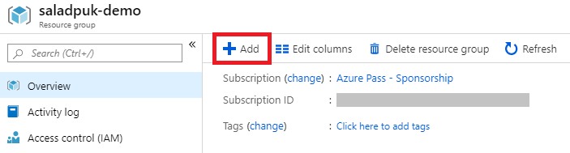

# ลองสร้างที่เก็บไฟล์กันเลย

ในรอบนี้เราจะลงสร้างที่เก็บไฟล์ธรรมดาก่อน หรือเราเรียกมันว่า Blob storage นั่นเอง


**Azure Portal**  
เนื้อหาในรอบนี้จะต้องเข้าไปที่ทำที่เว็บ [https://portal.azure.com](https://portal.azure.com) นี้นะครับ ซึ่งเราต้องสมัครสมาชิกก่อนด้วย ส่วนถ้าใครยังไม่ได้สมัครก็ไปสมัครให้เรียบร้อยแซ๊ร [\(วิธีสมัครจิ้มตรงนี้\)](https://saladpuk.gitbook.io/learn/cloud/azure101/register)


## 🤔 สร้าง Azure Storage ทำไง ?

1.ที่เมนูด้านซ้ายมือให้เลือก Resource groups ซะ แล้วในหน้าตรงกลางให้เลือกชื่อ Resource group ที่เราสร้างไว้

2.หลังจากที่เข้ามาใน Resource group แล้วให้กดปุ่ม + ที่มุมบนซ้ายของเมนู

3.ระบบจะพาเราไปที่หน้า **Marketplace** ซึ่งในหน้า marketplace นี้เป็นหน้าหลักในการเลือก service ที่เราจะทำการสร้าง ซึ่งในรอบนี้เราจะพิมพ์ในช่องค้นหาว่า **Storage account** แล้วกด Enter เลย

4.ถัดมาเขาก็จะบอกรายละเอียดเกี่ยวกับ Storage account ว่ามันคืออะไร จะไปศึกษาลองเล่นต่อได้ยังไง ราคาที่ต้องจ่ายต่อเดือนคิดยังไง บลาๆ ก็ถ้าอ่านจนหนำใจแล้วก็จิ้มปุ่ม **Create** เบาๆไป 1 ทีงับ

5.ในขั้นตอนถัดมาเขาก็จะถามรายละเอียดของ Storage ของเรา ซึ่งในส่วนนี้ก็ค่อยๆเลือกใส่ทีละอันเลย แล้วพอใส่เสร็จก็กดปุ่ม **Review + create** โลด

<table>
  <thead>
    <tr>
      <th style="text-align:left">&#xE0A;&#xE37;&#xE48;&#xE2D;</th>
      <th style="text-align:left">&#xE23;&#xE32;&#xE22;&#xE25;&#xE30;&#xE40;&#xE2D;&#xE35;&#xE22;&#xE14;</th>
    </tr>
  </thead>
  <tbody>
    <tr>
      <td style="text-align:left">Storage account name</td>
      <td style="text-align:left">&#xE0A;&#xE37;&#xE48;&#xE2D; storage &#xE17;&#xE35;&#xE48;&#xE08;&#xE30;&#xE2A;&#xE23;&#xE49;&#xE32;&#xE07;</td>
    </tr>
    <tr>
      <td style="text-align:left">Location</td>
      <td style="text-align:left">&#xE08;&#xE30;&#xE2A;&#xE23;&#xE49;&#xE32;&#xE07;&#xE17;&#xE35;&#xE48;&#xE40;&#xE01;&#xE47;&#xE1A;&#xE44;&#xE27;&#xE49;&#xE20;&#xE39;&#xE21;&#xE34;&#xE20;&#xE32;&#xE04;&#xE44;&#xE2B;&#xE19;
        (Southeast Asia)</td>
    </tr>
    <tr>
      <td style="text-align:left">Performance</td>
      <td style="text-align:left">
        
&#xE1B;&#xE23;&#xE30;&#xE40;&#xE20;&#xE17;&#xE04;&#xE27;&#xE32;&#xE21;&#xE40;&#xE23;&#xE47;&#xE27;&#xE02;&#xE2D;&#xE07;
          Harddisk
           Standard = &#xE08;&#xE32;&#xE19;&#xE41;&#xE21;&#xE48;&#xE40;&#xE2B;&#xE25;&#xE47;&#xE01;&#xE17;&#xE31;&#xE48;&#xE27;&#xE44;&#xE1B;

        
Permium = solid state drive (SSD)

      </td>
    </tr>
    <tr>
      <td style="text-align:left">Replication</td>
      <td style="text-align:left">&#xE08;&#xE30;&#xE43;&#xE2B;&#xE49;&#xE40;&#xE02;&#xE32; backup &#xE02;&#xE49;&#xE2D;&#xE21;&#xE39;&#xE25;&#xE40;&#xE23;&#xE32;&#xE14;&#xE35;&#xE02;&#xE19;&#xE32;&#xE14;&#xE44;&#xE2B;&#xE19;
         (&#xE1C;&#xE21;&#xE40;&#xE25;&#xE37;&#xE2D;&#xE01; LRS &#xE0B;&#xE36;&#xE48;&#xE07;&#xE40;&#xE1B;&#xE47;&#xE19;&#xE41;&#xE1A;&#xE1A;&#xE16;&#xE39;&#xE01;&#xE2A;&#xE38;&#xE14;
        &#xE2A;&#xE48;&#xE27;&#xE19;&#xE43;&#xE04;&#xE23;&#xE08;&#xE30;&#xE25;&#xE2D;&#xE07;&#xE15;&#xE31;&#xE27;&#xE40;&#xE17;&#xE1E;&#xE46;&#xE01;&#xE47;&#xE44;&#xE14;&#xE49;)</td>
    </tr>
    <tr>
      <td style="text-align:left">Access tier</td>
      <td style="text-align:left">
        
&#xE25;&#xE31;&#xE01;&#xE29;&#xE13;&#xE30;&#xE02;&#xE49;&#xE2D;&#xE21;&#xE39;&#xE25;&#xE17;&#xE35;&#xE48;&#xE40;&#xE01;&#xE47;&#xE1A;&#xE40;&#xE1B;&#xE47;&#xE19;&#xE41;&#xE1A;&#xE1A;&#xE44;&#xE2B;&#xE19;

        
Cool = &#xE19;&#xE32;&#xE19;&#xE46;&#xE08;&#xE30;&#xE21;&#xE32;&#xE43;&#xE0A;&#xE49;&#xE07;&#xE32;&#xE19;&#xE21;&#xE31;&#xE19;&#xE17;&#xE35;&#xE19;&#xE36;&#xE07;
          &#xE21;&#xE31;&#xE19;&#xE08;&#xE30;&#xE0A;&#xE49;&#xE32;&#xE2B;&#xE19;&#xE48;&#xE2D;&#xE22;&#xE41;&#xE15;&#xE48;&#xE16;&#xE39;&#xE01;

        
Hot = &#xE40;&#xE23;&#xE35;&#xE22;&#xE01;&#xE43;&#xE0A;&#xE49;&#xE21;&#xE31;&#xE19;&#xE1A;&#xE48;&#xE2D;&#xE22;&#xE46;
          &#xE40;&#xE02;&#xE32;&#xE08;&#xE30;&#xE40;&#xE01;&#xE47;&#xE1A;&#xE40;&#xE07;&#xE34;&#xE19;&#xE41;&#xE1E;&#xE07;&#xE2B;&#xE19;&#xE48;&#xE2D;&#xE22;&#xE41;&#xE15;&#xE48;&#xE23;&#xE27;&#xE21;&#xE46;
          ok

      </td>
    </tr>
  </tbody>
</table>5.เขาจะสรุปรายการให้เราว่าจะทำการสร้าง Storage account แบบนี้จริงๆใช่ไหม ถ้าตรวจแล้วถูกต้องก็กดปุ่ม **Create** เบย

6.รอจนกว่าจะเสร็จก็เป็นอันเสร็จพิธี

## 🤔 สร้างเสร็จแล้วไงต่อ ?

ก็ลองใช้มันสิครับ ซึ่งในตัวอย่างผมจะอัพโหลดไฟล์รูปขึ้นไปเก็บแล้ว แล้วเปิดเป็นสาธารณะให้ใครเข้ามาดูไฟล์ได้นะครับ ดังนั้นก็ทำตามขั้นตอนกันเลย

1.เข้าไปที่ resource group ที่สร้างไว้ แล้วจะเห็น **Storage account** โผล่ขึ้นมาละ ก็จัดการคลิกมันเข้าไปเลย

2.ถัดเราจะเห็นตัวเก็บข้อมูลทั้ง 4 รูปแบบ Blobs, Files, Tables, Queues ซึ่งในรอบนี้ผมจะอัพโหลดไฟล์ไปที่ Blobs นะครับ ดังนั้นก็จิ้มมันเข้าไปเลย 1 จึ๊ก

3.ในหน้านี้เขาจะบอกว่าเรายังไม่มีสิ่งที่เรียกว่า **Container** นะ ซึ่งเจ้า container ก็จะเหมือนกับโฟเดอร์นั่นเอง ดังนั้นเราก็จะทำการสร้าง container โดยการกดปุ่ม **+ Container** ไปครับ

4.ถัดมาก็ทำการใส่รายละเอียดของ Container ที่เราจะสร้างครับ พอใส่ครบแล้วก็กดปุ่ม **OK** เลย

| ชื่อ | รายละเอียด |
| :--- | :--- |
| Name | ชื่อ Container |
| Public access level | สิทธิ์ในการเข้าถึง |


**Public access level**  
ใน container เราสามารถตั้งสิทธิ์ในการเข้าใช้งานได้ ซึ่งเราสามารถเลือกได้ 3 แบบตามนี้ครับ

* **Private** - ไม่ให้คนอื่นเข้ามาใช้งานได้ คนที่ใช้ได้ต้องมี key เท่านั้น
* **Blob** - เปิดให้คนอื่นเข้ามาดูข้อมูลของไฟล์ได้ แต่ขอดูทั้ง Container ไม่ได้
* **Container** - เปิดให้คนอื่นเข้ามาดูข้อมูลไฟล์และขอดูไฟล์ทั้ง container ได้ แต่ดู container อื่นไม่ได้


5.เพียงเท่านี้เราก็จะได้ container มาละ อย่ารอช้ากดเข้าไปเลย

6.หน้านี้จะเป็นหน้าจัดการของใน container และตัว container นี้ ซึ่งเราสามารถอัพโหลดไฟล์ได้จากหน้านี้เลยโดยการกดปุ่ม **Upload** ที่มุมบนซ้าย

7.หน้าต่าง Browse file ก็จะโผล่ขึ้นมา เราก็ทำการเลือกรูปแล้วปุ่ม **Upload** ไปซะ

> ในหน้านี้เราสามาถตั้งค่าได้อีกจากการเลือก Advanced แต่รายละเอียดการตั้งค่านี้จะอยู่กับบทความอื่นนะครับ ลองหาอ่านได้จาก side menu

8.หลังจากที่อัพโหลดเสร็จแล้วเราก็จะเห็นไฟล์ของเราโผล่ขึ้นมาใน container ดังนั้นก็ลองกดไฟล์นั้นเข้าไปนะครับ

9.ในหน้านี้เขาจะแสดงรายละเอียดของไฟล์ขึ้นมานะครับ ซึ่งของที่เราต้องการจริงๆคือลิงค์ของไฟล์นี้ต่างหาก ดังนั้นผมก็จะกดปุ่ม copy link สีฟ้าๆนั้นเลยครับ แล้วก็ไปเปิด web browser แล้วลองเข้าลิงค์ที่ copy มาดูซิ

10.เรียบร้อยครับผมก็จะเห็นรูปที่ผมอัพโหลดขึ้นไปโชว์อยู่นะครับ ซึ่งผมสามารถเข้าไปดูได้เพราะผมเปิด Container เป็น public นั่นเอง


แม้ว่าจะอยู่ใน Incognito mode \(โหมดไม่ระบุตัวตน\) ผมก็สามารถเข้าดูรูปที่ผมอัพโหลดไว้ได้ เพราะ container นี้ตั้งเป็น public blob ครับ


## 🤔 จะทำอะไรก็ต้องทำผ่านหน้าเว็บเท่านั้นเหรอ ?

ไม่ใช่ครับ หน้าเว็บเป็นเพียงช่องทางนึงเท่านั้น ซึ่งเราสามารถใช้ command line หรือใช้ IDE เช่น Visual Studio Code หรือใช้โปรแกรม [Azure Storage Explorer](https://azure.microsoft.com/en-us/features/storage-explorer/) เข้ามาช่วยก็ได้นะครับ อีกทั้งยังสามารถเขียนโค้ดมาสั่งงานมันได้ด้วยนะเออ

## 🎯 บทสรุป

การสร้างและใช้งาน Azure Storage จริงๆง่ายนิดเดียวจิ้มๆหน่อยนึงก็สามารถมีที่เก็บไฟล์ที่รองรับไฟล์ปริมาณมากได้ แถมเอาไปทำ Big Data ก็ชิวๆ ดังนั้นจงรีบศึกษาทำความเข้าใจ Azure Storage รูปแบบอื่นๆให้เร็วแล้วใช้ให้ถูก เพียงเท่านีก็ช่วยประหยัดต้นทุนเราได้เยอะแล้วครับ


เนื้อหาของ Azure Storage มีเยอะม๊วก ลองติดตามอ่านได้จาก side menu หมวด Azure Storage นะครับ จะค่อยทยอยเขียนบทความเรื่องพวกนี้ให้อ่านเรื่อยๆครับป๋ม


