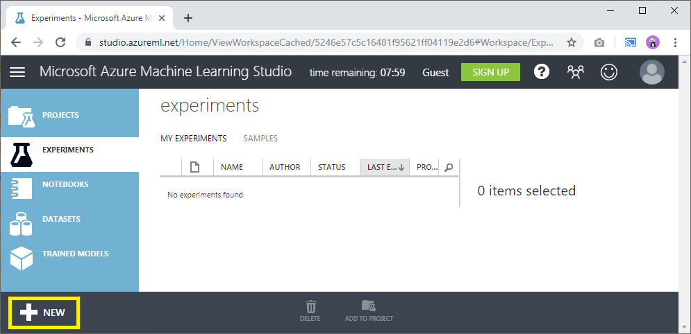
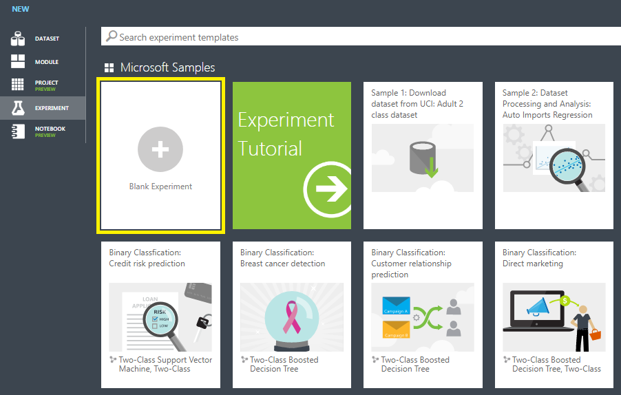

# สร้าง AI ตัดสินใจอนุมัติบัตรเครดิต 💳

ในรอบนี้เราจะมาเขียน AI ให้มันช่วยตัดสินใจความเสี่ยง เช่น คนที่มีประวัติทางการเงินแบบนี้ ควรจะอนุมัติออกบัตรเครดิตให้เขาดีหรือเปล่ากันดูบ้าง ซึ่งในบทความนี้เราจะสร้าง AI ผ่านเครื่องมือที่ชื่อว่า **Machine Learning Studio** หรือเรียกย่อๆว่า **MLS** กันครับ


**แนะนำให้อ่าน**  
บทความนี้เป็นหนึ่งในซีรี่ **Machine Learning** ดังนั้นถ้าเพื่อนสนใจของสนุกๆ เช่นการสร้าง AI เพื่อ [ทำนายราคารถยนต์](https://saladpuk.gitbook.io/learn/cloud/machine-learning-studio/ml101) วิเคราะห์ว่าควรอนุมัติบัตรเครดิตหรือเปล่า ทำนายว่าฝนจะตกหรือไม่ และอื่นๆ สามารถดูเนื้อหาทั้งหมดได้จาก Side menu ในหมวดของ **Machine Learning Studio** ครับ ซึ่งถ้ามีบทความเกี่ยวกับ machine learning ก็จะมาลงในหมวดนี้เรื่อยๆ แต่ถ้าอยากรู้ว่า AI สำเร็จรูปของ Microsoft Azure มีอะไรน่าเล่นบ้าง ไปอ่านกันได้จากลิงค์นี้เลยครัช [👶 Azure Cognitive Services](https://saladpuk.gitbook.io/learn/cloud/azure-cognitive-services) เชื่อผมเต๊อะ AI ไม่ได้ยากแบบที่คิด


## 🤔 อยากสร้าง AI ต้องเริ่มยังไง ?

ถ้าเพื่อนๆอยากดูรายละเอียดการใช้งาน Machine Learning Studio ขั้นพื้นฐาน และการสมัครใช้งาน สามารถอ่านได้จากลิงค์นี้เลยครับ



แต่สำหรับใครที่ขี้เกียจอ่านแล้วอยากจะเริ่มสร้าง AI โดยตามบทความนี้ก็กดที่ลิงค์ด้านล่างนี้เพื่อเข้าใช้งานได้เลยครับ

\*\*\*\*[**กดตรงนี้เพื่อนเข้าไปลองเล่นโดยไม่ต้องสมัครสมาชิก**](https://studio.azureml.net/Home/Anonymous)\*\*\*\*

## 🤔 สร้าง AI ให้มันตัดสินใจอนุมัติบัตรเครดิตทำไง ?

### 🔥 สร้างโปรเจคใหม่

หลังจากที่เราเข้ามาใน Machine Learning Studio ได้แล้ว ถัดมาเราก็จะสร้าง AI ของเราโดยการกดที่ปุ่ม **`NEW`** ด้านล่างซ้ายสุดเลย



ถัดมาเขาจะเปิดรายการตัวอย่าง AI แบบต่างๆให้เราดู ซึ่งในรอบนี้ผมจะสร้างใหม่ตั้งแต่เริ่มต้นเลย ดังนั้นกดที่ **Blank Experiment** เลยครับ



ถัดมาเราก็จะได้หน้าสำหรับเขียน AI เปล่าๆมาละ ซึ่งมันถูกแบ่งออกเป็น 4 โซนตามรูปเลย


| โซน | ใช้สำหรับ |
| :--- | :--- |
| **A** | เครื่องมือในการจัดการกับข้อมูลว่าจะให้มันทำอะไรบ้าง |
| **B** | แสดงให้เราเห็นว่าข้อมูลจะมีการวิ่งไปยังไงบ้าง |
| **C** | รายละเอียดของข้อมูลที่เรากำลังเลือก ซึ่งมันจะแสดงผลต่างกันไปตามของที่เลือก |
| **D** | เมนูในการจัดการโปรเจคที่กำลังทำงานอยู่ |

พอทำมาถึงตรงนี้ เราก็พร้อมที่จะสร้าง AI ของเราเองกันแล้วครับ

### 🔥 นำข้อมูลตัวอย่างการใช้บัตรเครดิตเข้ามา

ในหลักการสร้าง AI ของ Data science นั้น เขาจะต้องเอาข้อมูลตัวอย่างมาเยอะๆๆ เพื่อป้อนให้กับ AI ยิ่งเยอะมากเท่าไหร่ AI จะยิ่งเก่งขึ้นมากเท่านั้น ดังนั้นในขั้นตอนแรกของเราก็คือ เราจะต้องเอาข้อมูลตัวอย่างเข้ามาก่อนนั่นเอง

ดังนั้นที่โซน A ให้พิมพ์หาข้อมูลตัวอย่างในการใช้บัตรเครดิตในช่องค้นหาว่า **`credit`** แล้วลากมันเข้ามาที่โซน B ตามรูปเลย


ถัดมาลองมาดูข้อมูลตัวอย่างที่เขาเตรียมให้เรากันหน่อย โดยกดที่วงกลมเล็กๆใต้กล่อง **German Credit Card UCI dataset** แล้วเลือก **Visualize** เลย


เขาก็จะแสดงข้อมูลมาให้เราดูตามรูปเลย ซึ่งมีทั้งหมด 1000 รายการ และ 21 column และเราจะเห็นว่าข้อมูลตัวอย่างหัวตารางมันมีชื่อที่เราไม่รู้เรื่องเลยนิว่ามันคืออะไร


ดังนั้นเราก็จะทำการเปลี่ยนหัวตารางมันใหม่เพื่อไม่ให้เรา งง โดยค้นหาเครื่องมือที่ชื่อว่า **Edit Metadata** แล้วลากกล่องนั้นเข้ามาวางด้านล่างเลย แล้วก็ลากเส้นเพื่อให้ข้อมูลจากกล่อง German Credit Card ไหลมาเข้ากล่อง Edit Metadata ด้วยตามรูป


ถัดมาให้กดที่กล่อง Edit Metadata แล้วที่โซน C ให้เลือก **Lunch column selector** เพื่อไปเลือกหัวตารางที่จะเปลี่ยนชื่อครับ


ในรอบนี้เราต้องการจะเปลี่ยนชื่อหัวตารางทั้งหมด ดังนั้นเลือก **WITH RULES** แล้วเลือกที่ **all features** แล้วกดตกลง


ถัดมาที่โซน C เราจะต้องกำหนดว่าหัวตารางแต่ละอันมันชื่อว่าอะไรบ้าง ดังนั้นเราก็จะ copy ชื่อหัวตารางไปใส่ในช่องนั้นได้เลย ตามรูปด้านล่าง

```text
Status of checking account, Duration in months, Credit history, Purpose, Credit amount, Savings account/bond, Present employment since, Installment rate in percentage of disposable income, Personal status and sex, Other debtors, Present residence since, Property, Age in years, Other installment plans, Housing, Number of existing credits, Job, Number of people providing maintenance for, Telephone, Foreign worker, Credit risk
```


ลองกดดูข้อมูลที่ใส่หัวตารางดูบ้างซิ โดยการกด Visualize ที่กล่อง Edit Metadata เหมือนเดิมครับ \(ถ้ากดไม่ได้ให้กดปุ่ม **`RUN`** ด้านล่างก่อนแล้วรอแป๊ปนึงนะครับ\) ซึ่งเราก็จะเห็นว่าหัวตารางอ่านรู้เรื่องละ และที่ด้านขวาสุดก็จะมีบันทึกว่า คนๆนี้มีความเสี่ยงในการออกบัตรเครดิตหรือไม่นั่นเอง \(1 กับ 2 ในกรณีนี้คือ true / false\)


### 🔥 สอน AI จากข้อมูล \(Train model\)

จากทั้งหมดที่ว่ามาเราก็จะมีข้อมูลตัวอย่างแล้วว่า ถ้ามีคนมาขอเปิดบัตรเครดิต เราควรจะให้หรือไม่ให้ โดยดูจากช่อง **Credit risk** นั่นเอง ดังนั้นถัดมาเราจะให้ AI ลองเรียนรู้จากข้อมูลพวกนี้กันว่าพฤติกรรมของคนแบบไหนควรให้ผ่านแบบไหนไม่ควรให้ผ่าน

ตามหลักของ Data science แล้วเราจะแบ่งข้อมูลออกเป็น 2 ส่วน โดย**ส่วนแรก**จะเอาไปให้ AI ได้เรียนรู้ และ**ส่วนที่สอง**จะเอาไปทดสอบว่า AI มันแม่นยำขนาดไหน ดังนั้นในขั้นตอนนี้เราก็จะทำการแบ่งข้อมูลออกเป็น 2 ส่วน ด้วยการลากเครื่องมือที่ชื่อว่า **Split Data** ไปวางต่อท้ายไว้ แล้วก็ลากให้ข้อมูลไหลเข้ามาในกล่อง Split data ด้วย


ถัดมาเราก็ต้องกำหนดว่าจะแบ่งข้อมูลไปสอน AI กี่เปอร์เซ็น ดังนั้นเราก็ทำกากดที่กล่อง Split Data แล้วที่โซน C ในช่อง **Fraction** ให้เลือกเป็น 0.75 เพื่อแบ่งข้อมูลออไปสอน AI 75% ส่วนที่เหลืออีก 25% ก็จะเอาไปเทสนั่นเอง ตามรูปเลย


ถัดมาเราก็จะสอน AI จากข้อมูลตัวอย่างละ ซึ่งขั้นตอนนี้เราเรียกว่าการ **Train Model** ดังนั้นเราก็จะลากกล่องที่ชื่อว่า **Train Model** มาวางไว้ แล้วลากให้ข้อมูลจากกล่อง Split Data ในช่องแรกให้เข้ามาใส่ใน Train Model ตามรูป


ถัดมาเราจะต้องบอกว่าจะให้ AI เราเรียนรู้ข้อมูลเพื่อทำนายค่าใน Column ไหน ดังนั้นเราก็จะกดที่กล่อง Train Model แล้วในโซน C ให้กดเลือก **Lunch column selector**


ถัดมาเราก็เลือก Column ที่เราจะให้ AI ทำนายค่า นั่นก็คือ **`Credit risk`** นั่นเอง


ถัดมาเราจะต้องเลือกว่าเราจะให้ AI ตัดสินใจว่าจะทำนายค่า Credit risk ด้วยวิธีการไหนดี ซึ่งถ้าเราไม่รู้เรื่องหลักทางด้าน Data science เลย เราสามารถไล่จากไฟล์ด้านล่างนี้ได้เลย



ซึ่งจากจุดเริ่มต้นของไฟลน์นี้ เราต้องการจะให้ AI ทำนายค่าที่มีผลลัพท์เพียง 2 อย่างคือ **true/false** ดังนั้นเราก็จะตามมาที่เส้นล่างขวาตามรูป และในกลุ่มนี้ก็มีของให้เล่นเยอะเต็มไปหมด แต่ในรอบนี้ผมจะลองเลือก Algorithm ที่ชื่อว่า **Two-class boosted decision tree** มาลองเล่นดูกัน ตามรูปเลย


ดังนั้นเราก็จะลากกล่อง **Two-class boosted decision tree** มาว่างต่อ แล้วลากมันเข้าไปในกล่อง Train Model เพื่อบอกว่าเราจะใช้เจ้า Algorithm นี้ให้ AI ใช้ในการทำนายนะ


เพียงเท่านี้เราก็จะได้ Model ของ AI แบบง่ายๆออกมาละ

### 🔥 ทดสอบว่า AI ที่ได้แม่นขนาดไหน

หลังจากที่ได้ AI แบบคร่าวๆละ คราวนี้เราก็จะต้องลองเอาข้อมูลที่เก็บไว้ 25% ที่เหลือ เอามาทดสอบดูว่า AI ของเรามันจะตัดสินใจได้แม่นขนาดไหนนั่นเอง โดยการลากกล่องที่ชื่อว่า **Score Model** เข้ามา แล้วลากให้ข้อมูลจากผลการทำนายจากกล่อง Train Model เข้ามาใส่ในกล่อง Score Model ซะ แล้วตามด้วยลากข้อมูลที่แอบเก็บไว้จากกล่อง **Split Data** มาใส่กล่อง Score Model ด้วยเช่นกัน ตามรูปเลย


สุดท้ายเพื่อความง่ายในการดูผลลัพท์ว่ามันแม่นขนาดไหน เราก็จะลากกล่องที่ชื่อว่า Evaluate Model เข้ามาใส่ แล้วลากผลลัพท์การตรวจให้ไหลมาใส่กล่อง Evaluate model ซะ


คราวนี้ลองกด Visualize ที่กล่อง Evaluate Model ดูผลสรุปความแม่นยำของ AI เราซิ \(ถ้ากด visualize ไม่ได้ให้กด RUN ที่เมนูด้านล่างแล้วรอแป๊ปนึงนะ\)


เรียบร้อยแล้วครับ เราก็จะได้ AI ที่มีความแม่นยำในการตัดสินใจความเสี่ยงที่มีความแม่นยำ 75% ได้แล้วจากการแค่ลากๆวางๆเท่านั้นเอง


**ความแม่นยำของ AI**  
AI ที่เราสร้างนั้นจะเก่งหรือไม่ขึ้นอยู่กับ 2 อย่างหลักๆคือ  
**1.ข้อมูล** - **ปริมาณ**ข้อมูลยิ่งมากเท่าไหร่ AI จะยิ่งตัดสินใจได้เก่งขึ้นมากเท่านั้น และต้องเป็นข้อมูลที่มี**คุณภาพ**ด้วย ไม่ใช่เอาข้อมูลขยะมาให้มันเยอะๆแบบ คำว่าคุณภาพคือ มีความถูกต้อง ข้อมูลถูกเลือกปัจจัยที่เหมาะสม  
**2.Algorithm** - หากเลือก Algorithms เราก็จะได้ AI ที่ทำงานไม่ค่อยดีเท่าไหร่ คล้ายๆกับเอาค้อนไปเลื่อยไม้อ่ะ มันก็อาจจะเลื่อยไม้จนขาดได้\(มั้ง\) แต่มันก็เทียบกับการที่เราเอาเลื่อยหรือเลือก algorithm ที่เหมาะสมให้มันตั้งแต่แรกไม่ได้หรอก


## 🤔 อยากเอา AI ไปใช้งานที่แอพอื่นๆ

เราสามารถเอา AI ที่สร้างจาก Machine Learning นี้เปิดออกเป็น REST API ได้เลยทันที โดยคนที่เรียกจะต้องมีการแนบ Access Key มาให้ถูกต้องด้วย ซึ่งวิธีการไปดูได้จากลิงค์นี้ \(กดจริงๆ 2-3 ทีก็เสร็จแล้ว แต่ขี้เกียจไปก๊อปมาไปเอาเอาซะ\)

\*\*\*\*[**การสร้าง REST API จาก Machine Learning**](https://saladpuk.gitbook.io/learn/cloud/machine-learning-studio/ml101#ai-2)\*\*\*\*

## 🎯 บทสรุป

จากทั้งหมดที่โชว์ให้ดู เราก็จะสามารถเขียน AI ให้มันวิเคราะห์ผลที่มีคำตอบแค่ 2 อย่างคือ true/false แบบง่ายๆได้ แล้วมันก็สามารถเอาไปใช้ได้กับหลายๆเรื่องที่ต้องการคำตอบจำพวกนี้ได้ครับ อีกทั้งใน Machine Learning Studio เรายังสามารถจัดการกับข้อมูลที่ไม่มีหัวคอลัมน์ได้โดยการใช้กล่องที่ชื่อว่า Edit Metadata อีกด้วย

ดูเหมือนว่ามันจะยาวมาก แต่เชื่อมไหว่าถ้าทำจนเข้าใจจริงๆแล้วนั่งจิ้มไม่ถึง 3 นาทีเลยทั้งหมดนั่น แต่ถ้าให้เราไปเขียนโค้ดเพื่อสร้าง AI ให้มันออกมาทำงานได้แบบนี้แล้วล่ะก็ผมคิดว่าอย่างต่ำก็ใช้เป็นหลักชั่วโมง ไม่ก็อาจจะเป็นเดือนเลยก็ได้ 🤣


**แนะนำให้อ่าน**  
สำหรับคนที่อยากใช้ AI แบบไม่ต้องมานั่งสร้างเองก็สามารถดูได้จากคอร์ส [👶 Azure Cognitive Services](https://saladpuk.gitbook.io/learn/cloud/azure-cognitive-services) ได้เลยนะครับ ซึ่งภายในบทความก็จะมีตัวอย่างสนุกๆ เช่น [**Login ด้วยใบหน้า**](https://saladpuk.gitbook.io/learn/cloud/azure-cognitive-services/faceauth)**,** **ยืนยันตัวตนด้วยเสียง,** [**แปลงภาพเป็นข้อความ**](https://saladpuk.gitbook.io/learn/cloud/azure-cognitive-services/ocr)**,** [**แยกแยะภาพต่างๆ**](https://saladpuk.gitbook.io/learn/cloud/azure-cognitive-services/image-classification) และอื่นๆ เชื่อผมเต๊อะ AI ไม่ได้ยากแบบที่คิด


