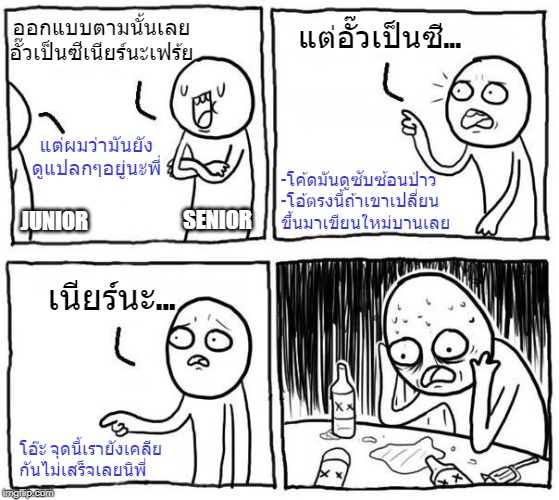

# เวลาทำงานเหตุผลมาก่อนเสมอ

ในแต่ละบริษัทนั้นมีตำแหน่งอำนาจที่แตกต่างกัน ซึ่งแต่ละที่จะใช้อะไรเป็นตัวกำหนดตำแหน่งนั้นไม่ใช่เรื่องที่แมวน้ำตัวนี้จะไปวุ่นวายด้วย แต่สิ่งที่แมวน้ำเห็นว่ามันควรจะเป็นคือ 

> **💖การทำงานเป็นทีมนั้นควรจะใช้เหตุผลมาก่อนตำแหน่งงานเสมอ  
> \(**เพราะผมเชื่อว่าทุกคนในทีมย่อมอยากให้งานออกมาดีที่สุดนั่นเอง\)

แต่หลายครั้งที่เราจะเห็นของแปลกๆโผล่เข้ามาในโปรเจคเราเสมอ ซึ่งถ้าเราไปเค้นเอาความจริงว่าทำไมเขาถึงทำแบบนั้น ซึ่งเชื่อไหมว่า **ส่วนใหญ่จะทำไปเพราะความหวังดีอยากให้งานเสร็จ** โดยที่เจ้าตัวที่ใส่ของแปลกๆเข้าไป บางทีก็ไม่รู้ด้วยซ้ำว่ามันไม่ควรทำแบบนั้น หรือคิดหาวิธีแก้ปัญหาแบบอื่นไม่ได้นั่นเอง

ดังนั้นวิธีการแก้ปัญหาเรื่องพวกนี้จริงๆก็คือ **"การสร้างทีมให้มี Mindset เปิดใจรับความคิดเห็นคนอื่น"** และ ทีมต้องมีเวลาในการสอนกันเอง เช่น การทำ [**Code Review**](https://www.saladpuk.com/basic/agile-methodology/code-review) นั่นเอง หรือไม่มีเวลาจริงๆก็ควรจะต้องมีการทำ **Pair Programming** ก็จะเป็นการช่วยละช่องว่างของ **Junior & Senior** ลงได้ดีทีเดียว

## 💕 การเปิดใจ

ไม่ว่าคนพูดจะมีตำแหน่งอะไร หรือ เขาจะดูโง่แค่ไหนในสายตาเราก็ตาม เราก็ควรจะรับฟังสิ่งที่เขาพูด แล้วค่อยเสนอเหตุผลหรือวิธีการที่ดีกว่าให้เขาฟัง บางทีเราอาจจะประหลาดใจที่พบว่า พอเขาฟังเราเสร็จ เขาอาจจะบอกจุดอ่อนของเหตุผลของเราให้ฟัง แล้วพบว่าวิธีการของเขามันง่ายกว่าของเราก็เป็นได้ ... แต่เชื่อผมเถอะเราต้องฟังเขาก่อนตัดบทเขาเสมอ เพราะ ... เป็นคุณก็ไม่อยากทำฟังเหตุผลอีกคนถ้าเขาตัดบทพูดเราหรอก ... เขาคนนั้นก็เช่นกัน


**แนะนำให้อ่าน**  
สำหรับใครที่คิดว่าการทำ Pair Programming เป็นการเสียเวลา ผมแนะนำให้ไปอ่านหนังสือเรื่อง [**Agile Principles, Patterns, and Practices in C\#**](https://www.amazon.com/Agile-Principles-Patterns-Practices-C/dp/0131857258) ในบทที่ 4 เพียงบทเดียว ผมรับรองว่าเราจะมองการทำ pair programming เปลี่ยนไปเยอะเลย ส่วนอีกตัวที่แนะนำคือหลักในการทำงานพื้นฐานที่เหมาะกับการพัฒนาซอฟต์แวร์ [👦 **Agile Methodology**](https://www.saladpuk.com/basic/agile-methodology)\*\*\*\*


