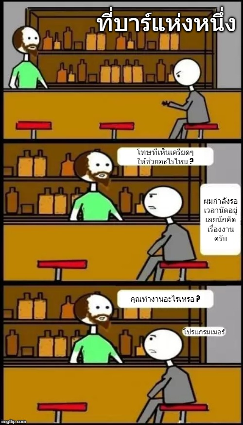
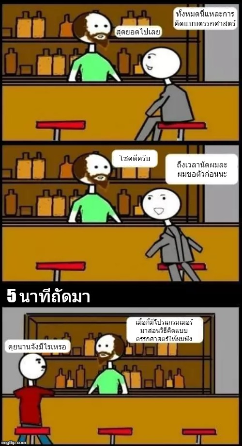
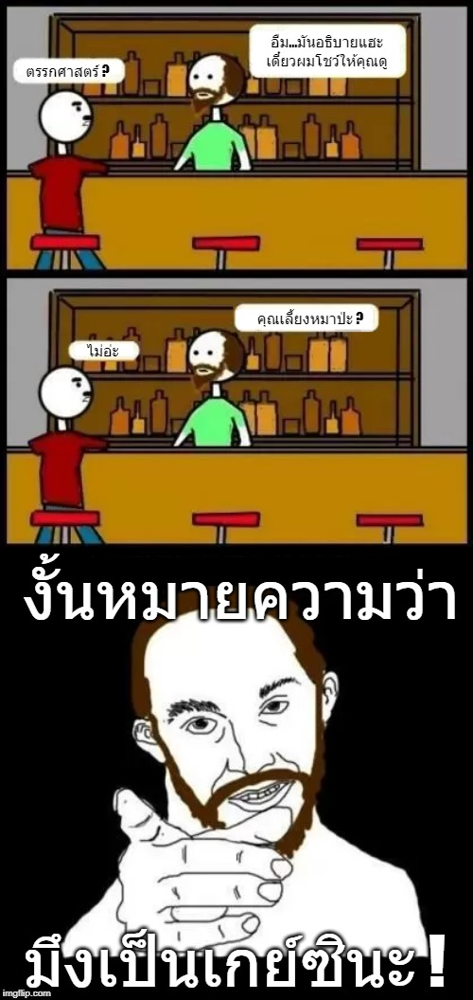

# คิดแบบตรรกะจำแบบโปรแกรมเมอร์

สำหรับคนที่คิดอะไรม่ค่อยออก จำอะไรไม่ค่อยได้ และยังไม่มั่นใจว่ามาทำงานสายโปรแกรมเมอร์แล้วจะรอดหรือเปล่า ?**ดช.แมวน้ำ** โดนคำถามนี้มาเยอะม๊วกเวลาไปสอนน้องๆ มัธยมหรือมหาลัย ดังนั้นในบทความสั้นรอบนี้จะมาบอกเคล็ดไม่ลับที่ป๋มใช้เอาตัวรอดมาจนถึงทุกวันนี้ตามนี้ขอรับ

## อย่าจำ...แต่จงเข้าใจ

การท่องจำนั้นจะช่วยให้เราจำสิ่งนั้นๆได้ **"ในระยะเวลาสั้นๆ"** แต่ผ่านไปซักพักใหญ่ๆเราก็จะลืมมันจนหมด \(ลองนึกดูของที่นั่งท่องก่อนไปสอบอ่ะ ยังจำกันได้ป่าว?\) แต่สิ่งที่ป๋มใช้ตลอดมาก็คือการ **"ทำความเข้าใจ"** ซึ่งถ้าเราเข้าใจเรื่องอะไรแล้วเราก็จะ **"ไม่ลืมตลอดชีวิต"** แต่ถ้าลืมขึ้นมา แล้วไปทวนนิดหน่อยก็จะจำได้ทันที \(ลองนึกดูว่าเราเคยลืมการบวกลบคูณหารเลขหรือเปล่า? เคยต้องไปนั่งท่องจำไหมว่าการคูณมันทำยังไง?\)

## อย่าอ่านอย่างเดียว...แต่จงปฎิบัติ

การอ่านเป็นเรื่องดีที่ทำให้เราเข้าใจสิ่งต่างๆได้ แต่การอ่านนั้นก็เป็น **"ความทรงจำระยะสั้น"** เหมือนกัน \(ถ้าเป็นเรื่องที่เราชอบอาจจะเป็นระยะยาว\) และสิ่งที่เราเข้าใจ **"อาจจะไม่ถูกหมดก็ได้"** ดังนั้นวิธีการที่ดีที่สุด ไม่ว่าจะเป็นแมวน้ำที่เก่งกาจแค่ไหนก็ตามก็ต้อง เอาสิ่งที่ได้เรียนรู้มา **"ไปลองทำ"** เพื่อพิสูจน์ว่าตัวเองเข้าใจมันจริงๆหรือเปล่า ซึ่งมันจะทำให้เราเข้าใจได้ลึกขึ้น และมันจะกลายเป็น **"ความทรงจำระยะยาว"**

## อย่าจำผลลัพท์...แต่จงจำที่เหตุผล

คนส่วนใหญ่ชอบจำแต่คำตอบ ซึ่งมันจะทำให้เราแก้ปัญหาได้ถ้าคำถามยังเป็นแบบเดิมๆ แต่สิ่งที่มีค่าที่สุดของคำตอบนั่นคือ **"เหตุผลของการได้คำตอบ"** นั่นเอง เช่น เราจำว่าเจองานปัญหาแบบนี้ให้ใช้ if..else นะ ซึ่งเราก็จะทำตามกันโดยไม่ได้สนใจเหตุผล ดังนั้นเราก็จะไม่รู้ว่าทำไมการใช้ switch case ถึงไม่เหมาะสม แล้วเมื่อไหร่มันถึงจะเหมาะสม? นั่นแหละคือสิ่งที่บอกว่า เหตุผลของคำตอบ คือสิ่งที่สำคัญที่สุด เพราะมันจะทำให้เราตัดสินใจในหลายๆสถานะการณ์ได้มากขึ้น

## 💖 หัวใจหลัก

จริงไม่ว่าจะเป็นเรื่องไหนก็ตามมันมาจากหลักการคิดแบบ **"ตรรกะ \(Logic\)"** เพราะสมองเราไม่ได้เก่งในเรื่องการจดจำแบบมั่วๆ แต่มันเก่งในเรื่องการจดจำแบบมีเหตุผลมาประกอบเสมอ เช่น ลองเทียบการจำแบบที่ไม่มีตรรกะ กับแบบมีตรรกะดูนะ

**แบบไม่มีตรรกะ**  
คุณแม่ เด็กผู้หญิง ขนมปัง คุณยาย ป่ารกทึก หมาป่า นายพราน

**แบบมีตรรกะ**  
คุณแม่ให้เด็กผู้หญิงเอาขนมปังไปให้คุณยาย ที่อาศัยในป่ารกทึบ ซึ่งคุณแม่บอกว่าให้ระวังหมาป่าด้วย ดังนั้นเลยจ้ายนายพรานไปช่วยดูแลความปลอดภัย

แม้ว่าแบบมีตรรกะอาจจะยาวไปหน่อย แต่ผมเชื่อว่าถ้าให้จำแล้วล่ะก็ แบบมีตรรกะน่าจะจำง่ายกว่าเยอะเลยชิมิ?

ดังนั้น **ดช.แมวน้ำ** ขอฝากให้เพื่อนๆที่คนไปเข้าใจที่เหตุผลว่าเขามีตรรกะในการคิดยังไงกันนะครับ จะได้เอาไปใช้งานได้กับหลายๆสถานะการณ์ เพราะถ้าไม่อย่างนั้นเราจะ รู้คำตอบ แต่พลิกแพลงไม่ได้เหมือนในการ์ตูนนั่นเองนั่นเอง


**แนะนำให้อ่าน**  
ส่งที่จะช่วยให้เราสามารถเรียบเรียงความคิดได้ง่ายขึ้น เพื่อช่วยดูภาพรวมทั้งหมด นั่นคือ UML นั่นเอง ซึ่งเพื่อนๆสามารถศึกษาต่อได้จากลิงค์ด้านล่างนี้เบยครัช [👶 UML พื้นฐาน](https://www.saladpuk.com/basic/uml)


