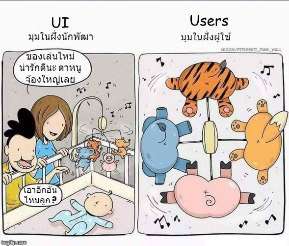

# แค่ต่างมุมมองทองก็กลายเป็นขี้ได้

ของหลายๆอย่างที่เราคิดว่ามันดีนั้น มันอาจจะไม่จริงเสมอไปก็ได้นะ เช่น เราเชื่อกันว่า ถ้าเราสร้าง AI ที่ฉลาดๆ เทพๆ ล้ำๆ ออกมาได้ มันก็น่าจะเป็นที่นิยมชิมิ? แต่เชื่อไหมว่าหนึ่งใน **"หลักการออกแบบ AI" \(Principles of AI design\)** เขาบอกว่า **"อย่าไปทำแบบนั้น"** ... ทำไมนะเหรอ? ขอยกตัวอย่างนี้ให้ฟังละกัน

สมมุติว่าเราสร้าง AI โคตรเทพ ฉลาดฝุดๆ โต้ตอบหลายภาษา สั่งการด้วยเสียงได้ด้วย นั่นคือ **"โถส้วมอัจฉริยะ"** แต่ถามหน่อยว่า ปรกติเราจะคุยอะไรกับโถส้วมเหรอ? มันจะช่วยแก้ปัญหาอะไรเราเหรอ? และ ตลกร้ายคือ ถ้ากลุ่มลูกค้าที่เป็นผู้พิการทางหูมาใช้ มันจะต่างอะไรกับโถส้วมธรรมดาหรือเปล่า?

เพราะหลักในการออกแบบจริงๆแล้วเข้าเน้นไปที่เรื่อง **"แก้ปัญหาได้จริง ง่ายและเร็ว"** หรือพูดง่ายๆคือ คนใช้ไม่ต้องทำด๋อยอะไรเลยปัญหาก็ถูกแก้ไขไปแล้ว ... \(ยังไม่ทันถอดกางเกงนั่งส้วมเลย เจ้าโถส้วมอัจฉริยะก็ทำให้คุณไม่ต้องขี้แล้ว\) นี่คือสุดยอดแห่งการแก้ปัญหา ... และอย่าลืมว่า ผู้ใช้เขาไม่สนใจหรอกว่าคุณจะสร้างมันมาจากอะไร ใช้ Back-end ที่มี security ดีเท่าไหร่? Architecture เป็นยังไง? \(ผู้ใช้ 90% น่าจะไม่เคยสงสัยเรื่องเหล่านี้กับแอพธนาคารเลย แม้ว่ามันจะมีเรื่องสนุกๆให้ดูทุกๆสิ้นเดือนก็ตาม\)

ซึ่งทั้งหมดที่โม้มาจะขาดสิ่งสุดท้ายไม่ได้เลยนั่นก็คือ **"มุมมอง"** เพราะของสิ่งเดียวกัน แต่ถ้า ผู้ใช้งานต่างกลุ่มกัน มันอาจจะไม่ได้แก้ปัญหาเขาเขาได้โดยตรงก็ได้ เช่น ฝ่ายบัญชีบอกว่าแบบนี้ดีที่สุด มันอาจจะไม่จริงในมุมของฝ่ายการตลาดก็ได้นะจ๊ะ

