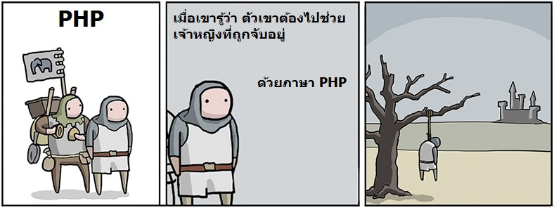
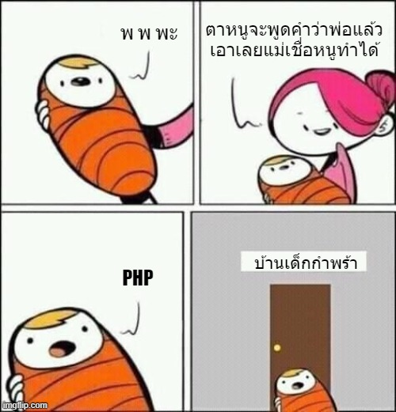

# ดราม่ากับ PHP

โดนดราม่าเพราะรูปนี้จนได้ และเริ่มขี้เกียจตอบคำถามเดิมๆซ้ำหลายๆครั้ง เลยจะขอเขียนไว้ตรงนี้เลยละกันว่า

> จริงๆภาษา php มันก็โดนแซะไม่ต่างจากภาษาอื่นๆ เช่นภาษา javascript เท่าไหร่หรอก และภาษา PHP ไม่ได้เลวร้ายขนาดนั้นนะ  แต่ที่มันกลายเป็นมุกแบบนั้น เราต้องเข้าใจพื้นหลังของเขาก่อนดีกว่า

## Backend

PHP ก็สามารถเขียน backend ได้นะ และส่วนใหญ่งานที่ลูกค้าจ้าง 80-90% ก็เป็นเว็บง่ายๆไม่ได้วุ่นวายอะไร แต่สำหรับงาน backend จ๋าๆ แล้วให้ใช้ PHP ทำ มันจะเหมือนตกนรกทั้งเป็นเลย ยกตัวอย่างง่ายๆ เช่น การประมวลผลธรรมดานี่แหละ แต่มีผู้ใช้ request มาเป็นล้านๆครั้งต่อนาที ปัญหาที่จะเกิดขึ้นคือ ภาษา **PHP มันเป็น interpreter** ซึ่งหมายความว่า **"มันจะหน่วง" ดังนั้นมันจะมีปัญหาเรื่อง perfomance** และ ด้วยความที่เขาเป็น server side script เพียงอย่างเดียว นั่นหมายความว่า ทุกอย่างเซิฟเวอร์ต้องประมวลผลทั้งหมด ไม่มีการลดภาระของเซิฟเวอร์เลย

## Facebook

Facebook ยังใช้ PHP เลย!! ใช่ครับแต่เพราะ **php นี่แหละ เลยเกือบทำให้ facebook ตายมาแล้ว** และตอนนี้เขาโล๊ะทิ้งแล้วนะ ไม่มี php ในฝั่ง facebook backend เหลือแล้ว \(ไปอ่านตามข่าวเองละกัน\) แต่ที่ยังเห็น facebook รับพนักงานที่เขียน php อยู่ ก็เพราะโปรแกรมเมอร์ที่เขียน php หาง่าย แล้ว facebook ก็เอาคนเหล่านั้นไปเขียน php ซึ่งทาง **facebook มีโปรแกรมแปลง php ให้กลายเป็น ภาษา c++ เพื่อเอาไปใช้ใน backend ของเขาต่อ**นั่นเอง

## หัดให้นิสัยเสีย

ภาษา PHP เป็นหนึ่งในภาษาที่อยากเขียนอะไรลงไปก็ได้ บรรทัดนี้ตัวแปร money อาจมีค่าเป็นตัวเลข บรรทัดถัดไปกลายเป็นตัวอักษร บรรทัดที่สามกลายเป็น object หรือเอา boolean ไปเขียน if แล้วได้ค่า 1 ไรงี้ และรวมถึงอยากจะเขียนอะไรตรงไหนก็เขียนได้หมดเลย อยากแทรกก็แทรกลงไปได้ดื้อๆ เลยทำให้หลายๆคนหลงรัก PHP เพราะมันง่ายม๊วกๆ แต่ก็เช่นเคย ด้วยความง่ายนั่นแหละมันจะทำลายนิสัยในการเขียนโปรแกรมที่ดี และต้องมีการควบคุมที่มากขึ้น ถึงจะให้ทุกคนในทีมทำงานร่วมกันได้ ซึ่งถ้าใครเคยศึกษาเรื่องการทำ **Clean Code & Clean Architect** จะเข้าใจปัญหาที่มากับความง่ายของภาษาลักษณะนี้ \(บอกแล้วไม่ได้มีแค่ php ที่มีปัญหานี้นะ\)

ว่าเขาไปตั้งเยอะละ มาปิดฉากสวยๆกับ php บ้างดีกว่า

