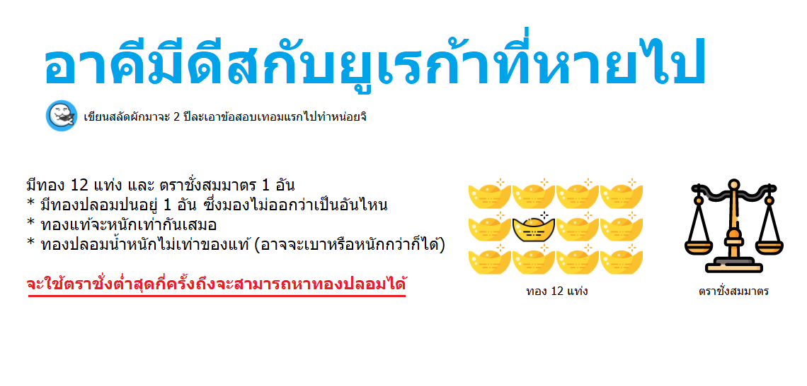

# 🥇 ทองเก๊

## 🥳 โจทย์

ตรงหน้ามีทองอยู่ทั้งหมด 12 แท่งที่มีหน้าตาเหมือนกันเด๊ะๆ แต่ว่าหนึ่งในนั้นเป็นของปลอม เรารู้แค่ว่าทองของแท้มีน้ำหนักเท่ากันเสมอ ส่วนทองของปลอมอาจจะหนักกว่าหรือเบากว่าทองของแท้ แต่ไม่มีทางที่จะหนักเท่ากันแน่ๆ ใกล้ๆตัวเรามีตราชั่งสมมาตรอยู่ 1 อันที่จะเอามาชั่งกี่ครั้งก็ได้ **เราจะชั่งอย่างน้อยที่สุดกี่ครั้งเพื่อหาทองปลอมชิ้นนั้นออกมา?**

> โจทย์ทุกข้อ **ดช.แมวน้ำ** ไม่ได้อยากได้ตัวเลขที่เป็นคำตอบ แต่อยากได้วิธีทำ เพราะมันคือ Logic ขั้นพื้นฐานของการแก้ไขปัญหา และ การอธิบายนี่แหละคือจุดอ่อนของเหล่าโปรแกรมเมอร์ เพราะสปีชีส์โปรแกรมเมอร์ส่วนใหญ่จะสื่อสารภาษามนุษย์กันไม่ค่อยเป็นเท่าไหร่นั่นเอง 😂


**แนะนำให้อ่าน**  
บทความนี้เป็นส่วนหนึ่งของ [**🧠 Challenges**](https://www.saladpuk.com/puzzle/challenges) ที่จะคอยรวบรวมโจทย์ที่น่าสนุกคิดเพลินๆ หากใครสนใจอยากดูว่ามีโจทย์อะไรบ้างก็อัญเชิญกดที่ชื่อสีฟ้าๆไปเสพต่อได้เบย ส่วนใครที่คิดว่ามีโจทย์น่าสนใจก็สามารถส่งมาได้ที่ [**Saladpuk Fanclub**](https://www.facebook.com/mr.saladpuk) นะกั๊ฟ 😘


## 🤠 วิธีคิด

โจทย์ข้อนี้จริงๆมันซ่อนความยากไว้ 2 อย่าง อันแรกคือ **ทองแท่งไหนคือของปลอม** ซึ่งการที่จะหามันได้เราจะ **ต้องรู้ว่าทองปลอมมันหนักกว่าหรือเบากว่า** ด้วยนั่นเอง

🚀 เฉลยไว้ก่อนเลยว่าเราสามารถหาคำตอบได้ 100% สำหรับทุกกรณีคือการ**ชั่ง 3 ครั้ง**

* 💡 **การชั่งแต่ละครั้งโคตรสำคัญเพราะมันเป็นจุดใช้ติดสินใจการชั่งครั้งถัดไป ดังนั้นทุกการชั่งควรต้องได้ infomation ที่เอาไปคิดต่อได้เสมอ ซึ่งการที่จะทำแบบนั้นได้จุดเริ่มต้นของมันคือ การแบ่งกลุ่ม**
* **💡** \(ข้อนี้สำคัญที่สุด\) **ทองแท้เท่านั้นที่มีคุณสมบัติในการเปลี่ยนกลุ่มแล้วได้ผลลัพท์เหมือนเดิม ทองปลอมไม่มีคุณสมบัตินี้** เพราะทองแท้ไม่ว่าจะเปลี่ยนไปวางไว้ในกลุ่มไหน ผลลัพท์ในการชั่งต้องได้เหมือนเดิมเสมอ
* **💡 ถ้าเราชั่งครั้งที่ 2 เสร็จ แต่ยังหาความสัมพันธ์เรื่องน้ำหนักไม่ได้ เราก็จะไม่มีทางตอบคำถามข้อนี้ด้วยการชั่ง 3 ครั้งได้เลย**

## **🔥 แบ่งกลุ่ม**

ทอง 12 แท่งสามารถจัดกลุ่มได้หลายแบบ ซึ่งแมวน้ำขอยกตัวอย่างแค่ 4 แบบให้ดูละกัน ตามรูปด้านล่าง

🤠 เมื่อมีตัวเลือกเยอะๆ เราควรชั่งน้ำหนักข้อดีข้อเสียก่อนเลือกเสมอ เพราะไม่ว่าจะเลือกวิธีไหนเราก็จะเสียเวลาในการคิดเหมือนกัน ซึ่งจากรูปด้านบน **สิ่งแรกที่เราควรตัดออกคือการแบ่ง 2 กลุ่ม** เพราะเราไม่ต้องชั่งเราก็รู้คำตอบชัวร์ๆว่า มันมีฝั่งหนึ่งหนักและอีกฝั่งหนึ่งเบา **ซึ่งไม่ทำให้เราได้ข้อมูลอะไรเลยจากการเอามันไปชั่ง** ดังนั้นตัดออกซะ

**🤠 ตัวเลือกถัดมาที่ควรตัดออกคือแบบ 6 กลุ่ม** เพราะจำนวนกลุ่มมันเยอะเกินไป สมมุติง่ายๆว่า**เราโชคร้าย**ไปหยิบเจอกลุ่มที่เป็นของปลอมได้ตอนท้ายๆ เราก็ต้องชั่งไปอย่างน้อย 3 ครั้งละ ดังนั้นไม่มีทางที่เราจะหาคำตอบได้ภายในการชั่ง 3 ครั้งแน่นอน

🤠 ถัดมาถ้าเราคิดจากกรณีโชคร้ายก็จะทำให้เรารู้ว่า **ควรตัดแบบ 4 กลุ่มทิ้ง เพราะถ้าชั่งครั้งแรกแล้วมันหนักเท่ากัน เราจะได้ข้อมูลกลับมาน้อยกว่าแบบ 3 กลุ่ม ในกรณีที่โชคร้ายเหมือนกัน** ตามรูปด้านล่าง \(ถ้าการชั่งไหนได้ information กลับไปน้อยถือว่าเสียประโยชน์ เพราะจำนวนในการชั่งมีค่าเยอะกว่าม๊ากกก\)

> บางคนอาจจะเถียงข้อนี้ก็ไม่เป็นไร เพราะกรณีแย่สุดๆของการแบ่ง 4 กลุ่มคือ ชั่งครั้งที่ 1 เท่ากัน แล้วชั่งครั้งที่ 2 ก็เท่ากันอีก เราจะหาทองปลอมไม่ได้ครับทุกกรณีนั่นเอง \(เฉลยขู่ไว้ก่อนไม่เชื่อลองทำดู 🤣\)

🤠 ดังนั้นจากที่ว่ามาเลยทำให้ตัวเลือกเราเหลือแค่การแบ่งเป็น 3 กลุ่มนั่นเองกั๊ฟ

## 🔥 ตราชั่ง

ก่อนจะเอามันไปขึ้นเขียง **ดช.แมวน้ำ** ขอตั้งชื่อมันให้ง่ายต่อความเข้าใจหน่อยนุง ตามภาพด้านล่าง

คราวนี้เราก็หยิบมันมาขึ้นเขียงซะ!! โดยแมวน้ำขอหยิบ A กับ B ละกัน ซึ่ง**ผลลัพท์เป็นไปได้แค่ 3 แบบ**คือ **`หนักกว่า`** **`เบากว่า`** และ **`เท่ากัน`**  ดังนั้นก็จะเป็นตามรูปด้านล่าง

จากรูปด้านบนก็จะทำให้เรารู้ว่า ในกรณีที่ 1 กับ 2 นั้นกลุ่ม C เป็นทองแท้ทั้งหมด ส่วนกรณีที่ 3 กลุ่ม C มีทองปลอมอยู่แน่ๆ ตามรูปด้านล่าง

\(กรณีที่ 3 แก้ง่ายแม้วน้ำเลยขอไปแก้ของยากๆก่อนนะ 🤣\) จากตรงนี้ขอเอา **กรณี 1 มาทำต่อ** โดยขอซูมเข้าไปในรูปอีกนิสก็จะเห็นเลขที่ติดไว้บนทองแต่ละแท่งตามนี้

🤠 ในการชั่งครั้งที่ 2 นี้สำคัญที่สุด **ซึ่งเราต้องบีบตัวเลือกให้เหลือทองน้อยกว่า 4 อัน** เพราะไม่งั้นการชั่งครั้งที่ 3 จะหาคำตอบไม่ได้ 

> ไม่เชื่อลองจินตนาการดูก็ได้ว่า ถ้าเหลือทอง 4 อัน \(ต่อให้รู้ว่าทองปลอมหนักหรือเบากว่าก็ได้\) แต่ให้ชั่งได้ครั้งเดียวเราจะหาคำตอบแบบ 100% ได้ยังไง?

จากที่ว่ามาเราเลยต้องทำการเลือกบางส่วนที่จะไม่นำมาชั่ง และอันที่จะชั่งจะต้องสลับระหว่างกลุ่ม A กับ B \(เดี๋ยวอธิบายตอนเห็นตัวอย่างจะเข้าใจง่ายกว่า\) ดังนั้นเราเลยเลือกทองที่จะชั่งในครั้งที่ 2 เป็นตามรูปด้านล่าง

จากแนวคิดที่ว่า 💡 **ทองแท้เท่านั้นที่มีคุณสมบัติในการเปลี่ยนกลุ่มแล้วได้ผลลัพท์เหมือนเดิม ทองปลอมไม่มีคุณสมบัตินี้** หมายถึงเอาทองแท้กับทองแท้สลับกันผลลัพท์ต้องเหมือนเดิม แต่ถ้าเอาของแท้กับของปลอมสลับกันผลลัพท์จะไม่เหมือนเดิม \(เพราะเรื่องนี้แหละเราเลยต้องชั่งน้ำหนักแบบสลับด้านกัน\) ดังนั้นจะทำให้เรารู้ว่า

* \(กรณีที่ 4\) **ตาชั่งเอียงทิศทางเดิม** แสดงว่า B1, B2, A2 เป็นทองจริง เพราะพวกมันถูกสลับตำแหน่งมาแล้วยังคงให้ผลลัพท์เหมือนเดิม เลยทำให้เรารู้ว่า **ทองปลอมต้องอยู่ใน A1, B3, B4**
* \(กรณีที่ 5\) **ตาชั่งเอียงเปลี่ยนทิศ** เลยทำให้เรารู้ว่า **ทองปลอมต้องอยู่ใน B1, B2, A2** เพราะมันสลับตำแหน่งกันแล้วผลลัพท์เปลี่ยนไปจากเดิม
* \(กรณีที่ 6\) **หนักเท่ากัน** แสดงว่า **ทองปลอมต้องอยู่ในกลุ่มที่ไม่ได้เอามาชั่งนั่นคือพวก A3, A4**

จากที่ว่ามาก็จะได้ออกมาตามรูปด้านล่าง + เติมสีแดงช่วยให้จำง่ายขึ้นว่าในการชั่งครั้งที่ 1 ฝั่งไหนหนักฝั่งไหนเบาลงไปด้วย

\(กรณีที่ 3 แก้ง่ายแม้วน้ำเลยขอไปแก้ของยากๆก่อนนะ 🤣\) จากตรงนี้ขอเอา **กรณี 4 มาทำต่อ** โดยการเอากลุ่ม B มาชั่งกันเอง เพราะกลุ่ม B มันนำเสนอมาตลอดว่ากลุ่มมันเองตัวเบานะ ดังนั้นถ้า B3 ชั่งกับ B4 แล้ว

* **หนักเท่ากัน**แสดงว่ากลุ่ม B ทั้งหมดเป็นทองแท้ ดังนั้น**ทองปลอมคือ A1 และมีน้ำหนักมากกว่าปรกติ**
* **B3 หนักกว่า B4** แสดงว่า ทองปลอมคือ **B4 และมีน้ำหนักเบากว่าปรกติ**
* **B3 เบากว่า B4** แสดงว่า ทองปลอมคือ **B3 และมีน้ำหนักเบากว่าปรกติ**

ซึ่งก็จะได้ผลลัพท์ตามนรูปด้านล่าง

ซึ่งพอได้คำตอบตรงนี้เราก็จะรู้ว่า **กรณีที่ 5 และ 6 ก็สามารถหาคำตอบได้โดยใช้ทำตามแบบกรณีที่ 4 ได้เลย** ส่วน**กรณี 2 ก็จะเป็นด้านตรงข้ามกับกรณี 1** ดังนั้นลอกลงมาแล้วกลับด้านก็จะได้คำตอบเหมือนกัน ดังนั้นก็จะเหลือแค่กรณี 3 ซึ่งแมวน้ำเชื่อว่าเพื่อนๆก็ทำได้อยู่แล้วแน่ๆเลยขอไม่อธิบายต่อนะ 

ดังนั้นเราก็จะสามารถหาทองปลอมได้ไม่ว่าจะเป็นกรณีไหนก็ตาม แถมบอกได้เสมอว่ามันน้ำหนักเบากว่าหรือมากกว่าปรกตินั่นเองขอรับ

## **🎯 ข้อคิดที่ได้**

**Scenarios นั้นสำคัญมาก** เพราะถ้าไม่มีไว้วางไว้ในหัวเลย มันจะทำให้เราไม่รู้ว่าทำจนครบทุกรณีหรือยัง และ ในหลายๆครั้งเราต้อง **ชั่งน้ำหนักก่อนที่จะตัดสินใจเลือกใช้ของแต่ละอย่าง** เพราะไม่อย่างนั้นเราก็จะทำๆไปซักพักก็ต้องกลับมารื้อเพราะ Design ไม่สามารถตอบโจทย์ได้ สุดท้าย**ความรู้ทุกอย่างเราควรหาจุดเชื่อมโยงกัน** เพราะทุกอย่างจริงๆมันเชื่อมกันได้หมด ขึ้นอยู่กับว่าเราจะมองความสัมพันธ์ของมันในรูปแบบไหน แล้วเราก็จะเข้าใจในหลายๆเรื่องได้เร็วมากขึ้นกว่าเดิม 😋

