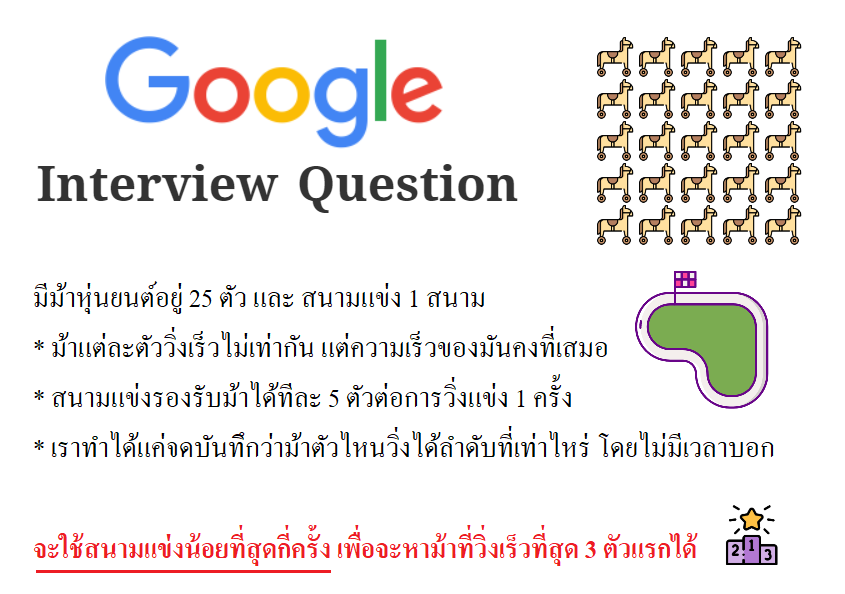

# 🐴 Google ม้า 25 ตัว

## 🥳 โจทย์

โจทย์ข้อนี้เห็นว่า Google ใช้สอบสัมภาษณ์ โดยเข้าให้โจทย์เรามาประมาณนี้

> **Interview Question**  
> There are 25 mechanical horses and a single racetrack. Each horse completes the track in a pre-programmed time, and the horses all have different finishing times, unknown to you. You can race 5 horses at a time. After a race is over, you get a printout with the order the horses finished, but not the finishing times of the horses. What is the minimum number of races you need to identify the fastest 3 horses?

**ซึ่งแปลเป็นไทยง่ายๆได้ว่า**  
มีม้าหุ่นยนต์อยู่ 25 ตัวและสนามแข่ง 1 สนาม ม้าแต่ละตัวถูกตั้งโปรแกรมให้วิ่งเร็วไม่เท่ากันแต่ทุกครั้งที่วิ่งความเร็วของมันจะคงที่เสมอ ส่วนสนามแข่งสามารถรองรับม้าได้ทีละ 5 ตัวต่อการวิ่งแข่ง 1 ครั้ง ซึ่งเราทำได้แค่จดบันทึกว่าม้าตัวไหนวิ่งได้ลำดับที่เท่าไหร่เท่านั้นโดยไม่มีเวลาบอก **เราจะใช้สนามแข่งน้อยที่สุดกี่ครั้ง เพื่อจะหาม้าที่วิ่งเร็วที่สุด 3 ตัวแรกได้**

จากตรงนี้ก็ลองคิดกันต่อดูนะว่าคำตอบคือเท่าไหร่ ? ส่วนใครที่คิดได้/ขี้เกียจคิดละก็เชิญอ่านเฉลยด้านล่างได้เบย 😘

> คนส่วนใหญ่จะตอบผิดว่า 6 ครั้ง เพราะยังคิด scenarios ได้ไม่ครบนั่นเองขอรับ


**แนะนำให้อ่าน**  
บทความนี้เป็นส่วนหนึ่งของ [**🧠 Challenges**](https://www.saladpuk.com/puzzle/challenges) ที่จะคอยรวบรวมโจทย์ที่น่าสนุกคิดเพลินๆ หากใครสนใจอยากดูว่ามีโจทย์อะไรบ้างก็อัญเชิญกดที่ชื่อสีฟ้าๆไปเสพต่อได้เบย ส่วนใครที่คิดว่ามีโจทย์น่าสนใจก็สามารถส่งมาได้ที่ [**Saladpuk Fanclub**](https://www.facebook.com/mr.saladpuk) นะกั๊ฟ 😘


## 🤠 วิธีคิด

สิ่งแรกที่เรารู้คือมัน **มีม้า 25 ตัว** ตามรูปด้านล่าง

ซึ่งเราก็รู้นะว่า **ม้าแต่ละตัววิ่งเร็วไม่เท่ากัน** ดังนั้นมันต้องมี **🐎 ม้าที่วิ่งได้ไวที่สุด** อยู่แต่แค่เราไม่รู้ว่ามันเป็นตัวไหนเฉยๆ ดังนั้นถ้าเราเอาทุกตัวมาแข่งกัน เราก็จะหาตัวที่วิ่งได้เร็วที่สุดได้แน่นอน

### 🔥 จัดกลุ่ม

สิ่งถัดมาที่เรารู้คือ **สนามแข่งรองรับม้าได้รอบละ 5 ตัว** ดังนั้นถ้าเราจะเอาม้าทุกตัวมาวิ่งแข่งกัน เราจะต้องจัดกลุ่มอย่างน้อย 5 กลุ่ม \(A, B, C, D, E\) ตามรูปด้านล่าง

### 🔥 เรียงลำดับในกลุ่ม

ม้าในแต่ละกลุ่มตอนนี้มันอยู่มั่วซั่วไปหมด ดังนั้นในแต่ละกลุ่มเราต้องจับมัน **เรียงลำดับจากความเร็วมากไปหาน้อย** โดยการให้แต่ละกลุ่มวิ่งแข่งกันในสนามซะ ซึ่งก็จะได้ผลตามรูปด้านล่าง

😎 เนื่องจากเราเอาทั้ง 5 กลุ่มไปวิ่งในสนาม ดังนั้นตอนนี้เรา**ใช้สนามไปทั้งหมด 5 ครั้งละ**

### **🔥 ม้าที่ไวที่สุด**

ม้าที่อยู่ในแถว 1 คือม้าที่วิ่งเร็วที่สุดในแต่ละกลุ่ม ดังนั้นมันจะต้องมี **🐎 ม้าที่วิ่งได้ไวที่สุด** อยู่แน่นอน ซึ่งวิธีที่เราจะหามันได้ก็คือ **เอาม้าในแถวที่ 1 ทุกตัวไปแข่งกันในสนามอีกครั้ง** แล้วให้เรียงลำดับความเร็วของแต่ละกลุ่มใหม่ ก็จะได้ผลลัพท์ตามรูปด้านล่าง

😎 ในตอนนี้หาม้าที่วิ่งได้เร็วที่สุดได้แล้ว โดยที่เรา**ใช้สนามไปทั้งหมด 6 ครั้ง** ซึ่งเราก็จะเหลือแค่หาม้าที่วิ่งได้ไวที่สุดเป็นอันดับ 2 กับ 3 แค่นั้นเอง

## **🔥 ม้าเบอร์ 2 กับ 3**

### 👻 กับดัก

ตรงจุดนี้มีหลายคนติดกับดักเยอะม๊วกกกกก เพราะคิดว่าม้าที่เร็วเป็นอันดับ 2-3 จะอยู่ในแถวที่ 1 ด้วยชิมิ ... ซึ่งมันจะถูกในบางกรณี แต่กรณีส่วนใหญ่จะไม่ถูกครับ ตามรูปด้านล่าง

เพราะว่าเราไม่มีทางรู้เลยว่าม้าจะถูกจัดกลุ่มแบบไหน ดังนั้น**จะเกิดอะไรขึ้นถ้าม้าที่วิ่งเร็วเบอร์ 1,2,3 ดันถูกจัดไว้ในกลุ่มเดียวกันตั้งแต่แรกล่ะ?** ตามรูปด้านล่าง

🤓 ดังนั้นหากได้คำตอบว่า 6 ครั้งก็จะยังถือว่าตอบไม่ถูก เพราะมันยังไม่ครบทุกเคสที่อาจะเกิดขึ้นได้นั่นเอง

### 🤠 วิธีคิดในการตัดตัวเลือก

ถ้าเราเจอเหตุการณ์ที่มีตัวเลือกเยอะเต็มไปหมด ****สิ่งที่เราควรจะทำคือ **หาว่าตัวเลือกไหนตัดทิ้งได้** โดยการค่อยๆวิเคราะห์จากทีละเรื่อง

#### หาจุดที่ม้าเบอร์ 2 อยู่ได้

ถ้าเรามานั่งคิดดูดีๆก็จะพบว่า **ม้าเบอร์ 2 มันต้องไม่มีทางวิ่งได้ตำกว่าตำแหน่งที่ 2 แน่นอน** ดังนั้นจุดที่มันควรจะอยู่ได้ก็จะมีแค่ตามในรูปด้านล่าง

#### หาจุดที่ม้าเบอร์ 3 อยู่ได้

เช่นเดียวกัน **ม้าเบอร์ 3 มันต้องไม่มีทางวิ่งได้ต่ำกว่าตำแหน่งที่ 3 แน่นอน** ดังนั้นจุดที่มันควรจะอยู่ได้ก็คือตามรูปด้านล่าง

![&#xE2A;&#xE32;&#xE40;&#xE2B;&#xE15;&#xE38;&#xE17;&#xE35;&#xE48;&#xE21;&#xE31;&#xE19;&#xE2D;&#xE32;&#xE08;&#xE44;&#xE1B;&#xE2D;&#xE22;&#xE39;&#xE48;&#xE15;&#xE33;&#xE41;&#xE2B;&#xE19;&#xE48;&#xE07;&#xE17;&#xE35;&#xE48; 2 &#xE44;&#xE14;&#xE49;&#xE01;&#xE47;&#xE08;&#xE30;&#xE40;&#xE1B;&#xE47;&#xE19;&#xE01;&#xE23;&#xE13;&#xE35;&#xE17;&#xE35;&#xE48;&#xE21;&#xE49;&#xE32;&#xE40;&#xE1A;&#xE2D;&#xE23;&#xE4C; 2 &#xE44;&#xE1B;&#xE2D;&#xE22;&#xE39;&#xE48;&#xE01;&#xE25;&#xE38;&#xE48;&#xE21;&#xE40;&#xE14;&#xE35;&#xE22;&#xE27;&#xE01;&#xE31;&#xE19;&#xE01;&#xE31;&#xE1A;&#xE21;&#xE49;&#xE32;&#xE40;&#xE1A;&#xE2D;&#xE23;&#xE4C; 1 &#xE19;&#xE31;&#xE48;&#xE19;&#xE40;&#xE2D;&#xE07;](../../.gitbook/assets/image%20%281250%29.png)

จากที่ว่ามาเราก็จะพบว่า ตำแหน่งของม้าเบอร์ 2 กับ 3นั่นจะต้องอยู่ภายในสีเขียวเท่านั้น ดังนั้นเราก็แค่เอาม้าทุกตัวที่อยู่ในสีเขียวมาวิ่งแข่งกัน เราก็จะหาม้าที่วิ่งไวที่สุดเบอร์ 2 กับ 3 ได้แล้วนั่นเอง ซึ่งตำแหน่งสีเขียวมี 5 อันพอดีกับลูกวิ่งเลย

😎 จากทั้งหมดเราก็สามารถหาม้าที่วิ่งไว้ที่สุด 3 อันดับแรกได้แล้ว โดยที่เรา**ใช้สนามไปทั้งหมด 7 ครั้งครัช**

## **🤔 ต่ำกว่า 7 ได้มะ?**

หลายคนเมื่อเห็นคำตอบก็อาจสงสัยว่า 7 ครั้งคือคำตอบที่น้อยที่สุดแล้วหรือเปล่า ดังนั้นเราลองมาคิดกันต่ออีกนิสนุงกันครัช 😁

### 🐴 ม้าทุกตัวต้องถูกจับวิ่ง

อย่างแรกเลยเราไม่รู้ว่าม้าทั้ง 25 ตัวมันวิ่งเร็วเท่าไหร่ และตัวไหนวิ่งเร็ววิ่งช้าก็ไม่มีทางรู้ได้ถ้าไม่เอามันไปวิ่งในสนาม ซึ่ง **เราต้องเอาม้าทุกตัวลงวิ่งโดยห้ามละเว้นซักตัว** เพราะถ้าตัวที่ถูกละเว้นมันเป็นตัวที่วิ่งเร็วเบอร์ 1-3 ขึ้นมาเราก็จะได้คำตอบผิด

### 🦸‍♀️ จำนวนรอบขั้นต่ำ

เนื่องจากเราต้องเอาม้าทั้ง 25 ตัวไปวิ่ง ซึ่งสนามรับได้รอบละ 5 ตัว ดังนั้น **ขั้นต่ำสุดที่จะเอาม้าไปวิ่งได้หมดคือ 5 รอบ** \(5x5=25\)

### 👩‍🔬 Cross check

แม้เราจะเอาม้าไปวิ่งครบแล้วก็จริง แต่จะเห็นว่ามันแยกกันเป็นกลุ่มๆไม่เกี่ยวข้องกันเลย ดังนั้นเราจะต้อง **ตรวจข้ามกลุ่มกัน** ซึ่งเราจะส่งม้าตรวจข้ามกลุ่มมั่วๆมันก็จะเสียการใช้สนามไปเปล่าๆ ดังนั้นเราควรจะเลือกตัวที่ส่งผลดีที่สุดไป นั่นคือ **เลือกม้าที่เร็วสุดของแต่ละกลุ่มมาแข่งกัน** นั่นเอง

ซึ่งจากการใช้สนามครั้งที่ 6 นี้เราจะได้คำ**ตอบของสมการตัวแรกคือม้าที่เร็วสุด** จะต้องอยู่ใน Cross Check นั้นแน่นอน แต่สำหรับม้าเบอร์ 2 กับ 3 เราไม่สามารถหาความสัมพันธ์ใดๆได้เลยว่ามันจะอยู่ในกลุ่ม Cross check หรือเปล่า ดังนั้น 6 เลยไม่มีทางที่จะเป็นคำตอบได้นั่นเองขอรับ 


6 มีโอกาสตอบถูกเหมือนกันแต่ไม่ใช่สำหรับทุกกรณี ถ้าถามว่าเรารับกันได้ งั้นผมก็ขอบอกว่า ผมก็สุ่มมั่วๆมา 3 ตัวก็มีโอกาสถูกเหมือนกันนิครับ 😅


🤠 หากใครมีวิธีคิดที่ได้ผลลัพท์เร็วกว่านี้ก็สามารถส่งคำตอบมาได้เลยนะ จะได้ช่วยกันผลักดันวิธีคิดใหม่ๆกันฮ๊าฟ

## **🎯 ข้อคิดที่ได้**

* **Scenarios นั้นสำคัญมาก** เพราะถ้าเราไม่คิดมันไว้ก่อนเราก็จะได้คำตอบที่ต่ำกว่า 7 ครั้ง
* เวลาที่เราเจอโจทย์ อย่ากระโดดไปเขียนโค้ดเลย ไม่งั้น solution / performance ที่ได้มันจะค่อนข้างห่วย ให้คิดให้ดีก่อนว่า **จะแก้ปัญหาเรื่องนั้นๆยังไงโดยออกแรงให้น้อยที่สุด** ดังนั้น **`การวางแผน`** คือ 💖 หัวใจหลักในการทำซอฟต์แวร์
* เวลาที่เราเจอโจทย์อะไรก็ตาม **เราไม่จำเป็นต้องหาวิธีที่ดีที่สุดในการแก้ปัญหาก็ได้** ขอแค่ให้เราได้แนวทางที่จะแก้ไขโจทย์นั้นๆได้ก่อน แล้วเมื่อเราเข้าใจภาพรวมทั้งหมดแล้วค่อยกลับมาหาวิธี Optimize ให้มันดีขึ้นภายหลังก็ได้ [**กฎ 80:20**](https://www.saladpuk.com/v/tips/80-20)\*\*\*\*

