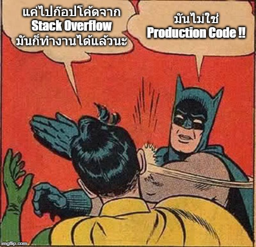

# Quality vs Quantity

## ทำงานคุณภาพหรือเอาแค่พอส่งดี ?

ในเรื่องของธุรกิจ **เวลา** คือสิ่งที่สำคัญที่สุด เพราะถ้าปล่อยของออกตลาดได้ช้า นั่นก็อาจจะหมายถึงจากไปของบริษัทเลยก็เป็นได้ และแน่นอนเหล่าโปรแกรมเมอร์ก็มันจะโดยท้าทายด้วยตัวเลือก 2 ตัวนี้เสมอ

**"ทำให้ส่งงานได้ไปก่อนแล้วค่อยมาแก้ทีหลัง"** หรือจะเลือก **"ทำให้มันถูกต้องไปเลยแต่อาจจะช้าหน่อยนะ"**

คำตอบมีหลากหลายแง่มุมมาก ดังนั้นในบทความนี้ผมอยากจะให้แนวทางแบบรวบรัดว่าทีมควรจะเลือกเดินยังไงต่อเมื่อเจอปัญหาพวกนี้ครับ

### 🔥 ทำให้ส่งงานได้ไปก่อนค่อยกลับมาแก้ทีหลัง \(ถ้า\)

**1.มันเป็นเรื่องคอขาดบาดตายแล้วจริงๆ** - เช่นบริษัทอาจจะไปรับปากอีกบริษัทไว้ว่ามันต้องได้วันนี้แล้วนะ ซึ่งเมื่อถึงเวลา developer ก็ต้องทำให้มันได้ตามที่คุยกันจริงๆไม่ว่าจะด้วยอะไรก็ตาม

### 🔥 เลือกทำให้มันถูกต้องไปเลย \(ถ้า\)

**1.สิ่งนั้นมันเป็น Core Architecture และเราคุยกับลูกค้าแล้วเขารับผลกระทบที่ตามมาได้** - เพราะตัว core architecture ถ้าเราทำมันแบบส่งๆ Bad Code เหล่านั้นจะลามและแก้ยากมาก ดังนั้นตัดไฟตั้งแต่ต้นลมจะดีกว่าครับ

**2.ใช้เวลาแก้แล้วก็ยังอยู่ภายใน iteration ที่ commit อยู่** - เพราะ Bad Code ถ้าเราปล่อยไว้แทบจะเรียกได้เลยว่า ไม่มีใครกลับมาแก้หรอก ถ้าไม่ได้ใจรักจริง และการปล่อยให้มี Bad Code อยู่สุดท้ายมันจะกลายเป็น **Technical debt** ซึ่งเจ้าตัวนี้นี่แหละคือตัวภัยร้ายในการฆ่าบริษัทในภายหลัง อ่านเรื่องนี้ได้จากบทความ [ปัญหาที่ใหญ่ที่สุดในการทำซอฟต์แวร์](https://saladpuk.gitbook.io/learn/v/tips/why-software-fail)ครับ ดังนั้นถ้าไม่มีผลกระทบมากผมเลือกที่จะลดจำนวน features ที่จะ commit ลงแล้วเก็บงานให้มันถูกที่ถูกทางดีกว่าครับ

สุดท้ายไม่ว่าจะเลือกวิธีไหนมันก็ต้องมีผลตามมาแน่นอน ดังนั้นไม่ว่าจะทำอะไร \(ถ้าทำได้\) เราก็ควรจะปรึกษากับลูกค้าก่อนที่จะลงมือตัดสินใจเดินงานต่อ เพราะในบางทีของที่เราคิดว่าสำคัญนั้น ในมุมของลูกค้าอาจจะไม่สำคัญเลย และตรงกันข้ามกัน ของที่ลูกค้าคิดว่ามัน โคตรสำคัญ เราดันกลับไปมองว่ามันไร้สาระก็เจอเหตุการณ์เหล่านี้อยู่เกลื่อนเลย

