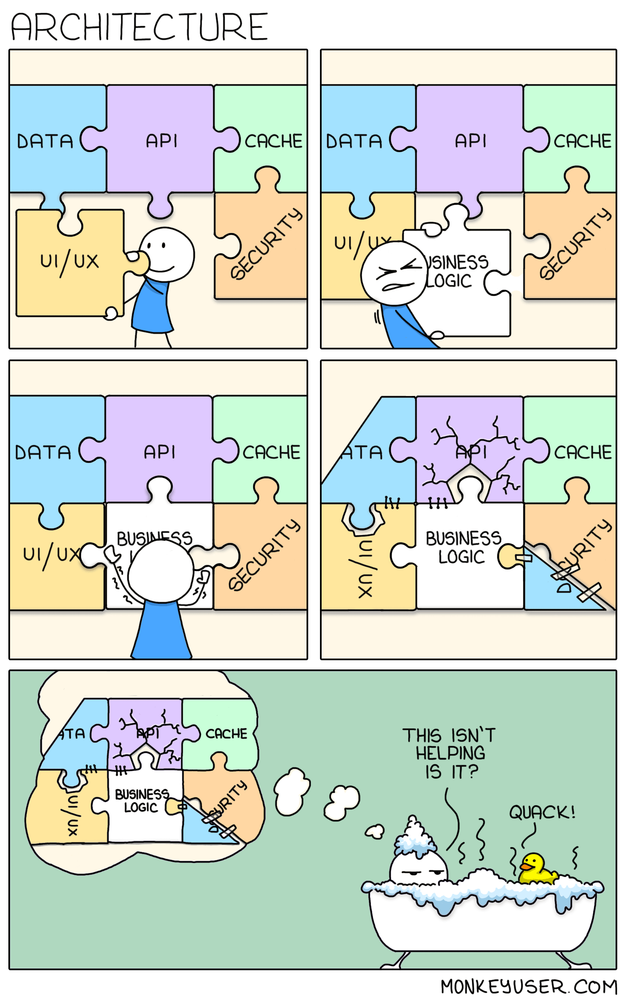

# Requirement Driven Design

💀 สิ่งที่คนในวงการซอฟต์แวร์ทำผิดกันคือ **การเอา solution เป็นที่ตั้ง** แล้วค่อยมาปรับให้เข้ากับความต้องการของลูกค้า ซึ่งเรื่องนี้เป็นเรื่องที่อันตรายมาก เพราะมันอาจจะทำให้ของที่ออกแบบมานั้นอาจได้รือทำใหม่ หรือต้องแก้แบบไม่ถูกหลักในการออกแบบชนิดแมวเห็นยังกรีดร้องถามหาคนออกแบบ

💖 หัวใจสำคัญของวงการซอฟต์แวร์คือ **Business Requirements** ดังนั้นจงนำสิ่งนี้เป็นตัวตั้ง ห้ามมโน ห้ามมั่ว เป็นอันขาด และเมื่อเข้าใจความต้องการที่แท้ทรูของลูกค้าแล้ว เราค่อยมาเลือกเทคโนโลยี ค่อยมาหา solution ที่เหมาะสมกับมันอีกทีต่างหาก

**ลองคิดง่ายๆ** เราจะไปจีบใครซักคน เราจะเดินไปหาเขาแล้วซื้อไอติมให้เข้าเลยหรือเปล่า? หรือจะทำความเข้าใจก่อนว่าเขามีรสนิยมยังไง เป็นคนแบบไหน ชอบอะไร แล้วค่อยมาตัดสินใจอีกทีว่าจะจีบเขายังไง? ... การทำซอฟต์แวรก็เช่นกับการจีบใครซักคนแหละ อย่าเข้าใจลูกค้าแค่พอผ่านๆ เพราะสิ่งที่ลูกค้าพูดอาจจะไม่ใช่ความต้องการที่แท้จริงของเขาก็ได้

