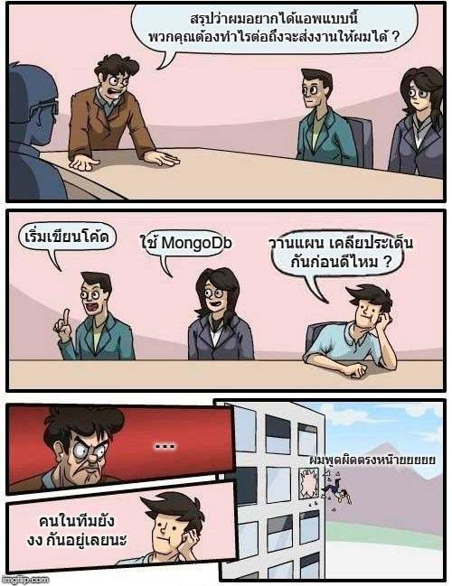

# เรื่องแปลกในการทำซอฟต์แวร์

ในการทำซอฟต์แวร์โปรเจค หลังจากที่เราได้รับ Requirements จากลูกค้า หรือ อะไรก็ตาม เราจะพบว่า Developer หลายๆคนเลือกที่จะ **"เขียนโค้ดเป็นอันดับแรก"** ไม่ก็ไป **"ออกแบบระบบต่างๆเป็นอันดับแรก"** เช่น ออกแบบฐานข้อมูล, ทำ class diagram, เลือกเทคโนโลยีที่จะใช้ บลาๆ ซึ่งเชื่อไหมว่านั่นก็เป็นหนึ่งในปัญหาที่เราคิดว่ามันเป็นเรื่องปรกติไปเสียแล้ว

เพราะการทำซอฟต์แวร์นั้น ถ้าตัวเรา คนในทีม และลูกค้า ยังไม่ได้เคลียประเด็นความเข้าใจกัน ว่างานแต่ละส่วนคืออะไร?, งานแต่ละตัวมีลำดับความสำคัญยังไง?, และอะไรคือจะเรียกว่าเราปิดงานตัวนั้นได้? หรือพูดรวมๆคือ 

### "ทีมยังไม่ได้เข้าใจตัวงาน และ Definition of Done ของงานเลย "

แต่ทีมกระโดดไปทำของที่ยังคลุมเคลืออยู่มันจะเกิดอะไรขึ้นถ้าสิ่งนั้นมันต้องแก้ไข? ดังนั้นสิ่งที่ทีมควรจะทำเมื่อได้รับ requirements ต่างๆจากลูกค้า คือ

* คุยกับลูกค้าก่อนว่า features เหล่านั้นมันจะไปช่วยตอบโจทย์อะไรเขา **เพื่อหาความต้องการที่แท้จริง** เพราะบ่อยครั้งลูกค้าจะพูดสิ่งที่เขาอยากได้ แต่มันไปแก้โจทย์ทาง business แบบอ้อมๆเท่านั้นเอง
* คุยกับลูกค้าก่อนว่า ความเร่งด่วนของแต่ละ features เป็นยังไง และกับในหน้าตักตอนนี้ เขาอยากได้อะไรก่อน **เพื่อเราจะได้ส่งมอบงานที่มีผลกระทบสูงสุดกับธุรกิจเขาก่อน** เพราะผมเชื่อว่าระบบ login น่าจะมีผลน้อยกว่า ระบบสั่งซื้อแน่นอน
* เ**คลียความเข้าใจกับลูกค้าก่อนว่า features ที่เรากำลังจะทำให้เขานั้น ลูกค้าตีว่าเขาต้องได้อะไรบ้างถึงจะถือว่าส่งมอบงานได้** เพราะไม่งั้นเราจะทำงานเสร็จโดยเรารู้สึกว่ามันเสร็จ แต่สำหรับลูกค้าอาจจะมองว่ามันยังไม่เสร็จก็ได้

จากเรื่องที่เล่ามา บริษัทหลายๆบริษัทเลือกที่จะไม่ทำของเหล่านี้เพราะคิดว่ามันเสียเวลาที่จะมานั่งคุยกัน ซึ่งคำตอบตอบคือใช่ครับ **มันเสียเวลาในระยะแรก แต่ถ้านับในระยะยาวแล้วมันคุ้มค่าในการทำ**

